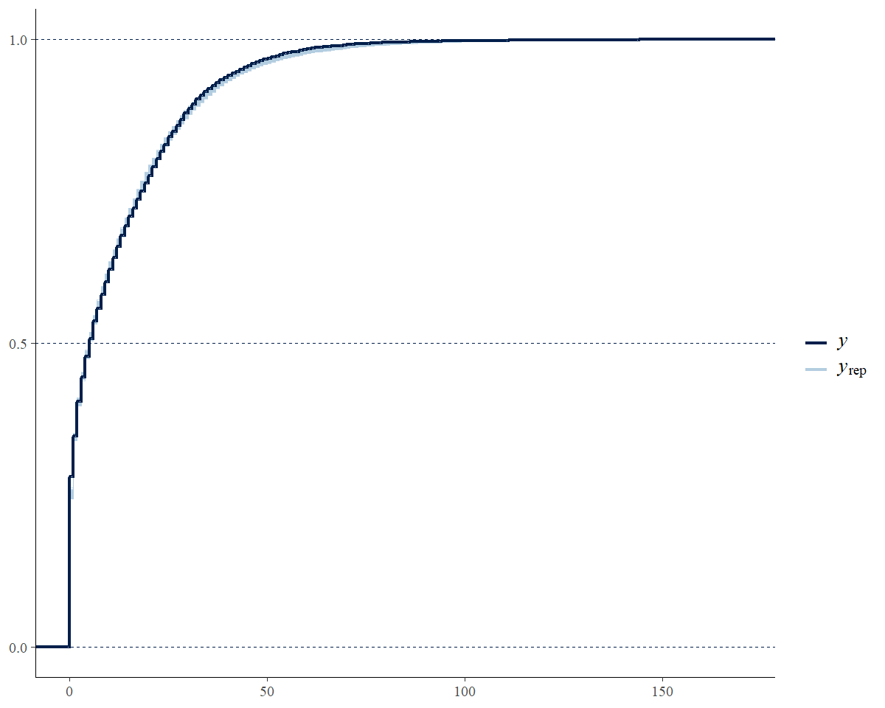
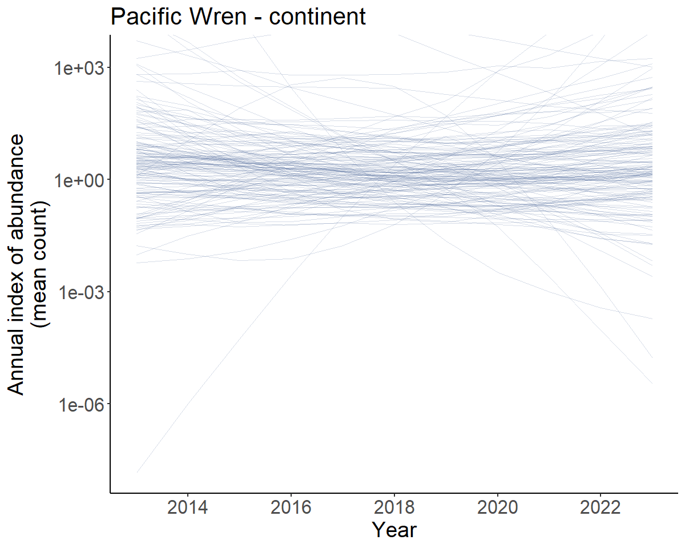
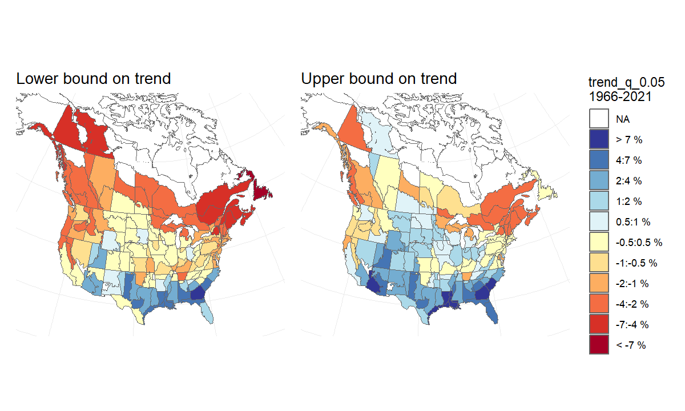
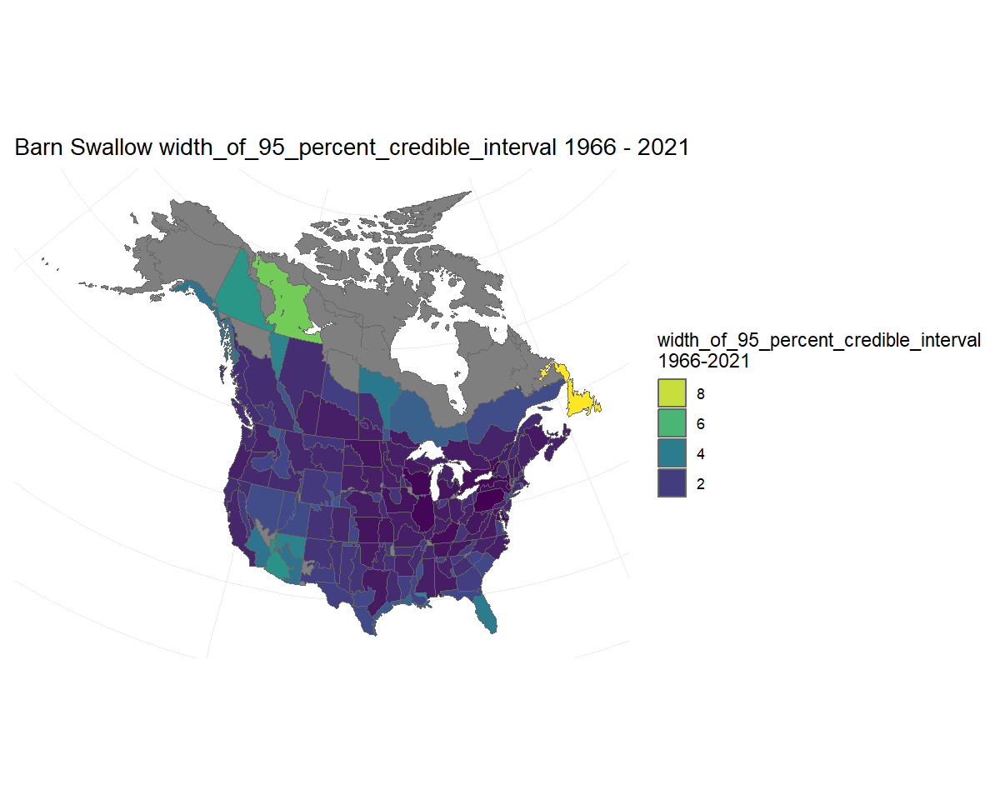
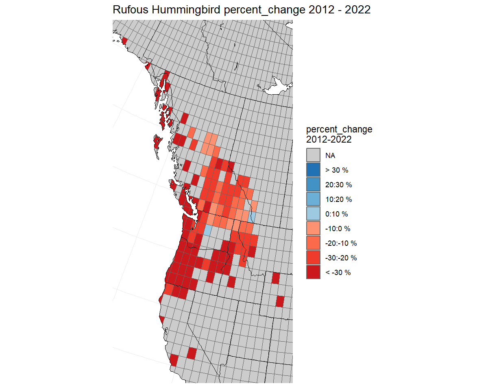
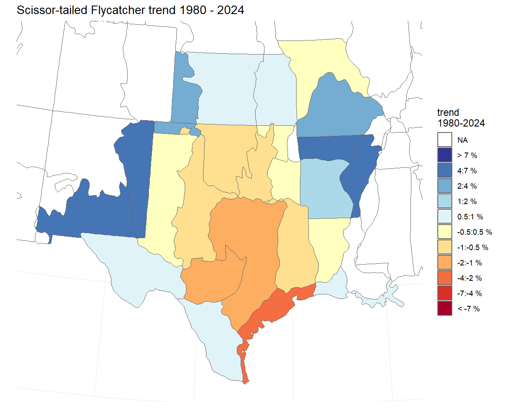
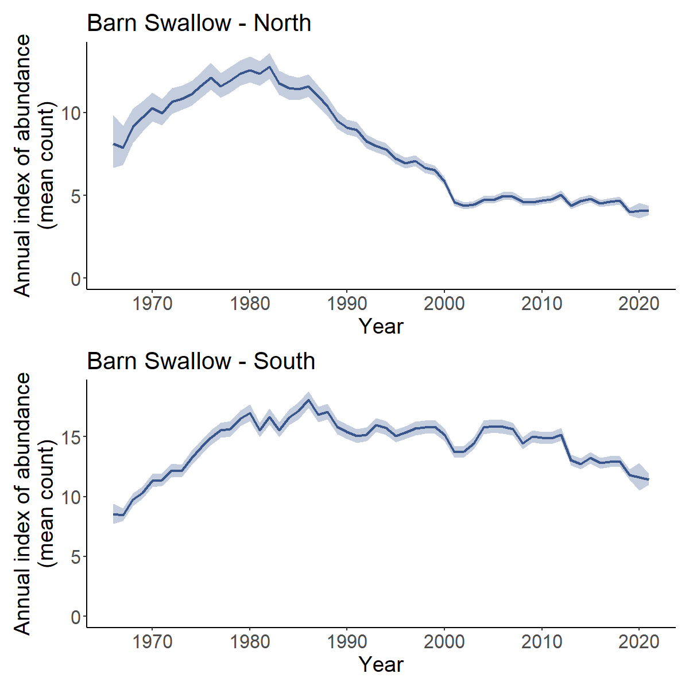
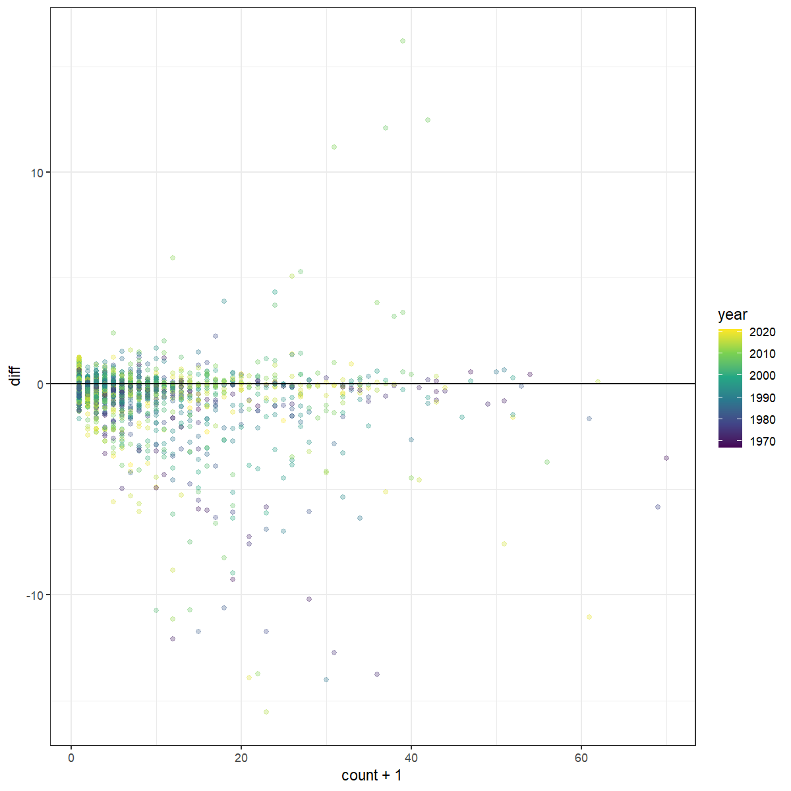

``` r
  library(bbsBayes2)
  library(dplyr)
  library(ggplot2)
  library(sf)
  library(patchwork)
  library(bayesplot) #to visually check convergence
  library(tidyr)

```

# Some more advanced options

For most of these examples, we will be using a series of saved model outputs. These model outputs can be downloaded from this [Google Drive](https://drive.google.com/drive/folders/1m45wWySCJYxh4DZGfvp_xI8fRUEsE5e1?usp=sharing). In the example code here, we have unzipped these saved model outputs and stored the *.rds* files in a local sub-directory called *output*.

## Posterior Predictive Checks

Posterior predictive checks are graphical comparisons of the model-based predictions of data and the observed data. They are best done in R, after fitting the model.
It is certainly possible to modify the Stan code to include posterior
predictions of the individual BBS counts. However, using Stan to
generate these predicted counts will almost double the size of the saved
model object.

To generate the posterior distributions of predicted
counts, you will need to extract the posterior samples of the parameter
`E` in the bbsBayes2 models (these represent the expected values on the log-scale). Also, if the model used the negative
binomial error distribution, then you will also need to extract the
posterior samples for the parameter `phi` (the inverse negative binomial
dispersion parameter). In the [Stan negative binomial
distribution](https://mc-stan.org/docs/functions-reference/neg-binom-2-log.html),
$\phi$ is the same parameter as `size` in `base::rnbinom()`, with
arguments `mu = exp(E), size = phi`. Here's an example, using the fitted
model object for the Scissor-tailed Flycatcher data fit to the `gamye` model
with the 'spatial' variant, and the using the `bbs_usgs` stratification.


``` r
STFL_gamye_spatial <- readRDS("output/4430_gamye_spatial.rds")

# tibble with one row for each posterior draw and one column for each parameter (i.e., each count)
E <- posterior::as_draws_df(STFL_gamye_spatial$model_fit) %>%
  select(matches("^E([[:punct:]])"),
         .draw)
#> Warning: Dropping 'draws_df' class as required metadata was removed.
# tibble with 1 column for phi and one row for each posterior draw
phi <- posterior::as_draws_df(STFL_gamye_spatial$model_fit)%>%
  select(phi,
         .draw)
#> Warning: Dropping 'draws_df' class as required metadata was removed.

# join tibbles by draw
E <- left_join(phi,E,
               by = ".draw")
# custom function to generate posterior predictive counts from negative binomial
pred_counts_nb <- function(e_mu,phi_i){
  n <- length(phi_i)
  x <- rnbinom(n,mu = exp(e_mu),size = phi_i)
  return(x)
}

# generate predicted negative binomial counts
y_rep <- E %>%
  mutate(across(matches("^E([[:punct:]])"),
                          ~ pred_counts_nb(.x,phi))) %>%
  select(matches("^E([[:punct:]])")) %>%
  sample_n(.,500) # take a random sample of 500 to simplify plotting

# re-formatting to support the PPC plotting below
y_rep <- posterior::as_draws_matrix(y_rep)

# graphical posterior predictive check using the
# discrete option on a cumulative distribution plot
ppc_overplot <- bayesplot::ppc_ecdf_overlay(y = STFL_gamye_spatial$raw_data$count,
                                    yrep = y_rep,
                                    discrete = TRUE)
# focusing in on the range of observed data
ppc_overplot <- ppc_overplot +
  coord_cartesian(xlim = range(STFL_gamye_spatial$raw_data$count))


print(ppc_overplot)
```



## Prior predictive checks

As of version 1.1.3, all of the models in bbsBayes2 can generate predictions from the priors using `prepare_model(..., use_likelihood = FALSE)`. This `use_likelihood = FALSE` argument fits the model while ignoring the observed counts (i.e., ignoring the likelihood of the data, given the model). The resulting predictions are based solely on the priors. These prior predictive checks are especially useful if the user is modifying the default Stan models (e.g., new parameters, alternate prior values, etc.).
Generating prior predictions for any model, based on the data structure (number of surveys, years, strata, routes, observers, etc.) for a given species is as simple as  setting `prepare_model(..., use_likeihood = FALSE)` and then sending the output from `prepare_model()` to the next stages of the standard modeling workflow.


``` r

species.eng = "Pacific Wren"

stratified_data <- stratify(by = "bbs_usgs",species=species.eng)

# to be included a stratum must have at least 3 routes on which the species has been observed
# and at least one of those routes must have at least 2 years of observations
d<- prepare_data(strata_data = stratified_data,
                 min_year = 2013,
                 max_year = 2023)

sd <- prepare_spatial(d,load_map("bbs_cws")) # create spatial relationships

m<-prepare_model(
  prepared_data = sd,
  model="gamye",
  model_variant="spatial",
  use_likelihood = FALSE
)

prior_preds <- run_model(model_data = m,
                      refresh=100,
                      iter_sampling = 100,
                      iter_warmup = 200,
                      output_dir = "output",
                      output_basename = "BBS_PacificWren_gamye_spatial_prior")

```


``` r
prior_inds <- generate_indices(prior_preds, regions = "continent")
#> Processing region continent
prior_trajs <- plot_indices(prior_inds, spaghetti = TRUE, n_spaghetti = 150)
prior_trends <- generate_trends(prior_inds)

#transforming y-axis to log scale due to extreme uncertainty limits
cont_prior_trajectory <- prior_trajs[[1]]+
scale_y_continuous(transform = "log10")+
coord_cartesian(ylim = c(NA,2000)) # some of the mean predictions are extreme
#> Scale for y is already present.
#> Adding another scale for y, which will replace the existing scale.

print(cont_prior_trajectory)
```

<div class="figure">

<p class="caption">Prior predicted population trajectories</p>
</div>
So the predicted population trajectories include everything from extreme increases (upper 95% credible interval of the trends = 199.4 %/year to extreme decreases (lower 95% credible interval of the trends = -65.5 %/year).


## HPDI - Highest posterior density intervals

HPDI can provide a better summary of the posterior distribution than simple quantiles of the posterior distribution. HPDI are the narrowest interval that includes a particular portion of the posterior probability. For symetrical posterior distributions HPDI are the same as the Equal Density Intervals provided by taking simple quantiles of the posterior. For skewed distributions, the HPDI is less sensitive to the long-tail of the distribution. Annual indices of abundance (i.e., the index values generated by `generate_indices()`) are retransformed predictions from a log-link model and therefore often strongly skewed. HPDI values are not provided by default, but there is a logical argument `hpdi` in both `generate_trends()` and `generate_indices()`.
For example, in the trajectory plots below, the uncertainty bounds are more symmetrical around the dark line in the lower plot using the HPDI than they are in the upper plot using the default quantiles.


``` r
# set of indices for demonstrating HPDI
m <- readRDS("output/4430_first_diff_spatial.rds") # Scissor-tailed Flycatcher
i <- generate_indices(m)
#> Processing region continent
#> Processing region stratum
trajectories <- plot_indices(i)

i_hpdi <- generate_indices(m,hpdi = TRUE)
#> Processing region continent
#> Processing region stratum
trajectories_hpdi <- plot_indices(i_hpdi)

print(trajectories$US_NM_35 / trajectories_hpdi$US_NM_35)
```


## EXAMPLE - Replicating the CWS status and trend estimates (2022 version and later)

The CWS analysis, as of the 2022 BBS data-version, uses the spatial gamye model.

The full script to run the CWS analysis for the 2023 release is
accessible
[here](https://github.com/AdamCSmithCWS/CWS_BBS_2022_Analyses).


``` r

species.eng = "Pacific Wren"

stratified_data <- stratify(by = "bbs_cws",species=species.eng) #same stratification as USGS but with BCR7 as one stratum and PEI and Nova Scotia combined into one stratum

# to be included a stratum must have at least 3 routes on which the species has been observed
# and at least one of those routes must have at least 2 years of observations
d<- prepare_data(strata_data = stratified_data,
                 min_n_routes = 3,
                 min_max_route_years = 2)

sd <- prepare_spatial(d,load_map("bbs_cws")) # create spatial relationships
m<-prepare_model(
  prepared_data = sd,
  model="gamye",
  model_variant="spatial",
  use_pois = FALSE #negative binomial error distribution
)

mod_cws <- run_model(model_data = m,
                  refresh=500,
                      iter_sampling = 1000,
                      iter_warmup = 1000)

```

## EXAMPLE - Similar analyses to the USGS status and trend estimates 2023 data version

> This example is approximate. The USGS analysis does NOT use the
> bbsBayes2 package, nor have the analysts at the USGS confirmed that
> this example would replicate their analyses.

The USGS analyses for 2023 relase uses one of two different models (either
slope or first-difference) and with one of two different error
distributions (Poisson with either heavy-tailed overdispersion or
normally distributed overdispersion) (see, [Link et al.
2017](https://doi.org/10.1650/CONDOR-17-1.1) and [Link et al.
2020](https://doi.org/10.1002/eap.2137) for more details).

Here we provide data preparation and model options to approximate the
2022 USGS bbs analyses for a species that uses the heavy-tailed Poisson
error distribution and the first-difference model (more on the error distributions below).


``` r

species.eng = "Pacific Wren"
stratified_data <- stratify(by = "bbs_usgs",species=species.eng)
#BCR by province/state/territory intersections

d <- prepare_data(strata_data = stratified_data,
                  min_n_routes = 3,
                  min_max_route_years = 1) #slight difference in minimum data cut-offs

m<-prepare_model(prepared_data = d,
  model="first_diff",
  model_variant = "nonhier", #no sharing of information among strata on abundance or trends
  use_pois = TRUE, # overdispersed, Poisson distribution
  heavy_tailed = TRUE, #heavy-tailed (t-distribution) to model extra-Poisson dispersion
 calculate_nu = TRUE     # estimated the df parameter for the heavy-tailed t-distribution
)

# MCMC settings for the usgs analyses would not be relevant here because
# the official analyses use JAGS and Gibbs Sampling and not Stan's HMC algorithm
# mod <- run_model(model_data = m,
#                  ...)

```

## EXAMPLE - mapping uncertainty of trends or estimated abundance

A new feature since version 1.1, is the ability to use the plot_map function to map any of the numerical values provided in the output from `generate_trends()`. For example, you may be interested in understanding the spatial distribution of the upper and lower bounds of a trend estimate, in order to visualise the uncertainty in the spatial distribution of trend estimates.

Here, we'll demonstrate this feature using previously generate fitted model output from applying the spatial GAMYE model to the data for Barn Swallow (2022 data-release).

You can download a zip-file with a saved model output for Barn Swallow here:

[An example of the output from applying the spatial gamye model to Barn
Swallow data](https://drive.google.com/drive/folders/1m45wWySCJYxh4DZGfvp_xI8fRUEsE5e1?usp=drive_link).

Unzip the file and store it in a local directory.
In this example we've placed it in a sub-directory of our working directory called *output*.


``` r
BARS <- readRDS("output/Barn_Swallow_gamye_spatial.rds")
```

We generate annual indices of abundance using the smooth-only component of the population trajectory. Then use those to estimate long-term trends (1966 - 2021), and plot those trends on a map.


``` r
BARS_smooth_indices <- generate_indices(BARS,
                                        alternate_n = "n_smooth")
#> Processing region continent
#> Processing region stratum
BARS_trends <- generate_trends(BARS_smooth_indices)
BARS_trend_map <- plot_map(BARS_trends)
BARS_trend_map
```



Then, to visualise the uncertainty in this pattern of trend estimates, we generate two maps that each display the upper and lower credible intervals of the trends. We can interpret these maps as showing the lower-bound and the upper-bound on the rates of population change for the species. For example, we can be reasonably confident that the species' trends have not been more negative than the map on the left, and are unlikely to be more positive than the map on the right.


``` r

BARS_trend_map_lower <- plot_map(BARS_trends, alternate_column = "trend_q_0.05") +
  labs(title = "Lower bound on trend")
BARS_trend_map_upper <- plot_map(BARS_trends, alternate_column = "trend_q_0.95") +
  labs(title = "Upper bound on trend")+
  theme(legend.position = "none") #removing the second legend
# combined using the patchwork package
BARS_trend_bounds_maps <- BARS_trend_map_lower + BARS_trend_map_upper + plot_layout(guides = "collect")
BARS_trend_bounds_maps
```



Alternatively, we could visualise the width of the credible interval on the trends. Here we see that most of the trend estimates have credible intervals that are narrower than approximately 2%/year, but trends for a few strata in northern regions and the south-west are less precise. Note: Because in this case we are not displaying estimates of trends specifically, the function uses the viridis colour scale.


``` r

BARS_trend_map_CI_width <- plot_map(BARS_trends, alternate_column = "width_of_95_percent_credible_interval")
#> Error in plot_map(BARS_trends, alternate_column = "width_of_95_percent_credible_interval"): object 'pal' not found

BARS_trend_map_CI_width
#> Error: object 'BARS_trend_map_CI_width' not found
```

## EXAMPLE - mapping percent-change in the population

A new mapping option, as of version 1.1.3 includes a colour palette for mapping percent change in population that matches the palette and categories used in the eBird status and trend results.

Here, we'll demonstrate this feature using previously generate fitted model output from applying the spatial first difference `first_diff` model to the data for Allen's Hummingbird using the `latlong` stratification and the 2025 data-release.

First we fit the model, which requires less than an hour using the defaults.


``` r


species <- "Allen's Hummingbird"

# extract the unique numerical identifier for this species in the BBS database
species_number <- search_species(species) %>%
  filter(!grepl(pattern = "unid", x = english)) %>% #removing observations not clearly identified as Allen's Hummingbird.
  select(aou) %>%
  unlist()

s <- stratify("latlong",
              species = species) %>%
  prepare_data(min_n_routes = 1) # because the strata are small, we lower the threshold for minimum number of routes

mod <- "first_diff"
var <= "spatial"

p <- prepare_spatial(s, strata_map = load_map("latlong")) %>%
 prepare_model(model = mod, model_variant = var)


m <- paste0("output/",
              species_number,
              "_latlong_",
              mod,
              "_",
              var)
ALHU <- run_model(p,
                  output_basename = m,
                  output_dir = "output")

```


We generate annual indices of abundance, use those to estimate percent change over the short-term (2012 - 2022), and plot those changes on a map.


``` r

ALHU_smooth_indices <- generate_indices(ALHU)
#> Processing region continent
#> Processing region stratum
ALHU_trends <- generate_trends(ALHU_smooth_indices,
                               min_year = 2012,
                               max_year = 2022)
ALHU_trend_map <- plot_map(ALHU_trends,
                           alternate_column = "percent_change",
                           col_ebird = TRUE)
# load states and province map to overlay the 1-degree grid
States_Provinces <- load_map("prov_state")
# create a bounding box for the map, focused on the regions with data.
bb <- load_map("latlong") %>%
  filter(strata_name %in% ALHU_trends$meta_strata$strata_name) %>%
  sf::st_bbox()

# plot the map
ALHU_trend_map + geom_sf(data = States_Provinces, fill = NA,
                          colour = "black") +
  coord_sf(xlim = bb[c("xmin","xmax")],
           ylim = bb[c("ymin","ymax")])
#> Coordinate system already present. Adding new coordinate system, which will replace the existing one.
```




## Advanced options and customized models

## Alternate error distributions

Error distributions in the bbsBayes2 models can be accessed using a
combination of three arguments in the `?prepare_model()` function.

### Poisson vs negative binomial

For all of the models, the BBS counts on a given route and year can be
modeled using either an over-dispersed Poisson distribution or a
negative binomial distribution. This selection is controlled using the
`use_pois` argument. The negative binomial is the default
`use_pois = FALSE`, because it greatly reduces memory requirements and
the size of the object created using `run_model()`. If using the
negative binomial distribution, no other arguments need to be set.

If a user wishes to use the over-dispersed Poisson distribution to model
the error distribution of BBS counts, then set
`prepare_model(..., use_pois = TRUE)`. This approach generates a
count-level random effect to account for extra-Poisson variance,
following the approaches used in most of the official BBS analyses.
These count-level parameter estimates are the reason for the increase in
memory requirements and object size when fitting the model (i.e., they
require monitoring an additional parameter for every observation in the
dataset). If using the Poisson option, there are two additional
arguments that the user can select to control some of the specifics of
the over-dispersion. The first argument allows the user to select
between a normal distribution (`heavy_tailed = FALSE`) to model the
count-level random effects or the default heavier-tailed t-distribution
(`heavy_tailed = TRUE`). Finally, if the heavy-tailed t-distribution is
selected, then the user can choose to either estimate the degrees of
freedom for the t-distribution `calculate_nu = TRUE` letting the model
estimate the heaviness of the tails, or to have the t-distribution fixed
at 3 `calculate_nu = FALSE` implying very heavy-tails relative to the
normal. We have used the `calculate_nu = FALSE` as the default because
for many species estimating the degrees of freedom greatly increases the
model run-times.

## Alternate Measures of Trend and Population Change

The `generate_trends()` function produces much more than just the trend
estimates. This section explains one alternate measure of trend (i.e., *slope trends*) and measures of population change, such as the percent change in the population between the first and last years of the trend and the probability that a population has decreased by a certain amount.


``` r
# set of indices for demonstrating trend options
m <- readRDS("output/4430_first_diff_spatial.rds") # Scissor-tailed Flycatcher
i <- generate_indices(m)
#> Processing region continent
#> Processing region stratum
```
### The default trend estimate

The default trend calculation is an interval-specific estimate of the
geometric mean annual change in the population.
$Trend = (\frac {n[min-year]}{n[max-year]})^{(1/(max-year-min-year))}$
We refer to these as *end-point trends*. They rely on a comparison of
the annual indices in the first and last years of the trend period to
quantify the mean rate of population change. However, it ignores the
pattern of change between the two end-points.


``` r
t <- generate_trends(i,
                     slope = TRUE,
                     min_year = 1980) #trends from 1980-2021
t_map <- plot_map(t)
print(t_map)
```



### Slope-based Trends

bbsBayes2 includes an alternate trend estimate that can be applied to any of the
models to dampen the influence of the start and end years on the estimated trend.
These slope-based trends are calculated
by fitting a log-linear slope to the series of all annual indices
between the two end-points (e.g., all 11 years in a 10-year trend from
2011-2021). We refer to these trends as *slope-based trends*. The slope
of this line is transformed into an average annual percent change
across the time-period of interest. F\This slope-based trend may be useful for estimates derived
from a model and or a species with strong annual fluctuations when the
user wishes to account for the overall pattern of the annual
fluctuations in the trend estimate without letting the trend be completely determined by the annual fluctuations in the particular end-point years. These slope trends can be
added to the trend output table by setting the `slope = TRUE` argument
in `generate_trends()`. The default *end-point trends* are still
calculated, but additional columns are added that include the alternate
estimates. NOTE: the `plot_map()` function can map slope trends as well
with the same `slope = TRUE` argument.


``` r

t_map_slope <- plot_map(t,
                        slope = TRUE)
print(t_map_slope)
```


### Percent Change and probability of change

The `generate_trends()` function produces estimates of the overall
percent-change in the population between the first and last years of the
trend-period, by default. This calculation may be easier to interpret than an
average annual rate of change. These percent change estimates have
associated uncertainty bounds, and so can be helpful for deriving
statements such as "between 2008 and 2018, the population has declined
by 20 percent, but that estimate is relatively uncertain and the true
decline may be as little as 2 percent or as much as 50 percent"


``` r
t <- generate_trends(i)

t$trends[1,c("region","percent_change","percent_change_q_0.95")]
#> # A tibble: 1 × 3
#>   region    percent_change percent_change_q_0.95
#>   <chr>              <dbl>                 <dbl>
#> 1 continent          -44.4                 -37.1
```

In addition, the function can optionally calculate the posterior
conditional probability that a population has changed more or less than some user-defined threshold(s), using the `prob_decrease` and `prob_increase` arguments. The calculate the conditional probability a species population has decreased, set the argument `prob_decrease = 0`. Similarly if you want to know the conditaional probability that the population has decreased by more than 50% use `prob_decrease = 50`.


``` r
t <- generate_trends(i,
                     prob_decrease = c(0,50)) # two thresholds

t$trends[1,c("region","prob_decrease_0_percent","prob_decrease_50_percent")]
#> # A tibble: 1 × 3
#>   region    prob_decrease_0_percent prob_decrease_50_percent
#>   <chr>                       <dbl>                    <dbl>
#> 1 continent                       1                    0.081
```

These values can be useful for deriving statements such as "the
first-difference spatial model suggests that it is extremely likely that
the Scissor-tailed Flycatcher population monitored by the BBS has
decreased between 1966 and 2021 (prob_decrease_0_percent \> 0.999), and
that there is an approximate 21% probability that the species has
decreased by at least 50% in that same time period
(prob_decrease_50-percent = 0.20775)".

## Custom regional summaries

Yes, you can calculate the trend and trajectories for custom
combinations of strata, such as the trends for some largely arbitrary
groupings of Bird Conservation Regions based approximately on the
northern and southern portions of the Barn Swallow's range.

First we load a [fitted model object for Barn Swallow](https://drive.google.com/file/d/1hlJ9rljDSGdkV4P_-k07wBSyWyKOy-hm/view?usp=drive_link).


``` r

BARS <- readRDS("output/Barn_Swallow_first_diff_spatial.rds")

```

Then we extract the strata list from the fitted model object and define
a new column *north_south* that identifies which strata belong in each
of our new composite regions (*North* or *South*)


``` r

comp_regions <- BARS$meta_strata %>%
  mutate(north_south = ifelse(bcr < 15, "North","South"))

i_BARS <- generate_indices(BARS,
                           regions_index = comp_regions, # new data frame to identify which strata are in composite regions
                           regions = "north_south") # column in data frame with composite region names
#> Processing region north_south

trajectories <- plot_indices(i_BARS)
print(trajectories[["North"]] / trajectories[["South"]])
```



## Exporting and modifying the Stan models

You can easily export any of the bbsBayes2 models to a text file (file extension .Stan).


``` r

copy_model_file(model="gamye",
                model_variant = "hier",
                dir = getwd()) #writes the stan file to working directory

```

Then, you can modify the model text (e.g., try a different prior) and
run the modified model. To modify the model, you can open the saved
.stan file (RStudio has good support for Stan model syntax), make
modifications to the model, then re-save the file.

If you are not familiar with writing Stan code, you will want to be very careful modifying the bbsBayes2 models; The model files are relatively long and include some complicated components (conditional statements, transformed parameters and transformed data). However, there are excellent [online sources for getting comfortable with working in Stan](https://mc-stan.org/users/documentation/tutorials), and this package exists in a large part to allow users to explore, modify, elaborate, and understand these models.
So be brave, be careful, be open, and contact the package authors if you get stuck. We promise to be friendly and to do our best to help.

After modifying the .stan file, you can use bbsBayes2 to fit the data to
the modified model using the `model_file` argment in `prepare_model()`.


``` r

prep<- prepare_model(model = "gamye", model_variant = "spatial",
        model_file="gamye_hier_bbs_CV_COPY.stan",
         ...
          )

mod<-run_model(prep,...)
```
## Example - modifying a model to include a covariate

With some experience writing Stan code, there are limitless options to modify the base bbsBayes2 models and fit them using the package functions. For example, the bbsBayes models are designed to estimate how bird populations have changed in time and space. But with modifications to include predictors on the aspects of population change, they could also serve to estimate **why** pouplations have changed. Other very simple modifications could be to change the priors on particular parameters. We have used priors on the time-series components of these models that are somewhat informative. Based on the observed temporal and spatial variation from 50-years of monitoring bird populations with the BBS and the Christmas Bird Count. But some users may want priors that are less, or more, informative. See the supplementals associated with this paper, [Smith et al. 2024](https://doi.org/10.1093/ornithapp/duad056), for more information on these priors.

The details on this example are from an ongoing collaboration examining the effects of annual climate factors on the relative abundance of Black Tern, which you can explore more in this [GitHub repo](https://github.com/AdamCSmithCWS/Wetland_bird_trends_moisture).

### viewing and exporting the Stan code for the models

The `copy_model_file()` function writes a text file to a local directory containing the full Stan code for the selected bbsBayes2 model.


``` r
# writes a copy of the spatial slope model to the working directory
copy_model_file(model = "gamye", model_variant = "spatial", dir = getwd())
```
### Adding the necessary Stan code

Once copied, the model file can be modified by hand to include different priors, new parameters, etc. RStudio has good support for Stan code.
For example, the following code components were added to the text of the Stan file writen using the `copy_model_file()` function above. THese modifications create a model that takes a matrix of strata by year values of annual spring-moisture, and uses them as a predictor on the year-effects in a gamye model. Conceptually, a model that uses the moisture information to help estimate the annual fluctuations around the long-term smooth of the GAM component of the model. This particular modification is inspired by a project to understand the longer-term trends of wetland birds that are not a function of local fluctuations in moisture. The lines below were added to the "data", "parameters", "transformed parameters", and "model" sections of the Stan code, then saved as a new file, e.g., "gamye_spatial_bbs_CV_year_effect_covariate.stan".


``` r
## modify the model to add the following lines in each of the indicated sections
## of the Stan mdoel
# data {
#   ...
#   // covariate data
#   array[n_strata,n_years] real cov;   // covariate data annual moisture by strata
#   ...
# }
# parameters {
#   ...
# // covariate parameter
#  real beta_cov; //coefficient of covariate effect on annual fluctuations
#   ...
# }
# transformed parameters {
#   ...
#   // yeareffects as an additive combination of a random fluctuation
#   // and the simple linear effect of the annual moisture covariate
#   // may not be sufficient data to estimate both, in which case
#   // consider removing yeareffect_raw and sdyear
#   for(s in 1:n_strata){
#     yeareffect[s,] = sdyear[s]*yeareffect_raw[s,] + beta_cov*cov[s,];
#   }
#   ...
# }
# model {
#   ...
#   // covariate effect
#   beta_cov ~ normal(0,1); //prior for covariate effect
#   ...
# }

```
Once the model is saved, the only other necessary modification is to add the covariate data to the data list supplied to `prepare_model`


``` r

## Not Run
## example code, but the covariate data are not included


species <- "Black Tern"
stratification <- "latlong"
strata_map <- load_map(stratification)

# setting up a spatial object to filter the data to one BCR
bcr_11 <- load_map("bcr") %>%
  filter(strata_name == "BCR11") %>%
  sf::st_buffer(.,50000) %>% # 50 km buffer to catch all possible BBS routes
  rename(bcr = strata_name) %>%
  select(bcr)
# filtering the strata_map to just BCR 11 (Prairie Potholes)
strata_sel <- strata_map %>%
  sf::st_intersection(.,bcr_11)

model = "gamye"

model_variant <- "spatial"
# stratifying with custom stratification
s <- stratify(by = "latlong_bcr11",
              strata_custom = strata_sel,
              species = species)
p <- prepare_data(s,
                  min_n_routes = 1,
                  min_max_route_years = 6) #filtering to strata with more observations
ps <- prepare_spatial(p,
                      strata_map = strata_sel)
# string identifying the customized model file
 cov_mod <- "gamye_spatial_bbs_CV_year_effect_covariate.stan"

 # preparing the model
pm_cov <- prepare_model(ps,
                        model = model,
                        model_variant = model_variant,
                        model_file = cov_mod)


# reading in the moisture covariate data
 cov_all <- readRDS("data/annual_latlong_june_spei03.rds") # the covariate data

strata_incl <- ps$meta_strata # data frame with strata included in the data
years_incl <- min(ps$raw_data$year) : max(ps$raw_data$year) # vector of the years available

# Creating the covariate matrix to send to Stan
cov_incl <-  strata_incl %>%
  inner_join(.,cov_all,
             by = "strata_name") %>% # dropping covariates outside of the included strata
  select(matches(as.character(years_incl)),
         strata) %>% #dropping the covariates outside of the years included
  arrange(strata) %>% # sorting to match strata ordering
  select(-strata) %>% # dropping non-covariate column
  as.matrix() # formating as numerical matrix

## adding the covariate matrix to the model_data object in the
## object created by prepare_model()
pm_cov$model_data[["cov"]] <- cov_incl

# fitting the model using run_model()
fit_cov <- run_model(pm_cov,
                 refresh = 200,
                 iter_warmup = 2000, #increasing the warmup to support more complex model
                 iter_sampling = 4000, # increasing the sampling
                 thin = 2, # small thinning to reduce output file size
                 max_treedepth = 11, # also increased to support more complex model
                 adapt_delta = 0.8,
                 output_dir = "output", #saving model in a particular directory
                 output_basename = "covariate") #saving model output with a relevant name

# posterior summary and convergence of the covariate effect
cov_effect <- get_summary(fit_cov, variable = "beta_cov")

```


## Comparing Models

### Calculating the approximate loo-cv

The models include an option to calculate the point-wise log-likelihood
of each count given the model and parameter estimates. With the argument `calculate_log_lik = TRUE`, in the `prepare_model()` function, this
option allows for the use of the `cmdstanr::loo()` function to calculate
approximate leave-one-out cross-validation statistics. Some caveats and
warnings:

1.  Using the approximate loo-cv to assess models and/or compare
    alternate models requires some strong assumptions that the user
    should be very aware of. Importantly, leave one out
    cross-validation assumes that individual observations are
    conditionally independent. Given the rich nested dependencies of the
    BBS data (non-independence of observations within observers, routes,
    strata, and years), this assumption may be questionable.

2.  Observation-level random effects (i.e., if `use_pois = TRUE`) are
    often extremely flexible and result in very poor diagnostics for
    approximate loo calculations.

3.  Adding an observation-level log_likelihood calculation greatly
    increases the memory requirements and size of the saved model
    objects.

Here's an example using Baird's Sparrow, a species with a restricted range and so the models fit reasonably quickly (approximately 1-hour each) and adding the count-level log_lik parameter doesn't add too much to the file size. Here we compare the approximate leave-one-out cross-validation estimate between the 'gamye' and the 'first_diff' models.


``` r

s <- stratify("latlong","Baird's Sparrow")
p <- prepare_data(s, min_n_routes = 1)
map<-load_map(stratify_by = "latlong")
sp<-prepare_spatial(p,map)

# first difference
mp_first_diff <- prepare_model(sp, model = "first_diff",model_variant = "spatial",
                               calculate_log_lik = TRUE)
m_first_diff <- run_model(mp_first_diff,
                          iter_sampling = 2000)
saveRDS(m_first_diff,"output/BASP_latlong_first_diff_spatial.rds")

# gamye
mp_gamye <- prepare_model(sp, model = "gamye",model_variant = "spatial",
                          calculate_log_lik = TRUE)
m_gamye <- run_model(mp_gamye,
                     iter_sampling = 2000)
saveRDS(m_gamye,"output/BASP_latlong_gamye_spatial.rds")

```


``` r

m_gamye <- readRDS("output/BASP_latlong_gamye_spatial.rds")

m_first_diff <- readRDS("output/BASP_latlong_first_diff_spatial.rds")

# install.packages("loo") # you may need to install this package
loo_gamye <- m_gamye$model_fit$loo()# loo calculations using the functions built into the cmdstanr model-fit object
#> Error: Please install the 'loo' package to use this function.
loo_first_diff <- m_first_diff$model_fit$loo()# loo calculations using the functions built into the cmdstanr model-fit object
#> Error: Please install the 'loo' package to use this function.


loo_gamye
#> Error: object 'loo_gamye' not found
loo_first_diff
#> Error: object 'loo_first_diff' not found
```

This approximation of leave-one-out crossvalidation suggests that the first-difference model may slightly out-perform the gamye model for this species and time-period. However, the uncertainty in the calculation of loo is relatively wide and the estimates for the two models are only about 1 SD apart.
In addition, the 'pareto-k' warnings suggest that the approximation may not be accurate for some of the BBS counts.
These approximations of cross-validation results can be very useful, because they only require fitting the model once. However, they are approximations and they do not fully respect the spatial and temporal structure of the BBS data. Contrast this approximation of leave-one-out cross-validation with the following k-fold cross-validation that also accounts for some of the nested and hierarchical structures of the BBS data.

### K-fold Cross-Validation

Bayesian model assessment is an open area of research. We have included
some experimental features to allow for one approach to
cross-validation. These features are experimental and so users should be
cautious and be confident that they understand what they're doing. For
cross-validation, the `prepare_model()` function can be used to
define which observations are part of a test set and which are part of a
training set.

To use the method implemented by bbsBayes2, we'll specify `calculate_cv`
as `TRUE` during the `prepare_model()` step. By default, this will
prepare 10 test sets (K-folds, `cv_k`) using `obs_n` as the blocking
variable (`cv_fold_groups`) and omitting groups with only single
observations (`cv_omit_singles`). The blocking respects the hierarchical structure of the BBS data. It ensures that all of the routes, observers are retained in each of the training folds, and so that each of the k-fold model fits can generate predictions for all of the routes and observers in the test fold.
Conceptually, this default blocking approach results in out-of-sample predictions that represent all future counts for a given observer (a random sample of observers in each of the k folds), other than that observer's first year of observations on each route they have ever contributed to. Rephrased, the cross-validation compares the ability of the model (or the two models being compared) to accurately predict the future observations of each observer and route combination.
The 'cv_omit_singles' argument by default excludes the observers that have only every contributed a single BBS observation from the cross-validation exercise (they are never included in the test fold, because there are no "future" observations to predict for these observers).

First we use exactly the same data preparation steps to match the cv approximation above.


``` r

s <- stratify("latlong","Baird's Sparrow")
p <- prepare_data(s, min_n_routes = 1)
map<-load_map(stratify_by = "latlong")
sp<-prepare_spatial(p,map)

```
Then we prepare the models to identify the training and testing folds.


``` r

m_gamye <- prepare_model(sp,"gamye",
                        calculate_cv = TRUE)

m_first_diff <- prepare_model(sp,"first_diff",
                        calculate_cv = TRUE)

```

The `calculate_cv = TRUE` argument adds the calculation of a vector of derived parameters, "log_lik_cv[1:ntest]" that represent the predicted counts from the model for each of the observed counts in the testing dataset (i.e., the observed counts that were held out of the training dataset). So these are true out-of-sample predictions for counts with known values. The "log_lik_cv" values represent the log posterior predictive density (sometimes called lppd) or the log-likelihood of the observed data, given the fitted model and the data in the training set. They are logs of probability values, and so are always negative, and higher values (values closer to 0) indicate better fit.

And finally, we fit each of the models k-times. **Yes, this will take a while** We are fitting 20 models in total here. So fire it up on a Friday afternoon and we'll come back to it on Monday morning.


``` r
## fitting the gamye
for(k in 1:10){

  m_tmp <- run_model(m_gamye,
                     refresh = 500,
                     k = k, # this tells run_model which fold to use as the test
                     output_dir = "output", #saving the output in a directory
                     output_basename = paste0("m_gamye_",k,"_.rds"))

  sum_cv <- get_summary(m_tmp,variables = "log_lik_cv")

# identifying which counts are being predicted in each fold using the
# "test" vector in the original model data
  sum_cv <- sum_cv %>%
    mutate(original_count_index = m_tmp$model_data$test)

  saveRDS(sum_cv,paste0("output/cv_sum_gamye","_",k,".rds"))
}

## fitting the first_diff
for(k in 1:10){

  m_tmp <- run_model(m_first_diff,
                     refresh = 500,
                     k = k, # this tells run_model which fold to use as the test
                     output_dir = "output", #saving the output in a directory
                     output_basename = paste0("m_first_diff_",k,"_.rds"))

  sum_cv <- get_summary(m_tmp,variables = "log_lik_cv")

# identifying which counts are being predicted in each fold using the
# "test" vector in the original model data
  sum_cv <- sum_cv %>%
    mutate(original_count_index = m_tmp$model_data$test)

  saveRDS(sum_cv,paste0("output/cv_sum_first_diff","_",k,".rds"))
}

```
Now that it's Monday morning. We want to combine the results for each model and each of the k-folds.


``` r


orig_data <- m_gamye$raw_data %>%
  mutate(folds = m_gamye$folds,
         original_count_index = row_number())
sum_cv <- NULL
wide_cv <- orig_data %>%
  select(original_count_index)
for(mod_sel in c("gamye","first_diff")){
  wide_cvt <- NULL
for(k in 1:10){

  tmp <- readRDS(paste0("output/cv_sum_",mod_sel,"_",k,".rds")) %>%
    mutate(model = mod_sel)
  sum_cv <- bind_rows(sum_cv,tmp)
  tmp <- tmp %>%
    select(original_count_index,mean) %>%
    rename_with(., ~gsub("mean",paste0("log_lik_",mod_sel),.x))
  wide_cvt <- bind_rows(wide_cvt,tmp)

}
  wide_cv <- left_join(wide_cv,wide_cvt,
                       by = "original_count_index")
}

sum_cv <- sum_cv %>%
  inner_join(.,orig_data,
            by = "original_count_index")

saveRDS(sum_cv, "output/sum_cv.rds") # overall summary in grouped data frame

cv_dif <- wide_cv  %>%
  inner_join(.,orig_data,
             by = "original_count_index") %>%
  drop_na() %>% #dropping the single points that were never in the testing dataset
  mutate(diff = log_lik_first_diff - log_lik_gamye)

saveRDS(cv_dif,"output/cv_dif.rds") # summary of point-wise difference in log_lik between models

```
Now that we have combined the results for all of the predicted counts from across the k-folds and the two models, we can summarize these values. Again, because of the scaling of log probabilities that smaller absolute values (values closer to 0) indicate a better fitting model.


``` r
sum_cv <- readRDS("output/sum_cv.rds")
cv_comp <- sum_cv %>%
  drop_na() %>% #drops the rows for counts that were never in testing datasets
  group_by(model) %>%
  summarise(sum_log_lik = sum(mean), # total sum of log likelihoods
            mean_log_lik = mean(mean), # mean of point-level values
            se_log_lik = sd(mean)/sqrt(n())) # SE of point-level values

cv_comp
#> # A tibble: 2 × 4
#>   model      sum_log_lik mean_log_lik se_log_lik
#>   <chr>            <dbl>        <dbl>      <dbl>
#> 1 first_diff     -11251.        -2.66     0.0663
#> 2 gamye          -10115.        -2.39     0.0559
```
Interestingly, the cross-validation results suggest that the gamye model performs better than the first_diff model: The opposite finding of the approximation.
Model comparison is not a simple thing, especially for complex models with complex data.

We can explore the point-level relative support for each of the two models to better understand what aspects of the data are better predicted by each model.
For example, we can plot the difference in log likelihood values against the value of the observed counts. Here, we can see that the high counts, particularly those in the earlier years, appear to be better predicted by the gamye model than the first-difference model.


``` r
cv_dif <- readRDS("output/cv_dif.rds")
cv_dif_sum <- cv_dif %>%
  summarise(mean_diff = mean(diff),
            se_diff = sd(diff)/sqrt(n()),
            z = mean_diff/se_diff)
cv_dif_sum
#> # A tibble: 1 × 3
#>   mean_diff se_diff     z
#>       <dbl>   <dbl> <dbl>
#> 1    -0.269  0.0186 -14.4

# explore the differences by count value
dif_by_count <- ggplot(cv_dif) +
  geom_point(aes(x = count+1,y = diff,
                 colour = year),
             alpha = 0.3)+
  scale_colour_viridis_c()+
  #scale_x_continuous(trans = "log10")+
  geom_hline(yintercept = 0)+
  theme_bw()

dif_by_count
```




