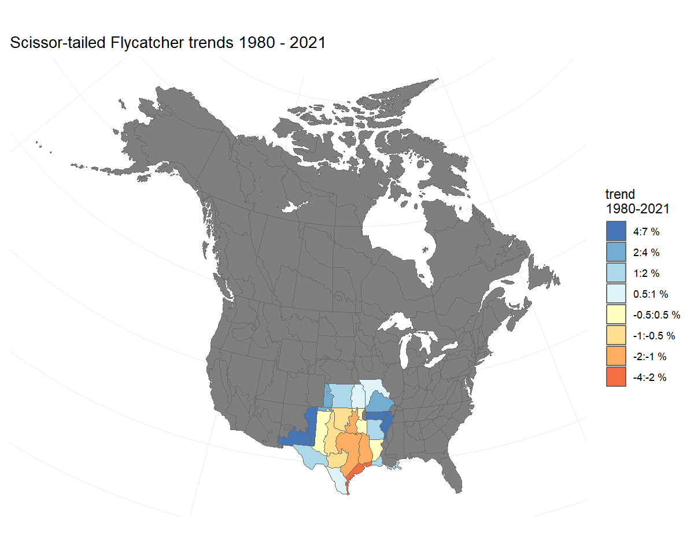
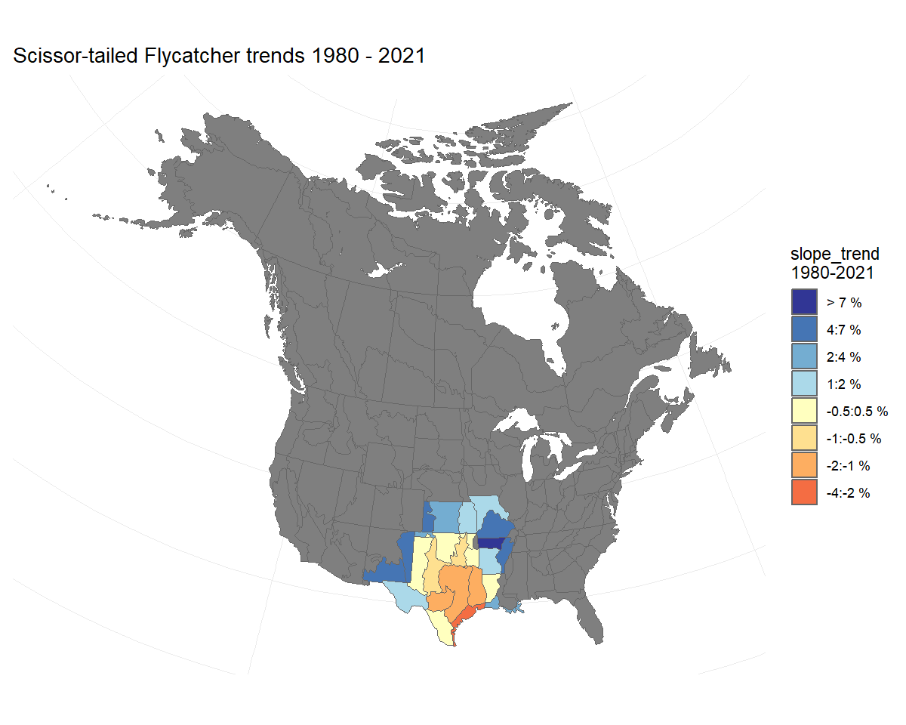
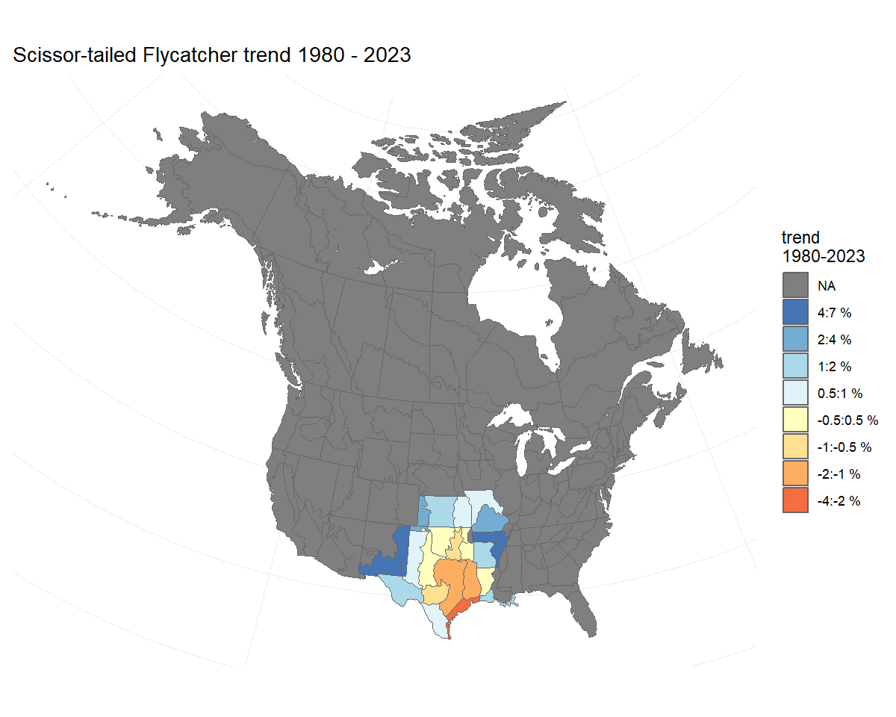

```r
  library(bbsBayes2)
#> Warning: package 'bbsBayes2' was built under R version 4.3.1
  library(dplyr)
  library(ggplot2)
  library(sf)
  library(patchwork)
  library(bayesplot) #to visually check convergence
#> Warning: package 'bayesplot' was built under R version 4.3.1
```

# Some more advanced options

For most of these examples, we will be using a series of saved model outputs. These model outputs can be downloaded from this [Google Drive](https://drive.google.com/drive/folders/1EMPqmRYjcw7aQ9rPfFoGFtgI0ELHY4Ga?usp=sharing). In the example code here, we have unzipped these saved model outputs and stored the *.rds* files in a local sub-directory called *output*.

## Posterior Predictive Checks

Posterior predictive checks are graphical comparisons of the model-based predictions of data and the observed data. They are best done in R, after fitting the model.
It is certainly possible to modify the Stan code to include posterior
predictions of the individual BBS counts. However, using Stan to
generate these predicted counts will almost double the size of the saved
model object.

To generate the posterior distributions of predicted
counts, you will need to extract the posterior samples of the parameter
`E` in the bbsBayes2 models (these represent the expected values on the log-scale). Also, if the model used the negative
binomial error distribution, then you will also need to extract the
posterior samples for the parameter `phi` (the inverse negative binomial
dispersion parameter). In the [Stan negative binomial
distribution](https://mc-stan.org/docs/functions-reference/neg-binom-2-log.html),
$\phi$ is the same parameter as `size` in `base::rnbinom()`, with
arguments `mu = exp(E), size = phi`. Here's an example, using the fitted
model object for the Scissor-tailed Flycatcher data fit to the `gamye` model
with the 'spatial' variant, and the using the `bbs_usgs` stratification.


```r
STFL_gamye_spatial <- readRDS("output/4430_gamye_spatial.rds")

# tibble with one row for each posterior draw and one column for each parameter (i.e., each count)
E <- posterior::as_draws_df(STFL_gamye_spatial$model_fit) %>%
  select(matches("^E([[:punct:]])"),
         .draw)
#> Warning: Dropping 'draws_df' class as required metadata was removed.
# tibble with 1 column for phi and one row for each posterior draw
phi <- posterior::as_draws_df(STFL_gamye_spatial$model_fit)%>%
  select(phi,
         .draw)
#> Warning: Dropping 'draws_df' class as required metadata was removed.

# join tibbles by draw
E <- left_join(phi,E,
               by = ".draw")
# custom function to generate posterior predictive counts from negative binomial
pred_counts_nb <- function(e_mu,phi_i){
  n <- length(phi_i)
  x <- rnbinom(n,mu = exp(e_mu),size = phi_i)
  return(x)
}

# generate predicted negative binomial counts
y_rep <- E %>%
  mutate(across(matches("^E([[:punct:]])"),
                          ~ pred_counts_nb(.x,phi))) %>%
  select(matches("^E([[:punct:]])")) %>%
  sample_n(.,500) # take a random sample of 500 to simplify plotting

# re-formatting to support the PPC plotting below
y_rep <- posterior::as_draws_matrix(y_rep)

# graphical posterior predictive check using the
# discrete option on a cumulative distribution plot
ppc_overplot <- bayesplot::ppc_ecdf_overlay(y = STFL_gamye_spatial$raw_data$count,
                                    yrep = y_rep,
                                    discrete = TRUE)
# focusing in on the range of observed data
ppc_overplot <- ppc_overplot +
  coord_cartesian(xlim = range(STFL_gamye_spatial$raw_data$count))


print(ppc_overplot)
```


## EXAMPLE - Replicating the CWS status and trend estimates (2018 version onwards)

The CWS analysis, as of the 2018 BBS data-version, uses the gamye model.

The full script to run the CWS analysis for the 2021 BBS data version is
accessible
[here](https://github.com/AdamCSmithCWS/CWS_BBS_2021_Analyses). Although
those particular analyses were run before bbsBayes2 was released, the
basic workflow can be replicated in bbsBayes2 for a given species as
follows.


```r

species.eng = "Pacific Wren"

stratified_data <- stratify(by = "bbs_cws",species=species.eng) #same stratification as USGS but with BCR7 as one stratum and PEI and Nova Scotia combined into one stratum

# to be included a stratum must have at least 3 routes on which the species has been observed
# and at least one of those routes must have at least 2 years of observations
d<- prepare_data(strata_data = stratified_data,
                 min_n_routes = 3,
                 min_max_route_years = 2)

m<-prepare_model(
  prepared_data = d,
  model="gamye",
  model_variant="hier", # non-spatial version used in 2021
  use_pois = FALSE #negative binomial error distribution
)

mod_cws <- run_model( model_data = m,
                  refresh=500,
                      iter_sampling = 1000,
                      iter_warmup = 1000,
                     chains = 3,
                     parallel_chains = 3)
```

## EXAMPLE - Similar analyses to the USGS status and trend estimates 2021 data version

> This example is approximate. The USGS analysis does NOT use the
> bbsBayes2 package, nor have the analysts at the USGS confirmed that
> this example would replicate their analyses.

The USGS analyses for 2021 uses one of two different models (either
slope or first-difference) and with one of two different error
distributions (Poisson with either heavy-tailed overdispersion or
normally distributed overdispersion) (see, [Link et al.
2017](https://doi.org/10.1650/CONDOR-17-1.1) and [Link et al.
2020](https://doi.org/10.1002/eap.2137) for more details).

Here we provide data preparation and model options to approximate the
2021 USGS bbs analyses for a species that uses the heavy-tailed Poisson
error distribution and the first-difference model (more on the error distributions below).


```r

species.eng = "Pacific Wren"
stratified_data <- stratify(by = "bbs_usgs",species=species.eng)
#BCR by province/state/territory intersections

d <- prepare_data(strata_data = stratified_data,
                  min_n_routes = 3,
                  min_max_route_years = 1) #slight difference in minimum data cut-offs

m<-prepare_model(prepared_data = d,
  model="first_diff",
  model_variant = "nonhier", #no sharing of information among strata on abundance or trends
  use_pois = TRUE, # overdispersed, Poisson distribution
  heavy_tailed = TRUE, #heavy-tailed (t-distribution) to model extra-Poisson dispersion
 calculate_nu = TRUE     # estimated the df parameter for the heavy-tailed t-distribution
)

# MCMC settings for the usgs analyses are not published, nor would they be relevant here
# because the official analyses use JAGS and Gibbs Sampling and not Stan's HMC algorithm
# mod <- run_model(model_data = m,
#                  ...)

```

## Advanced options and customized models

## Alternate error distributions

Error distributions in the bbsBayes2 models can be accessed using a
combination of three arguments in the `?prepare_model()` function.

### Poisson vs negative binomial

For all of the models, the BBS counts on a given route and year can be
modeled using either an over-dispersed Poisson distribution or a
negative binomial distribution. This selection is controlled using the
`use_pois` argument. The negative binomial is the default
`use_pois = FALSE`, because it greatly reduces memory requirements and
the size of the object created using `run_model()`. If using the
negative binomial distribution, no other arguments need to be set.

If a user wishes to use the over-dispersed Poisson distribution to model
the error distribution of BBS counts, then set
`prepare_model(..., use_pois = TRUE)`. This approach generates a
count-level random effect to account for extra-Poisson variance,
following the approaches used in most of the official BBS analyses.
These count-level parameter estimates are the reason for the increase in
memory requirements and object size when fitting the model (i.e., they
require monitoring an additional parameter for every observation in the
dataset). If using the Poisson option, there are two additional
arguments that the user can select to control some of the specifics of
the over-dispersion. The first argument allows the user to select
between a normal distribution (`heavy_tailed = FALSE`) to model the
count-level random effects or the default heavier-tailed t-distribution
(`heavy_tailed = TRUE`). Finally, if the heavy-tailed t-distribution is
selected, then the user can choose to either estimate the degrees of
freedom for the t-distribution `calculate_nu = TRUE` letting the model
estimate the heaviness of the tails, or to have the t-distribution fixed
at 3 `calculate_nu = FALSE` implying very heavy-tails relative to the
normal. We have used the `calculate_nu = FALSE` as the default because
for many species estimating the degrees of freedom greatly increases the
model run-times.

## Alternate Measures of Trend and Population Change

The `generate_trends()` function produces much more than just the trend
estimates. This section explains one alternate measure of trend (i.e., *slope trends*) and measures of population change, such as the percent change in the population between the first and last years of the trend and the probability that a population has decreased by a certain amount.


```r
# set of indices for demonstrating trend options
m <- readRDS("output/4430_first_diff_spatial.rds") # Scissor-tailed Flycatcher
i <- generate_indices(m)
#> Processing region continent
#> Processing region stratum
```
### The default trend estimate

The default trend calculation is an interval-specific estimate of the
geometric mean annual change in the population.
$Trend = (\frac {n[min-year]}{n[max-year]})^{(1/(max-year-min-year))}$
We refer to these as *end-point trends*. They rely on a comparison of
the annual indices in the first and last years of the trend period to
quantify the mean rate of population change. However, it ignores the
pattern of change between the two end-points.


```r
t <- generate_trends(i,
                     slope = TRUE,
                     min_year = 1980) #trends from 1980-2021
t_map <- plot_map(t)
print(t_map)
```



### Slope-based Trends

bbsBayes2 includes an alternate trend estimate that can be applied to any of the
models to dampen the influence of the start and end years on the estimated trend.
These slope-based trends are calculated
by fitting a log-linear slope to the series of all annual indices
between the two end-points (e.g., all 11 years in a 10-year trend from
2011-2021). We refer to these trends as *slope-based trends*. The slope
of this line is transformed into an average annual percent change
across the time-period of interest. F\This slope-based trend may be useful for estimates derived
from a model and or a species with strong annual fluctuations when the
user wishes to account for the overall pattern of the annual
fluctuations in the trend estimate without letting the trend be completely determined by the annual fluctuations in the particular end-point years. These slope trends can be
added to the trend output table by setting the `slope = TRUE` argument
in `generate_trends()`. The default *end-point trends* are still
calculated, but additional columns are added that include the alternate
estimates. NOTE: the `plot_map()` function can map slope trends as well
with the same `slope = TRUE` argument.


```r

t_map_slope <- plot_map(t,
                        slope = TRUE)
print(t_map_slope)
```



### Percent Change and probability of change

The `generate_trends()` function produces estimates of the overall
percent-change in the population between the first and last years of the
trend-period, by default. This calculation may be easier to interpret than an
average annual rate of change. These percent change estimates have
associated uncertainty bounds, and so can be helpful for deriving
statements such as "between 2008 and 2018, the population has declined
by 20 percent, but that estimate is relatively uncertain and the true
decline may be as little as 2 percent or as much as 50 percent"


```r
t <- generate_trends(i)

t$trends[1,c("region","percent_change","percent_change_q_0.95")]
#> # A tibble: 1 × 3
#>   region    percent_change percent_change_q_0.95
#>   <chr>              <dbl>                 <dbl>
#> 1 continent          -46.8                 -39.8
```

In addition, the function can optionally calculate the posterior
conditional probability that a population has changed more or less than some user-defined threshold(s), using the `prob_decrease` and `prob_increase` arguments. The calculate the conditional probability a species population has decreased, set the argument `prob_decrease = 0`. Similarly if you want to know the conditaional probability that the population has decreased by more than 50% use `prob_decrease = 50`.


```r
t <- generate_trends(i,
                     prob_decrease = c(0,50)) # two thresholds

t$trends[1,c("region","prob_decrease_0_percent","prob_decrease_50_percent")]
#> # A tibble: 1 × 3
#>   region    prob_decrease_0_percent prob_decrease_50_percent
#>   <chr>                       <dbl>                    <dbl>
#> 1 continent                       1                    0.208
```

These values can be useful for deriving statements such as "the
first-difference spatial model suggests that it is extremely likely that
the Scissor-tailed Flycatcher population monitored by the BBS has
decreased between 1966 and 2021 (prob_decrease_0_percent \> 0.999), and
that there is an approximate 21% probability that the species has
decreased by at least 50% in that same time period
(prob_decrease_50-percent = 0.20775)".

## Custom regional summaries

Yes, you can calculate the trend and trajectories for custom
combinations of strata, such as the trends for some largely arbitrary
groupings of Bird Conservation Regions based approximately on the
northern and southern portions of the Barn Swallow's range.

First we load a [fitted model object for Barn Swallow](https://drive.google.com/file/d/1hlJ9rljDSGdkV4P_-k07wBSyWyKOy-hm/view?usp=drive_link).


```r

BARS <- readRDS("output/Barn_Swallow_first_diff_spatial.rds")
```

Then we extract the strata list from the fitted model object and define
a new column *north_south* that identifies which strata belong in each
of our new composite regions (*North* or *South*)


```r

comp_regions <- BARS$meta_strata %>%
  mutate(north_south = ifelse(bcr < 15, "North","South"))

i_BARS <- generate_indices(BARS,
                           regions_index = comp_regions, # new data frame to identify which strata are in composite regions
                           regions = "north_south") # column in data frame with composite region names
#> Processing region north_south

trajectories <- plot_indices(i_BARS)
print(trajectories[["North"]] / trajectories[["South"]])
```



## Exporting and modifying the Stan models

You can easily export any of the bbsBayes2 models to a text file.


```r

copy_model_file(model="gamye",
                model_variant = "hier",
                dir = getwd()) #writes the stan file to working directory

```

Then, you can modify the model text (e.g., try a different prior) and
run the modified model. To modify the model, you can open the saved
.stan file (RStudio has good support for Stan model syntax), make
modifications to the model, then re-save the file.

If you are not familiar with writing Stan code, you will want to be very careful modifying the bbsBayes2 models; The model files are relatively long and include some complicated components (conditional statements, transformed parameters and transformed data). However, there are excellent [online sources for getting comfortable with working in Stan](https://mc-stan.org/users/documentation/tutorials), and this package exists in a large part to allow users to explore, modify, elaborate, and understand these models.
So be brave, be careful, be open, and contact the package authors if you get stuck. We promise to be friendly and to do our best to help.

After modifying the .stan file, you can use bbsBayes2 to fit the data to
the modified model using the `model_file` argment in `prepare_model()`.


```r

prep<- prepare_model(...,
        model_file="gamye_hier_bbs_CV_COPY.stan",
         ...
          )

mod<-run_model(prep,...)
```

## Comparing Models

### Calculating the approximate loo-cv

The models include an option to calculate the point-wise log-likelihood
of each count given the model and parameter estimates. If used, this
option allows for the use of the `cmdstanr::loo()` function to calculate
approximate leave-one-out cross-validation statistics. Some caveats and
warnings:

1.  Using the approximate loo-cv to assess models and/or compare
    alternate models requires some strong assumptions that the user
    should be very aware of. Importantly, leave one out
    cross-validation assumes that individual observations are
    conditionally independent. Given the rich nested dependencies of the
    BBS data (non-independence of observations within observers, routes,
    strata, and years), this assumption may be questionable.

2.  Observation-level random effects (i.e., if `use_pois = TRUE`) are
    often extremely flexible and result in very poor diagnostics for
    approximate loo calculations.

3.  Adding an observation-level log_likelihood calculation greatly
    increases the memory requirements and size of the saved model
    objects.

Here's an example using Baird's Sparrow, a species with a restricted range and so the models fit reasonably quickly (approximately 1-hour) and adding the count-level log_lik parameter doesn't add too much to the file size. Here we compare the approximate leave-one-out cross-validation estimate between the 'gamye' and the 'first_diff' models.


```r

s <- stratify("latlong","Baird's Sparrow")
p <- prepare_data(s, min_n_routes = 1)
map<-load_map(stratify_by = "latlong")
sp<-prepare_spatial(p,map)

# first difference
mp_first_diff <- prepare_model(sp, model = "first_diff",model_variant = "spatial",
                               calculate_log_lik = TRUE)
m_first_diff <- run_model(mp_first_diff,
                          iter_sampling = 2000)
saveRDS(m_first_diff,"output/BASP_latlong_first_diff_spatial.rds")

# gamye
mp_gamye <- prepare_model(sp, model = "gamye",model_variant = "spatial",
                          calculate_log_lik = TRUE)
m_gamye <- run_model(mp_gamye,
                     iter_sampling = 2000)
saveRDS(m_gamye,"output/BASP_latlong_gamye_spatial.rds")

```


```r

m_gamye <- readRDS("output/BASP_latlong_gamye_spatial.rds")

m_first_diff <- readRDS("output/BASP_latlong_first_diff_spatial.rds")

# install.packages("loo") # you may need to install this package
loo_gamye <- m_gamye$model_fit$loo()# loo calculations using the functions built into the cmdstanr model-fit object
#> Warning: Some Pareto k diagnostic values are too high. See help('pareto-k-diagnostic') for details.
loo_first_diff <- m_first_diff$model_fit$loo()# loo calculations using the functions built into the cmdstanr model-fit object
#> Warning: Some Pareto k diagnostic values are too high. See help('pareto-k-diagnostic') for details.


loo_gamye
#> 
#> Computed from 8000 by 4368 log-likelihood matrix
#> 
#>          Estimate    SE
#> elpd_loo  -7095.6 106.3
#> p_loo       682.1  26.7
#> looic     14191.2 212.5
#> ------
#> Monte Carlo SE of elpd_loo is NA.
#> 
#> Pareto k diagnostic values:
#>                          Count Pct.    Min. n_eff
#> (-Inf, 0.5]   (good)     3936  90.1%   576       
#>  (0.5, 0.7]   (ok)        298   6.8%   186       
#>    (0.7, 1]   (bad)       112   2.6%   14        
#>    (1, Inf)   (very bad)   22   0.5%   5         
#> See help('pareto-k-diagnostic') for details.
loo_first_diff
#> 
#> Computed from 8000 by 4368 log-likelihood matrix
#> 
#>          Estimate    SE
#> elpd_loo  -6976.8 105.3
#> p_loo       778.8  26.2
#> looic     13953.7 210.7
#> ------
#> Monte Carlo SE of elpd_loo is NA.
#> 
#> Pareto k diagnostic values:
#>                          Count Pct.    Min. n_eff
#> (-Inf, 0.5]   (good)     3913  89.6%   509       
#>  (0.5, 0.7]   (ok)        307   7.0%   177       
#>    (0.7, 1]   (bad)       130   3.0%   13        
#>    (1, Inf)   (very bad)   18   0.4%   4         
#> See help('pareto-k-diagnostic') for details.
```

This approximation of leave-one-out crossvalidation suggests that the first-difference model may slightly out-perform the gamye model for this species and time-period. However, the uncertainty in the calculation of loo is relatively wide and the estimates for the two models are only about 1 SD apart.
In addition, the 'pareto-k' warnings suggest that the approximation may not be accurate for some of the BBS counts.

### K-fold Cross-Validation

Bayesian model assessment is an open area of research. We have included
some experimental features to allow for one approach to
cross-validation. These features are experimental and so users should be
cautious and be confident that they understand what they're doing. For
cross fold validation, the `prepare_model()` function can be used to
define which observations are part of a test set and which are part of a
training set.

To use the method implemented by bbsBayes2, we'll specify `calculate_cv`
as `TRUE` during the `prepare_model()` step. By default, this will
prepare 10 test sets (K-folds, `cv_k`) using `obs_n` as the blocking
variable (`cv_fold_groups`) and omitting groups with only single
observations (`cv_omit_singles`). The blocking respects the hierarchical structure of the BBS data. It ensures that all of the routes, observers and strata are retained in each of the training folds, and so that each of the k-fold model fits can generate predictions for all of the routes, observers, and strata in the test fold.
Conceptually, this default blocking approach results in out-of-sample predictions that represent all counts for a given observer (a random sample of observers), other than that observer's first year of observations on each route they have ever contributed to. Rephrased, the cross-validation compares the ability of the model (or the two models being compared) to accurately predict the future observations of each observer.
The 'cv_omit_singles' argument by default excludes the observers that have only every contributed a single BBS observation from the cross-validation exercise (they are never included in the test fold)

More details and examples coming.


```r
#a model of counts from 2009-2019
md <- stratify(by = "bbs_usgs", species = "Hepatic Tanager", quiet = TRUE) %>%
  prepare_data(min_year= 2009, max_year = 2019) %>%
  prepare_model("first_diff", calculate_cv = TRUE, cv_k = 5) # splits into 5-folds
```

Now our model data (`md`) has a list item called `folds` which contains
the fold groups assigned to each observation. To use this, you'll need
to loop your model and specify the `k` iteration.


```r
#a quick model with too few iterations, not saving the example model
for(k in 1:5) {
  m <- run_model(md, k = k, chains = 2, iter_warmup = 500, iter_sampling = 100)
  save_model_run(m,path = paste0("output/first_diff_cv_",k,".rds"))
}
```


