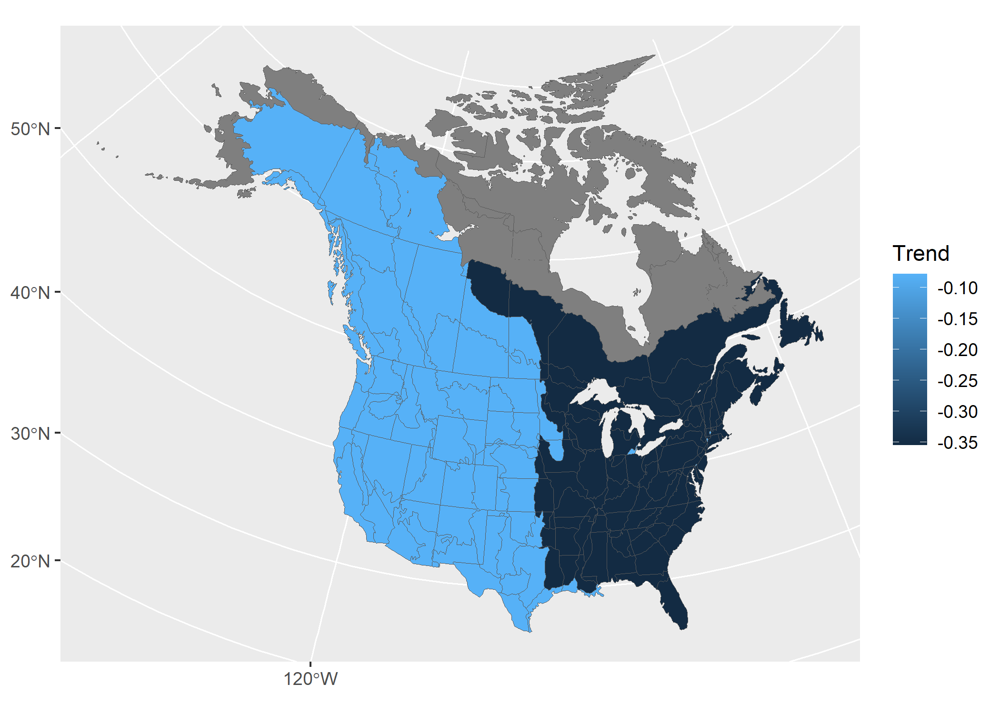

```{r, include = FALSE}
knitr::opts_chunk$set(
  collapse = TRUE,
  comment = "#>",
  # For pre-compiling and pkgdown (relative to pkg home)
  fig.path = "vignettes/articles/figures/advanced_",
  dpi = 150
)


```

```{r, message = FALSE}
  library(bbsBayes2)
  library(dplyr)
  library(ggplot2)
  library(sf)
  library(patchwork)
  library(bayesplot) #to visually check convergence

```

# Some more advanced options

For most of these examples, we will load

## Posterior Predictive Checks

Posterior predictive checks are best done in R, after fitting the model. It is certainly possible to modify the Stan code to include posterior predictions of the individual BBS counts. However, using Stan to generate these predicted counts will almost double the size of the saved model object. 
To generate the posterior distributions of predicted counts, you will need to extract the posterior samples of the parameter `E` in the bbsBayes2 models. Also, if you have used the negative binomial error distribution, then you will also need to extract the posterior samples for the parameter `phi` (the inverse negative binomial dispersion parameter). In the [Stan negative binomial distribution](https://mc-stan.org/docs/functions-reference/neg-binom-2-log.html), $\phi$ is the same parameter as `size` in `base::rnbinom()`, with arguments `mu = exp(E), size = phi`. 
Here's an example, using the fitted model object for the Hepatic Tanager data fit to the `first_dif` model using the `latlong` stratification. 

```{r}
STFL_gamye_spatial <- readRDS("output/4430_gamye_spatial.rds")

# tibble with one row for each posterior draw and one column for each parameter (i.e., each count)
E <- posterior::as_draws_df(STFL_gamye_spatial$model_fit) %>% 
  select(matches("^E([[:punct:]])"),
         .draw) 
# tibble with 1 column for phi and one row for each posterior draw
phi <- posterior::as_draws_df(STFL_gamye_spatial$model_fit)%>% 
  select(phi,
         .draw)

# join tibbles by draw
E <- left_join(phi,E,
               by = ".draw")
# custom function to generate posterior predictive counts from negative binomial
pred_counts_nb <- function(e_mu,phi_i){
  n <- length(phi_i)
  x <- rnbinom(n,mu = exp(e_mu),size = phi_i)
  return(x)
}

y_rep <- E %>% 
  mutate(across(matches("^E([[:punct:]])"),
                          ~ pred_counts_nb(.x,phi))) %>% 
  select(matches("^E([[:punct:]])")) %>% 
  sample_n(.,500) 

y_rep <- posterior::as_draws_matrix(y_rep)

ppc_overplot <- bayesplot::ppc_ecdf_overlay(y = STFL_gamye_spatial$raw_data$count,
                                    yrep = y_rep)
ppc_overplot <- ppc_overplot +
  coord_cartesian(xlim = range(STFL_gamye_spatial$raw_data$count))

print(ppc_overplot)


```


## EXAMPLE - Replicating the CWS status and trend estimates (2018 version onwards)

The CWS analysis, as of the 2018 BBS data-version, uses the gamye model. 

The full script to run the CWS analysis for the 2021 BBS data version is accessible [here](https://github.com/AdamCSmithCWS/CWS_BBS_2021_Analyses).
Although these particular analyses were run before bbsBayes2 was released, the basic workflow can be replicated in bbsBayes2 for a given species as follows.


```{r, eval=FALSE}

species.eng = "Pacific Wren"

stratified_data <- stratify(by = "bbs_cws",species=species.eng) #same as USGS but with BCR7 as one stratum and PEI and Nova Scotia combined into one stratum

# to be included a stratum must have at least 3 routes on which the species has been observed
# and at least one of those routes must have at least 2 years of observations
d<- prepare_data(strata_data = stratified_data,
                 min_n_routes = 3,
                 min_max_route_years = 2)

m<-prepare_model(
  prepared_data = d,
  model="gamye",
  model_variant="hier", # non-spatial version used in 2021
  use_pois = FALSE #negative binomial error distribution
)

mod_cws <- run_model( model_data = m,
                  refresh=500,
                      iter_sampling = 1000,
                      iter_warmup = 1000,
                     chains = 3,
                     parallel_chains = 3)
```

## EXAMPLE - Similar analyses to the USGS status and trend estimates 2021 data version

The USGS analysis is not run using the bbsBayes2 package, nor have the analysts behind the USGS analyses confirmed that this example will replicate their analyses. Readers should be aware that this this example may not replicate the published version. 

The USGS analyses, from 2018, uses one of two different models (either slope or first-difference) and with one of two different error distributions (Poisson with either heavy-tailed overdispersion or normally distributed overdispersion) (see, [Link et al. 2017](https://doi.org/10.1650/CONDOR-17-1.1) and [Link et al. 2020](https://doi.org/10.1002/eap.2137) for more details). 

Here we provide data preparation and model options to approximate the 2021 USGS bbs analyses for a species that uses the heavy-tailed Poisson error distribution and the first-difference model. 

```{r, eval=FALSE}

species.eng = "Pacific Wren"
stratified_data <- stratify(by = "bbs_usgs",species=species.eng) 
#BCR by province/state/territory intersections

d <- prepare_data(strata_data = stratified_data,
                  min_n_routes = 3,
                  min_max_route_years = 1) #slight difference in minimum data cut-offs

m<-prepare_model(prepared_data = d,
  model="first_diff",
  model_variant = "nonhier", #no sharing of information among strata on abundance or trends
  use_pois = TRUE, # overdispersed, Poisson distribution
  heavy_tailed = TRUE, #heavy-tailed (t-distribution) to model extra-Poisson dispersion
 calculate_nu = TRUE     # estimated the df parameter for the heavy-tailed t-distribution
)

# MCMC settings for the usgs analyses are not published, nor would they be relevant here
# because the official analyses use JAGS and Gibbs Sampling and not Stan's HMC algorithm
# mod <- run_model(model_data = m,
#                  ...) 

```

## Advanced options and customized models


## Alternate error distributions

Error distributions in the bbsBayes2 models can be accessed using a combination of three arguments in the `?prepare_model()` function. 

### Poisson vs negative binomial

For all of the models, the BBS counts on a given route and year can be modeled using either an over-dispersed Poisson distribution or a negative binomial distribution. This selection is controlled using the `use_pois` argument. The negative binomial is the default `use_pois = FALSE`, because it greatly reduces memory requirements and the size of the object created using `run_model()`. If using the negative binomial distribution, no other arguments need to be set.

If a user wishes to use the over-dispersed Poisson distribution to model the error distribution of BBS counts, then set `prepare_model(..., use_pois = TRUE)`. This approach generates a count-level random effect to account for extra-Poisson variance, following the approaches used in most of the official BBS analyses. These count-level parameter estimates are the reason for the increase in memory requirements and object size when fitting the model (i.e., they require monitoring an additional parameter for every observation in the dataset). If using the Poisson option, there are two additional arguments that the user can select to control some of the specifics of the over-dispersion. The first argument allows the user to select between a normal distribution (`heavy_tailed = FALSE`) to model the count-level random effects or the default heavier-tailed t-distribution (`heavy_tailed = TRUE`). Finally, if the heavy-tailed t-distribution is selected, then the user can choose to either estimate the degrees of freedom for the t-distribution `calculate_nu = TRUE` letting the model estimate the heaviness of the tails, or to have the t-distribution fixed at 3 `calculate_nu = FALSE` implying very heavy-tails relative to the normal. We have used the `calculate_nu = FALSE` as the default because for many species estimating the degrees of freedom greatly increases the model run-times. 


## Alternate Measures of Trend and Population Change

The `generate_trends()` function produces much more than just the trend estimates.

### Slope Trends

The default trend calculation is an interval-specific estimate of the geometric mean annual change in the population. $Trend = (\frac {n[min_year]}{n[max_year]})^{(1/(max_year-min_year))}$ We refer to these as *end-point trends*. They rely on a comparison of the annual indices in the first and last years of the trend period to quantify the mean rate of population change. However, it ignores the pattern of change between the two end-points. The gamye model partly accounts for the influence of the annual fluctuations in the min_year and max_year when generating trends from `generate_indices(alternate_n = "n_smooth")`, however the package also includes alternate trend estimates that can be applied to any of the models to dampen the influence of the start and end years of trend. 

The user can choose an alternative estimate of change that is calculated by fitting a log-linear slope to the series of all annual indices between the two end-points (e.g., all 11 years in a 10-year trend from 2011-2021). We refer to these trends as *slope-based trends*. The slope of this line could be expressed as an average annual percent change across the time-period of interest. If working with estimates derived from a model and or a species with strong annual fluctuations that the user wishes to account for the overall pattern of the annual fluctuations in the trend estimate, this slope-based trend may be a more comprehensive measure of the average population change, that is less dependent on the particular end-point years. These slope trends can be added to the trend output table by setting the `slope = TRUE` argument in `generate_trends()`. The default *end-point trends* are still calculated, but additional columns are added that include the alternate estimates. NOTE: the `plot_map()` function can map slope trends as well with the same `slope = TRUE` argument.

Here we create a model for a 10 year period, using the minimum number of iterations. We recommend using the defaults, 4 chains, 1000 iterations for both warmup and sampling, and assessing convergence.

``` {r}

strat<- stratify(by="bbs_usgs",species = "Hepatic Tanager")
p_dat<-prepare_data(strat, min_year=2009, max_year=2019)
p_mod<-  prepare_model(p_dat, model = "first_diff",use_pois = TRUE)

first_mod<- run_model(p_mod, chains=2,iter_warmup = 500,iter_sampling = 100,save_model = FALSE)

firstdiff_ind <- generate_indices(model_output = first_mod,
                                regions = c("continent","stratum"))
                                
fd_slope_trends_08_18 <- generate_trends(indices = firstdiff_ind,
                                         min_year = 2010,
                                         max_year = 2020,
                                         slope = TRUE)
plot_map(fd_slope_trends_08_18,
         slope = TRUE)
```


### Percent Change and probability of change

The `generate_trends()` function also produces estimates of the overall percent-change in the population between the first and last years of the trend-period. This calculation is often easier to interpret than an average annual rate of change. These percent change estimates have associated uncertainty bounds, and so can be helpful for deriving statements such as "between 2008 and 2018, the population has declined by 20 percent, but that estimate is relatively uncertain and the true decline may be as little as 2 percent or as much as 50 percent"

In addition, the function can optionally calculate the posterior conditional probability that a population has changed by at least a certain amount, using the `prob_decrease` and `prob_increase` arguments. These values can be useful for deriving statements such as "our model suggests that there is a 95% probability that the species has increased (i.e., \> 0% increase) and a 45 percent probability that the species has increased more than 2-fold (i.e., \> 100% increase)"

``` {.r}

fd_slope_trends_prob <- generate_trends(indices = firstdiff_ind,
                                             min_year = 2008,
                                             max_year = 2018,
                                             slope = TRUE,
                                             prob_increase = c(0,100))
                                             
plot_map(fd_slope_trends_prob)                                                       
```
< img src = "figures/prob_change-1.png" />

## Custom regional summaries

Yes, you can calculate the trend and trajectories for custom combinations of strata, such as the trends for Eastern and Western populations of the Barn Swallow.

Download the Barn Swallow GAMYE spatial model: <https://github.com/L-Daly/bbsbae/releases/tag/trial> click BARS_spatial_gamye.zip.

``` {.r}
#using our downloaded Barn Swallow Gamye example
library(readr)

mod<- read_rds(unzip(
  "BARS_spatial_gamye.zip",
  "BARS_spatial_gamye.rds"))

    
    #get our stratification
stratification<-stratify(by="bbs_cws","Barn Swallow")
    
```

Assuming the above setup has been run. The user could then generate population trajectories using a customized grouping of the original strata.

First extract a dataframe that defines the original strata used in the analysis.

``` {.r}

st_comp_regions <- as.data.frame(stratification$meta_strata)
```

The add a column to the dataframe that groups the original strata into the desired custom regions.

``` {.r}

#regions with barn swallows
no_barn<- st_comp_regions$bcr[!(st_comp_regions$bcr %in% c(unique(mod$meta_strata$bcr)))]

st_comp_regions$East_West <- ifelse(st_comp_regions$bcr %in% c(7,8,12:14,22:31),"East","West")

#remove regions without Barn Swallows
st_comp_regions$East_West <- ifelse(st_comp_regions$bcr %in% c(no_barn),NA,st_comp_regions$East_West)

```

st_comp_regions can now be used as the dataframe input to the argument alt_region_names in `generate_indices()`, with "East_West" as the value for the argument regions. The relevant trends can be calculated using just the `generate_trends()` function.

``` {.r}

ew_indices<-generate_indices(model_output = mod,
                             regions = "East_West",
                             regions_index = st_comp_regions)
plot_indices(ew_indices)
east_west_trends <- generate_trends(indices = ew_indices)


mmm<-load_map(stratify_by = "bbs_cws")
#eastern strata

east<-c(st_comp_regions[st_comp_regions$East_West=="East",][,"strata_name"])

#plot trends by east_west
mmm$ew2<-ifelse(mmm$strata_name %in% c(east),"East","West")


#put the east and west trends into map
e_trend<-as.numeric(filter(east_west_trends$trends,region=="East")[,"trend"])
w_trend<-as.numeric(filter(east_west_trends$trends,region=="West")[,"trend"])

mmm$Trend<-ifelse(mmm$ew2 %in% "East",e_trend,w_trend)
#remove trends when not in barn swallow range
mmm$Trend<-ifelse(mmm$bcr %in% c(no_barn),NA,mmm$Trend)

#plot
ggplot()+
  geom_sf(data=mmm,aes(fill=Trend))
  
```

 
## Exporting the Stan model

You can easily export any of the bbsBayes2 models to a text file.

``` {.r}

copy_model_file(
  model="gamye",model_variant = "hier",
  dir=tempdir()
)

unlink(file.path(tempdir(), "gamye_hier_bbs_CV_COPY.stan"))
```

Then, you can modify the model text (e.g., try a different prior) and run the modified model

``` {.r}

prep<- prepare_model(...,
        model_file="gamye_hier_bbs_CV_COPY.stan",
         ...
          )
          
mod<-run_model(prep,...)          
```

Details coming soon...

## Modifying the Stan model and data

You can even export the bbsBayes2 model as text, and modify it to add in covariates. For example a GAM smooth to estimate the effect of the day of year on the observations, or an annual weather covariate, or... Then add the relevant covariate data to the stan model object, and you're off! We'll add some more details and examples soon.

## Comparing Models


### Cross-fold Validation

For cross fold validation, you'll need to define which observations are part 
of a test set and which are part of a training set.

To use the method implemented by bbsBayes2, we'll specify `calculate_cv` as
`TRUE` during the `prepare_model()` step. By default, this will prepare 10 test
sets (K-folds, `cv_k`) using `obs_n` as the grouping variable (`cv_fold_groups`)
and omitting groups with only single observations (`cv_omit_singles`).

MORE DETAILS ON HOW CHOSEN

```{r}
#a model of counts from 2009-2019
md <- stratify(by = "bbs_usgs", species = "Hepatic Tanager", quiet = TRUE) %>%
  prepare_data(min_year= 2009, max_year = 2019) %>%
  prepare_model("first_diff", calculate_cv = TRUE, cv_k = 3) 
```

Now our model data (`md`) has a list item called `folds` which contains the 
fold groups assigned to each observation. To use this, you'll need to loop your
model and specify the `k` iteration.

```{r}
#a quick model with too few iterations, not saving the example model
for(k in 1:3) {
  run_model(md, k = k, chains = 2, iter_warmup = 500, iter_sampling = 100,
            save_model=FALSE)
}
```

AND NOW...

### Customizing initial parameter values

To customize the initial parameter values you can create the model data with
`prepare_model()` and then either edit or overwrite the `init_values` item in
the list.

Here we create a relatively fast model with the minimum number of iterations, for 10 years, the minimum period of time that trends can be reasonably created.

```{r}
#Hepatic Tanager model for 2009-2019
md <- stratify(by = "bbs_usgs", species="Hepatic Tanager", quiet = TRUE) %>%
  prepare_data(min_year = 2009,max_year = 2019) %>%
  prepare_model(model = "first_diff", model_variant = "hier")
```

Make some changes to the `init_values` and pass the `model_data` to
`run_model()`.

```{r}
md[["init_values"]][["sdnoise"]] <- 0.5

m <- run_model(md, iter_warmup = 500, iter_sampling = 100, chains = 2,save_model=FALSE)
```

Note that you can supply different init values for each chain. If you supply one
set of init values (which is what `prepare_model()` outputs), `run_model()`, 
will duplicate them for each chain for you. If you supply a list of init values
such that the length is the same as the number of chains, your input will be 
used as is.

### Customize Stan Model File

Copy model file (and modify by hand in text editor)
```{r}
new_model <- copy_model_file("first_diff", "hier", tempdir())
new_model
```

Then give the file path of this new file to `prepare_model()`
```{r}
model_data <- stratify(by = "bbs_usgs", species="Hepatic Tanager", quiet = TRUE) %>%
  prepare_data(min_year = 2009,max_year = 2019) %>%
  prepare_model(model = "first_diff", model_variant = "hier",
                model_file = new_model)
```


```{r, include = FALSE}
unlink(list.files(pattern = "^BBS_STAN_(\\w|\\d|-)+.(csv|rds)"))
```

