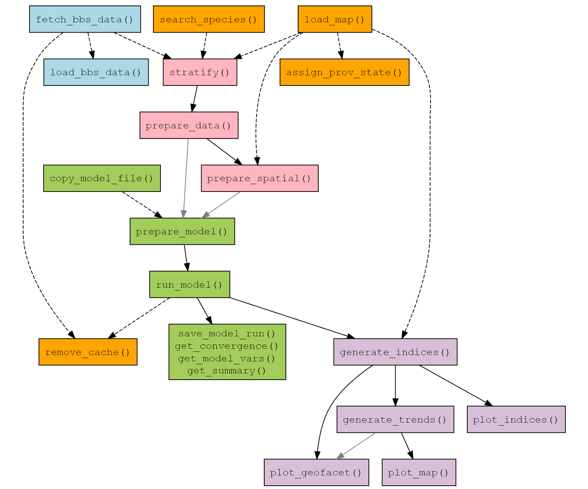

``` r
library(bbsBayes2)
library(tidyverse)
```

# Welcome!

bbsBayes2 is the successor to
[bbsBayes](https://github.com/bbsBayes/bbsBayes), with a major shift in
functionality. The MCMC backend is now *Stan* instead of *JAGS*, the
workflow has been streamlined, the syntax has changed, and there are new
functions. This vignette should help you get started with the package,
and there are three others that should help explain some of the new
features, choices, and more advanced uses:

-   [Stratification vignette](./stratification.html) The stratification
    vignette explains the built-in options for spatial stratifications
    as well as the workflow required to apply a custom stratification.

-   [Models vignette](./models.html) The models vignette explains the
    four built-in models that differ in the way the temporal components
    are structured, and it also covers the built-in options for error
    distributions and the differences among the model variants (e.g.,
    `model_variant = "spatial"`).

-   [Advanced vignette](./advanced.html) The advanced vignette is
    helpful for users wanting to take the bbsBayes2 functionality
    further, including alternate calculations of population trend,
    customizing the Stan models, adding covariates, and even some
    experimental functions that allow for k-fold cross-validations and
    approximate leave-one-out calculations to compare fit and predictive
    accuracy among models.

First we'll make sure we have the right software installed, we'll fetch
the BBS survey data, and then we'll run through some example workflows.


## Install [bbsbayes2](https://github.com/bbsBayes/bbsBayes2)

If you haven't already, install bbsBayes2 from the R-Universe.


``` r
install.packages("bbsBayes2", repos = c(bbsbayes = "https://bbsbayes.r-universe.dev",
                                        CRAN = getOption("repos")))
```

Note that due to non-CRAN dependencies, bbsBayes2 is not available on CRAN and
must be installed from GitHub or the R-Universe.

## Install [cmdstanr](https://mc-stan.org/cmdstanr/)

Because bbsBayes2 uses Stan to run the Bayesian models, we need to make
sure we have cmdstanr and cmdstan both installed.

Run this in a fresh R session.


``` r
install.packages("cmdstanr", repos = c("https://mc-stan.org/r-packages/",
                                       getOption("repos")))
```

Now we should be able to use cmdstanr to install cmdstan


``` r
cmdstanr::install_cmdstan()
```

Let's check that everything went as planned, and tell cmdstanr to fix any issues.


``` r
cmdstanr::check_cmdstan_toolchain(fix = TRUE)
#> The C++ toolchain required for CmdStan is setup properly!
```

> Problems? Check out cmdstanr's vignette on [Getting
> Started](https://mc-stan.org/cmdstanr/articles/cmdstanr.html)

### Special note for Windows users

We strongly recommend that you install Linux on your Windows machine and
take advantage of `cmdstanr` functions that run `Stan` models in Linux.
This will likely cut the MCMC run-times by 30-50% for the `bbsBayes2`
models. Installing [Windows Subsystem for Linux
(WSL)](https://learn.microsoft.com/en-us/windows/wsl/install) is a small
hassle, but only needs to be done once. Follow the directions at the
above link.

Once the WSL installation is complete, re-install `cmdstan` using
`cmdstanr::install_cmdstan(overwrite = TRUE, wsl = TRUE)`. Now,
everytime you run a model using `cmdstan` (and therefore anytime you run
a model using `bbsBayes2`), it will use the Linux installation to run
Stan. It's seamless and you'll be very thankful you did it once it's
done.

## Download BBS data

Now we'll fetch the BBS data using the `fetch_bbs_data()` function.


``` r
library(bbsBayes2)
fetch_bbs_data() #
```
This will save the data to a package-specific directory on your computer. You must agree to the terms and conditions of the data usage before the download will run (type `yes` at the prompt). The message also includes the key metadata for the dataset, including the citation, acknowledgements, and the release-version (below). You only need run this function once for each annual update of the BBS database (these updates usually occur in the summer, approximately 1-year following the data collection).

> Note: Most bbsBayes2 functionality can be explored **without**
> downloading BBS data by using the included sample data. Specify
> `sample_data = TRUE` in the first `stratify()` step (see the next
> section).


There are two types of BBS data that can be
downloaded, and annual release-versions:

-   Two levels `state` and `stop` (only `state` works with bbsBayes2
    models, the `stop` option is provided to facilitate custom projects and models)
-   Annual releases `2020`, `2022`, `2023`, and '2024' more options will be added as annual releases occur).

The defaults (level `state` and the most recent release - `2024`) is almost certainly what you are looking for, Unless you have a specific reason to need a different version. The most recent release will include all of the data included in earlier releases.
However you can download all releases and specify which one you wish to
use in the `stratify()` step.

### A note about BBS release names:

The releases are named for the year in which the annual dataset was
released after going through QA-QC. So the `2022` release contains all
surveys conducted up to and including the 2021 field season.
There is no
`release = 2021`, because the BBS was cancelled during the COVID
lockdowns of spring 2020 so no data were collected and there was no updated data to release the following year.


``` r
fetch_bbs_data()                  # Default - most recent release
fetch_bbs_data(release = "2020")  # Specify a different release
```


## Workflow overview

We can visualize the bbsBayes2 workflow with this flow chart of
functions.

The functions are colour coded by category:

-   BBS Data - Blue
-   Data Prep - Pink
-   Modelling - Green
-   Exploring model trends and indices - Purple
-   General helper functions - Orange

Functions which are connected by a **solid, black** arrow, indicate that
the output of the first function is required as input to the second. For
example, the output of `stratify()` is required input for
`prepare_data()`.

Functions which are connected by a **solid, grey** arrow, indicate that
the output of the first function is *optional* input to the second. For
example, the output of `generate_trends()` is an option input for
`plot_geofacet()`.

Functions which are connected by a **dotted** arrow indicate that the
first function can be used to create input for the second, but not
necessarily directly. For example, `fetch_bbs_data()` downloads BBS data
which is used by `stratify()`, but it isn't an input. Alternatively,
`load_map()` can load a spatial data file for a specific stratification
which can be modified by the user and then used as input to
`prepare_spatial()` or `generate_indices()`.

See the [Function Reference](../reference) for more details on how to
use a particular function.




## Workflow to fit models

> Note: If you would prefer to skip the model-fitting process for now,
skip down to [Workflow to explore the model outputs](#explore_output).

Now that you have cmdstanr installed and the BBS data downloaded, we'll
walk through a general workflow for modelling species trends with
bbsBayes2.

### Stratify the data

The first step in any bbsBayes2 analysis is to stratify the data. In
this step we choose a stratification type as well as a species to
explore.


``` r
s <- stratify(by = "bbs_usgs", species = "Scissor-tailed Flycatcher")
#> Using 'bbs_usgs' (standard) stratification
#> Loading BBS data...
#> Filtering to species Scissor-tailed Flycatcher (4430)
#> Stratifying data...
#>   Renaming routes...
```

We can also play around with the included sample data (Pacific Wrens)


``` r
s <- stratify(by = "bbs_cws", sample_data = TRUE) # Only Pacific Wren
#> Using 'bbs_cws' (standard) stratification
#> Using sample BBS data...
#> Using species Pacific Wren (sample data)
#> Filtering to species Pacific Wren (7221)
#> Stratifying data...
#>   Combining BCR 7 and NS and PEI...
#>   Renaming routes...
```

Stratifications included in bbsBayes2 are
bbs_usgs, bbs_cws, bcr, latlong, prov_state. See the article on
[stratifications](articles/stratification) for more details and
examples.

#### Species names in bbsBayes2

Let's first take a brief step out of the workflow to explain important information about species names in bbsBayes2.

All of the models in the package are species-specific. So the species is a fundamental aspect of any analysis.
The `search_species()` function allows the user to search up the species names in the BBS database, using text from the English, Spanish, French, or Latin names. The English names for each species will be retained in the metadata at every step of the workflow.


``` r
search_species("Geai bleu")
#> # A tibble: 1 × 8
#>     aou english  french    order         family   genus      species  unid_combined
#>   <dbl> <chr>    <chr>     <chr>         <chr>    <chr>      <chr>    <lgl>        
#> 1  4770 Blue Jay Geai bleu Passeriformes Corvidae Cyanocitta cristata TRUE
search_species("Cyanocitta")
#> # A tibble: 2 × 8
#>     aou english       french          order         family   genus      species  unid_combined
#>   <dbl> <chr>         <chr>           <chr>         <chr>    <chr>      <chr>    <lgl>        
#> 1  4780 Steller's Jay Geai de Steller Passeriformes Corvidae Cyanocitta stelleri TRUE         
#> 2  4770 Blue Jay      Geai bleu       Passeriformes Corvidae Cyanocitta cristata TRUE
search_species("Corvidae")
#> # A tibble: 20 × 8
#>      aou english                                            french          order family genus species unid_combined
#>    <dbl> <chr>                                              <chr>           <chr> <chr>  <chr> <chr>   <lgl>        
#>  1  4840 Canada Jay                                         Mésangeai du C… Pass… Corvi… Peri… canade… TRUE         
#>  2  4830 Green Jay                                          Geai vert       Pass… Corvi… Cyan… yncas   TRUE         
#>  3  4920 Pinyon Jay                                         Geai des pinèd… Pass… Corvi… Gymn… cyanoc… TRUE         
#>  4  4780 Steller's Jay                                      Geai de Steller Pass… Corvi… Cyan… stelle… TRUE         
#>  5  4770 Blue Jay                                           Geai bleu       Pass… Corvi… Cyan… crista… TRUE         
#>  6  4790 Florida Scrub-Jay                                  Geai à gorge b… Pass… Corvi… Aphe… coerul… TRUE         
#>  7  4811 Island Scrub-Jay                                   Geai de Santa … Pass… Corvi… Aphe… insula… TRUE         
#>  8  4812 California Scrub-Jay                               Geai buissonni… Pass… Corvi… Aphe… califo… TRUE         
#>  9  4813 Woodhouse's Scrub-Jay                              Geai de Woodho… Pass… Corvi… Aphe… woodho… TRUE         
#> 10  4810 unid. California Scrub-Jay / Woodhouse's Scrub-Jay unid Geai buis… Pass… Corvi… Aphe… califo… TRUE         
#> 11  4820 Mexican Jay                                        Geai du Mexique Pass… Corvi… Aphe… wollwe… TRUE         
#> 12  4910 Clark's Nutcracker                                 Cassenoix d'Am… Pass… Corvi… Nuci… columb… TRUE         
#> 13  4750 Black-billed Magpie                                Pie d'Amérique  Pass… Corvi… Pica  hudson… TRUE         
#> 14  4760 Yellow-billed Magpie                               Pie à bec jaune Pass… Corvi… Pica  nuttal… TRUE         
#> 15  4880 American Crow                                      Corneille d'Am… Pass… Corvi… Corv… brachy… TRUE         
#> 16  4900 Fish Crow                                          Corneille de r… Pass… Corvi… Corv… ossifr… TRUE         
#> 17  4881 unid. American Crow / Fish Crow                    unid Corneille… Pass… Corvi… Corv… brachy… TRUE         
#> 18  4870 Chihuahuan Raven                                   Corbeau à cou … Pass… Corvi… Corv… crypto… TRUE         
#> 19  4860 Common Raven                                       Grand Corbeau   Pass… Corvi… Corv… corax   TRUE         
#> 20  4865 unid. Chihuahuan Raven / Common Raven              unid Grand Cor… Pass… Corvi… Corv… crypto… TRUE
```
##### Species groupings

There are some taxonomic groupings of species-units in the BBS database
that bbsBayes2 by default also groups into combined species forms. These
represent groupings that make sense based on changes in taxonomy or
potentially inconsistent distinctions among observers, routes, regions, or time.

-   There are groupings that represent species considered distinct in
    the early portion of the BBS history that have been lumped into a
    single species at some point since then. For example, the Northern
    Flicker observations exist in the BBS database separately as
    Red-shafted Flicker (4130), Yellow-shafted Flicker (4120), unidentified Red/Yellow-shafted Flicker (4123) or hybrid Red x Yellow-shafted Flicker (4125). To provide an appropriate dataset to represent population trends of Northern Flicker, bbsBayes2 by default sums all of these observations into a new *species* called Northern Flicker (all forms), which replaces the (4123) unidentified category in the species database. The remaining original separate forms (Red, Yellow, and hybrid) are retained.
-   Similar combined *species* are created for taxonomic splits that have occurred since the start of the BBS, such as Clark's and Western Grebe, which are retained as their own separate species, but are also combined into Western Grebe (Clark's/Western) (12).
You can access a complete list of these combined *species* groups and the sub groups that make them up.


``` r
bbsBayes2::species_forms
#>    aou_unid                               english_original
#> 1      2973              unid. Dusky Grouse / Sooty Grouse
#> 2      5677                   (unid. race) Dark-eyed Junco
#> 3      4123    (unid. Red/Yellow Shafted) Northern Flicker
#> 4      5077      unid. Bullock's Oriole / Baltimore Oriole
#> 5      3370                                Red-tailed Hawk
#> 6      4022                                unid. sapsucker
#> 7      1690                                     Snow Goose
#> 8      6295       unid. Cassin's Vireo / Blue-headed Vireo
#> 9      4665     unid. Alder Flycatcher / Willow Flycatcher
#> 10     4642   unid. Cordilleran / Pacific-slope Flycatcher
#> 11       12            unid. Western Grebe / Clark's Grebe
#> 12     6556 (unid. Myrtle/Audubon's) Yellow-rumped Warbler
#> 13     5275           unid. Common Redpoll / Hoary Redpoll
#> 14     5012                               unid. Meadowlark
#>                                                   english_combined
#> 1                                        Blue Grouse (Dusky/Sooty)
#> 2                                      Dark-eyed Junco (all forms)
#> 3                                     Northern Flicker (all forms)
#> 4                            Northern Oriole (Bullock's/Baltimore)
#> 5                                      Red-tailed Hawk (all forms)
#> 6  Sapsuckers (Yellow-bellied/Red-naped/Red-breasted/Williamson's)
#> 7                                           Snow Goose (all forms)
#> 8                            Solitary Vireo (Blue-headed/Cassin's)
#> 9                               Traill's Flycatcher (Alder/Willow)
#> 10                  Western Flycatcher (Cordilleran/Pacific-slope)
#> 11                                 Western Grebe (Clark's/Western)
#> 12                               Yellow-rumped Warbler (all forms)
#> 13                                          Redpoll (Common/Hoary)
#> 14                         Meadowlark (Eastern/Western/Chihuahuan)
#>                                                french_combined                       aou_id
#> 1                            Tétras sombre (sombre/fuligineux)                   2970, 2971
#> 2                            Junco ardoisé (toutes les formes) 5671, 5670, 5680, 5660, 5690
#> 3                           Pic flamboyant (toutes les formes)             4125, 4120, 4130
#> 4                     Oriole du Nord (de Bullock/de Baltimore)             5080, 5070, 5078
#> 5                      Buse à queue rousse (toutes les formes)                         3380
#> 6  Pics buveur de sève (maculé/à nuque rouge/à poitrine rouge)       4020, 4021, 4031, 4032
#> 7                           Oie des neiges (toutes les formes)                         1691
#> 8                  Viréo à tête bleue (à tête bleue/de Cassin)             6292, 6291, 6290
#> 9               Moucherolle de Traill (des aulnes/ des saules)                   4661, 4660
#> 10                     Moucherolle côtier (des ravins/ côtier)                   4641, 4640
#> 11                      Grèbe élégant (à face blanche/élégant)                       10, 11
#> 12               Paruline à croupion jaune (toutes les formes)                   6550, 6560
#> 13                                 Sizerin (flammé/blanchâtre)                   5270, 5280
#> 14                               Sturnelle (prés/Ouest/Lilian)             5009, 5010, 5011
```

-   These splits that have occurred since the start of the BBS require some extra
care when considering what years to include in any model fit. For example, if fitting a trend model to the data for Clark's Grebe, it would not make sense to include all years back to 1966. Prior to 1985, Clark's Grebe was not a distinct species and so observers would not have recorded observations for this *species* in the same was as they would have after 1985. The `prepare_data()` function will generate warnings if the user selects a species and time-period where these species identification-issues may be important. Related concerns with time-span may apply to species that have expanded their range into the surveyed area of the BBS since the beginning of surveys. A list of the species where these time-span concerns may be most relevant can be found by calling the built-in data table.


``` r
bbsBayes2::species_notes
#>                  english                  french   aou minimum_year
#> 1       Alder Flycatcher  Moucherolle des aulnes  4661         1978
#> 2      Willow Flycatcher  Moucherolle des saules  4660         1978
#> 3          Clark's Grebe    Grèbe à face blanche    11         1990
#> 4          Western Grebe           Grèbe élégant    10         1990
#> 5 Eurasian Collared-Dove      Tourterelle turque 22860         1990
#> 6           Cave Swallow Hirondelle à front brun  6121         1985
#>                                                                                                                                                                                     warning
#> 1 Alder and Willow Flycatcher were considered a single species until 1973. It is likely that they are not accurately separated by BBS observers until at least some years after that split.
#> 2 Alder and Willow Flycatcher were considered a single species until 1973. It is likely that they are not accurately separated by BBS observers until at least some years after that split.
#> 3   Clark's and Western Grebe were considered a single species until 1985. It is likely that they are not accurately separated by BBS observers until at least some years after that split.
#> 4   Clark's and Western Grebe were considered a single species until 1985. It is likely that they are not accurately separated by BBS observers until at least some years after that split.
#> 5                                     Eurasian Collared Dove was introduced into North America in the 1980s. 1990 is the first year that the species was observed on at least 3 BBS routes.
#> 6                                                      Cave Swallows were relatively rare in the areas surveyed by BBS before 1980. There are only two observations during BBS before 1980.
```

If you're looking for a complete list of all species in the BBS database.

``` r
all_species_bbs_database <- load_bbs_data()$species
```


> Note: Because models can take hours to days to run,
if you're exploring the package functionality, we recommend
using species with relatively small ranges (i.e., relatively few data)
such as the Hepatic Tanager, Pacific Wren, or Scissor-tailed Flycatcher.

### Prepare the data

Once we have stratified the data, we can now prepare it for use in a
model. In this step data will be filtered to omit routes with too few
samples, etc. See `prepare_data()` for more details on how you can
customize this step.


``` r
p <- prepare_data(s)
```

### Prepare the model

Next we will prepare the model parameters and initialization values. See
`prepare_model()` for more details on how you can customize this step.


``` r
md <- prepare_model(p, model = "first_diff")
```

### Run model

Now we can run the model.

The default `iter_sampling` and `iter_warmup` are 1000 and the default
`chains` is 4. In the interest of speed for this example, we are using
much lower values, but note that this almost certainly will result in
problems with our model.


``` r
m <- run_model(md, iter_sampling = 100, iter_warmup = 500, chains = 2)
```

### Additional steps for spatial models

For spatial models there are two additional steps. You stratify and
prepare the data as in the previous example, but you also prepare the
map and the spatial data. An example is below.


``` r
s <- stratify(by = "bbs_usgs", species="Scissor-tailed Flycatcher")
#> Using 'bbs_usgs' (standard) stratification
#> Loading BBS data...
#> Filtering to species Scissor-tailed Flycatcher (4430)
#> Stratifying data...
#>   Renaming routes...
p <- prepare_data(s)
```

And now the additional steps...

``` r
# Load a map
map <- load_map(stratify_by = "bbs_usgs")
# Prepare the spatial data
sp <- prepare_spatial(p, map)
#> Preparing spatial data...
#> Identifying neighbours (non-Voronoi method)...
#> Formating neighbourhood matrices...
#> Plotting neighbourhood matrices...
```
Then the remaining steps are the same but we use `model_variant = "spatial"` in  `prepare_model()`.

``` r
# Then prepare the model with the spatial output
mod <- prepare_model(sp, model = "gamye", model_variant = "spatial")

# Then run the model as before
m <- run_model(mod)

# Optionally, save the model output as an .rds file
saveRDS(m, "output/4430_gamye_spatial.rds")
```
The spatial aspects of the spatial model variants use an intrinsic Conditional Autoregressive structure (iCAR) to share information among neighbouring strata on the population abundance and trend parameter ([Besag et al. 1991](https://doi.org/10.1007/BF00116466), [ver Hoef et al. 2018](http://doi.wiley.com/10.1002/ecm.1283), [Morris et al. 2019](https://doi.org/10.1016/j.sste.2019.100301)). For more information about the bbsBayes2 models and the spatial models see the [models vignette](./models.html) and [Smith et al., 2024](https://doi.org/10.1093/ornithapp/duad056).

The prepared spatial data object includes a map of the spatial neighbourhood relationships for a given species and stratification.


``` r
print(sp$spatial_data$map)
```


## Workflow to explore the model outputs {#explore_output}

If you would prefer to skip the model fitting steps for now, you can
[download a fitted model](https://drive.google.com/file/d/14SYabzAj_3IGmbBB-y0NZfBngKytiR0x/view?usp=sharing) object (the output of the code below) and test out the remaining package features.


``` r
library(bbsBayes2)
library(tidyverse)

species <- "Scissor-tailed Flycatcher"

# extract the unique numerical identifier for this species in the BBS database
species_number <- search_species(species) %>%
  select(aou) %>%
  unlist()

mod <- "gamye"
var <- "spatial"

out_name <- paste0("output/",
                      species_number,
                      "_",
                      mod,
                      "_",
                      var)

d <- stratify("bbs_usgs",
              species = species) %>%
  prepare_data() %>%
  prepare_spatial(s, strata_map = load_map("bbs_usgs")) %>%
  prepare_model(model = mod, model_variant = var)

m <- run_model(d,
    output_basename = out_name,
    output_dir = getwd()) # by default saves the model output using output_basename

```

The outputs of the collection of functions required to fit a model are
cumulative: each one retains the metadata from the previous step. As a
result, the saved object from the `run_model()` function is a large list
that includes the `cmdstanr` posterior samples object from the model
fitting process, as well as all of the data and metadata necessary to
understand and replicate the choices made to fit the model.


``` r
m <- readRDS("output/4430_gamye_spatial.rds")
names(m)
#> [1] "model_fit"   "model_data"  "meta_data"   "meta_strata" "raw_data"
```

### Convergence and parameter summaries

First, we will investigate the model convergence and the parameter
estimates of the model. There are two key helper functions in
`bbsBayes2` that provide information on model convergence:
`get_convergence()` calculates convergence diagnostics and
`get_summary()` calculates the convergence diagnostics as well as
summary statistics (mean, median, credible intervals) for all parameters
in a fitted model.


``` r
# Convergence diagnostics for all parameters
converge <- get_convergence(m)
```


``` r
# Convergence diagnostics for all smoothed annual indices
converge_n_smooth <- get_convergence(m, variables = "n_smooth") %>%
  arrange(-rhat)
converge_n_smooth
#> # A tibble: 1,425 × 5
#>    variable_type variable         rhat ess_bulk ess_tail
#>    <chr>         <chr>           <dbl>    <dbl>    <dbl>
#>  1 n_smooth      n_smooth[21,25]  1.00    5881.    2893.
#>  2 n_smooth      n_smooth[20,16]  1.00    4369.    3568.
#>  3 n_smooth      n_smooth[20,15]  1.00    4363.    3713.
#>  4 n_smooth      n_smooth[18,27]  1.00    4850.    3204.
#>  5 n_smooth      n_smooth[24,33]  1.00    5138.    3663.
#>  6 n_smooth      n_smooth[18,29]  1.00    4999.    3353.
#>  7 n_smooth      n_smooth[16,51]  1.00    4498.    3746.
#>  8 n_smooth      n_smooth[18,28]  1.00    5024.    3182.
#>  9 n_smooth      n_smooth[16,50]  1.00    4430.    3747.
#> 10 n_smooth      n_smooth[21,23]  1.00    5757.    3643.
#> # ℹ 1,415 more rows
```

Here we've sorted the convergence diagnostics by rhat values (highest values at the top to highlight any problems). Cut-offs for rhat statistics are somewhat arbitrary and recommendations vary in the literature, but values of
rhat \> 1.1 indicate a *serious* problem with the convergence of some of the
parameters in the model (i.e., there is more variation among the
independent chains than within them) and values of ess_bulk \<
~400 suggest an imprecise estimate of the parameter. In
some cases, refitting the model with more iterations (both warmup and
sampling) may improve convergence. More advice on exploring Bayesian
model convergence can be found
in [Gabry et al., 2019](https://doi.org/10.1111/rssa.12378). bbsBayes2 relies on functions in the packages `cmdstanr` and `posterior` to calculate rhat values following [Vehtari et al. 2021](https://doi.org/10.1214/20-BA1221).


``` r
m <- run_model(mod,
               iter_warmup = 2000,
               iter_sampling = 2000)
```

It is possible to thin the MCMC chains by passing arguments from
`cmdstanr::sample()` into the `run_model()` function. The call below would
result in the same number of posterior samples as `run_model()`
defaults, but may improve the efficiency of the sampling (and of course
would also increase the time required to fit the model by a factor of
approximately 4).


``` r
m <- run_model(mod,
               iter_warmup = 4000,
               iter_sampling = 4000,
               thin = 4)
```

If you want summary statistics of the parameters, as well as convergence
diagnostics, the function `get_summary()` may be more useful.


``` r
# Summary statistics and convergence diagnostics for all parameters
summary_stats <- get_summary(m)
```


``` r
# Summary statistics and convergence diagnostics for all smoothed annual indices
summary_stats_n_smooth <- get_summary(m, variables = "n_smooth") %>%
  arrange(-rhat)
summary_stats_n_smooth
#> # A tibble: 1,425 × 10
#>    variable         mean median    sd   mad    q5   q95  rhat ess_bulk ess_tail
#>    <chr>           <dbl>  <dbl> <dbl> <dbl> <dbl> <dbl> <dbl>    <dbl>    <dbl>
#>  1 n_smooth[21,25] 33.6   33.6  1.33  1.32  31.5  35.8   1.00    5881.    2893.
#>  2 n_smooth[20,16] 13.8   13.8  0.998 1.01  12.2  15.5   1.00    4369.    3568.
#>  3 n_smooth[20,15] 12.8   12.7  0.926 0.935 11.3  14.3   1.00    4363.    3713.
#>  4 n_smooth[18,27]  8.93   8.89 0.743 0.720  7.80 10.2   1.00    4850.    3204.
#>  5 n_smooth[24,33] 36.4   36.3  2.26  2.21  32.7  40.2   1.00    5138.    3663.
#>  6 n_smooth[18,29]  8.70   8.66 0.690 0.668  7.62  9.91  1.00    4999.    3353.
#>  7 n_smooth[16,51] 19.1   19.0  1.60  1.59  16.6  21.9   1.00    4498.    3746.
#>  8 n_smooth[18,28]  8.78   8.74 0.714 0.696  7.68 10.0   1.00    5024.    3182.
#>  9 n_smooth[16,50] 20.6   20.5  1.67  1.65  18.0  23.6   1.00    4430.    3747.
#> 10 n_smooth[21,23] 34.5   34.5  1.40  1.36  32.3  36.9   1.00    5757.    3643.
#> # ℹ 1,415 more rows
```

### Indices - predictions of annual relative abundance

Indices (annual indices of relative abundance) represent mean predicted
annual counts of the species in a given region, on an average route, by
an average observer. The pattern in the time-series of these annual
indices for a given region represent the estimated population
trajectory. We generate indices according to different categories of
regional summaries. All of the bbsBayes2 models are stratified based on
geographic spatial units, and these categories of regions are either
these strata (`generate_indices(region = "stratum")`), or some
combination of strata. By default the selected regions for most model
summaries are `continent` and `stratum`. The `continent` estimates
represent the area- and abundance-weighted means across all strata,
other regional summaries are built in for some stratifications that
allow it (e.g., `region = "country"` for the stratifications `bbs_usgs`,
`bbs_cws`, or `prov_state`).


``` r
i <- generate_indices(model_output = m)
#> Processing region continent
#> Processing region stratum
```

We can explore or extract these indices for saving as an external file
(e.g., export to .csv), by accessing the `indices` item in the list.


``` r
i[["indices"]]
#> # A tibble: 1,482 × 17
#>     year region    region_type strata_included         strata_excluded index index_q_0.025 index_q_0.05 index_q_0.25
#>    <dbl> <chr>     <chr>       <chr>                   <chr>           <dbl>         <dbl>        <dbl>        <dbl>
#>  1  1967 continent continent   US-AR-24 ; US-AR-25 ; … ""              13.1          11.7         11.9         12.6 
#>  2  1968 continent continent   US-AR-24 ; US-AR-25 ; … ""              12.9          11.8         12.0         12.5 
#>  3  1969 continent continent   US-AR-24 ; US-AR-25 ; … ""              12.9          12.0         12.1         12.6 
#>  4  1970 continent continent   US-AR-24 ; US-AR-25 ; … ""              12.9          12.1         12.2         12.6 
#>  5  1971 continent continent   US-AR-24 ; US-AR-25 ; … ""              12.9          12.0         12.1         12.6 
#>  6  1972 continent continent   US-AR-24 ; US-AR-25 ; … ""              12.8          12.0         12.1         12.5 
#>  7  1973 continent continent   US-AR-24 ; US-AR-25 ; … ""              11.7          11.0         11.1         11.5 
#>  8  1974 continent continent   US-AR-24 ; US-AR-25 ; … ""              11.0          10.3         10.5         10.8 
#>  9  1975 continent continent   US-AR-24 ; US-AR-25 ; … ""              10.3           9.67         9.77        10.1 
#> 10  1976 continent continent   US-AR-24 ; US-AR-25 ; … ""               9.35          8.76         8.85         9.14
#> # ℹ 1,472 more rows
#> # ℹ 8 more variables: index_q_0.75 <dbl>, index_q_0.95 <dbl>, index_q_0.975 <dbl>, obs_mean <dbl>, n_routes <int>,
#> #   n_routes_total <int>, n_non_zero <int>, backcast_flag <dbl>
```
### Trajectory plots

We can also generate time-series plots of these indices to visualize population trajectories.


``` r
# generates a list of ggplot graphs, one for each region
p <- plot_indices(indices = i,
                  add_observed_means = TRUE) # optional argument to show raw observed mean counts
```

Note that we get one plot for each region and regional category, in this
case that means one plot for the continent, and one for each stratum.


``` r
names(p)
#>  [1] "continent" "US_AR_24"  "US_AR_25"  "US_AR_26"  "US_KS_18"  "US_KS_19"  "US_KS_22"  "US_LA_25"  "US_LA_37" 
#> [10] "US_MO_22"  "US_MO_24"  "US_NM_18"  "US_NM_35"  "US_OK_18"  "US_OK_19"  "US_OK_21"  "US_OK_22"  "US_OK_25" 
#> [19] "US_TX_18"  "US_TX_19"  "US_TX_20"  "US_TX_21"  "US_TX_25"  "US_TX_35"  "US_TX_36"  "US_TX_37"
```

We can plot them individually by pulling a plot out of the list


``` r
print(p[["continent"]])
```


Each of these plots is a [ggplot2](https://github.com/tidyverse/ggplot2)
object that can be modified like any other. For example, you can modify
titles or axes.


``` r
library(ggplot2)

p1_mod <- p[["continent"]]+
  coord_cartesian(xlim = c(2000,NA))+ #subset of years
  labs(title = "") # remove the title
print(p1_mod)
```


#### Spaghetti plots to show uncertainty in population trajectories

The most common inference to draw from one of these BBS models relates to the estimates of the population trajectory. One particularly useful way to visualise the uncertainty of those population trajectories is to plot many posterior draws of the full trajectory. The default population trajectories plots `plot_indices()` show a line representing the path of the annual posterior medians of the annual indices and an uncertainty band spanning the outer limits of a credible interval on the annual indices. These are reasonable summaries of the uncertainty in the collection of annual indices. However, the uncertainty of each annual index of abundance includes information about the uncertainty in the estimate of the change in abundance through time (e.g., trend) and uncertainty in the estimate of the mean abundance (e.g., the mean count in any given route or observer). Those two sources of uncertainty can be correlated in the posterior distribution, so that the uncertainty of the annual indices may over-estimate the uncertainty in the trend.
To plot a sample of estimated trajectories, set the `spaghetti = TRUE` argument in the `plot_indices()` function.

``` r
# generates a list of ggplot graphs, one for each region
p <- plot_indices(indices = i,
                  add_observed_means = TRUE)
print(p[["continent"]])
```


There are arguments that also allow the user to control the transparency of each plotted line, as well as the number of lines to plot (the default is to draw 100 random samples).

### Trends - predictions of mean rates of change over time

Next we can calculate the long-term trends based on these indices. Note
all trends from bbsBayes2 models are derived from summaries of indices
through time or between two points in time.


``` r
t <- generate_trends(i)
```

We can explore or extract these trends for saving as an external file
(e.g., export to .csv), by accessing the `trends` item in the list.


``` r
t[["trends"]]
#> # A tibble: 26 × 27
#>    start_year end_year region    region_type strata_included      strata_excluded   trend trend_q_0.025 trend_q_0.05
#>         <dbl>    <dbl> <chr>     <chr>       <chr>                <chr>             <dbl>         <dbl>        <dbl>
#>  1       1967     2023 continent continent   US-AR-24 ; US-AR-25… ""              -0.874         -1.11        -1.07 
#>  2       1967     2023 US-AR-24  stratum     US-AR-24             ""               4.41           3.10         3.33 
#>  3       1967     2023 US-AR-25  stratum     US-AR-25             ""               0.214         -0.553       -0.411
#>  4       1967     2023 US-AR-26  stratum     US-AR-26             ""               4.65           2.78         3.06 
#>  5       1967     2023 US-KS-18  stratum     US-KS-18             ""               2.81          -1.36        -0.700
#>  6       1967     2023 US-KS-19  stratum     US-KS-19             ""              -0.538         -1.31        -1.19 
#>  7       1967     2023 US-KS-22  stratum     US-KS-22             ""              -0.0272        -0.701       -0.615
#>  8       1967     2023 US-LA-25  stratum     US-LA-25             ""              -1.25          -2.85        -2.56 
#>  9       1967     2023 US-LA-37  stratum     US-LA-37             ""               0.320         -1.81        -1.49 
#> 10       1967     2023 US-MO-22  stratum     US-MO-22             ""              -0.356         -2.43        -2.08 
#> # ℹ 16 more rows
#> # ℹ 18 more variables: trend_q_0.25 <dbl>, trend_q_0.75 <dbl>, trend_q_0.95 <dbl>, trend_q_0.975 <dbl>,
#> #   percent_change <dbl>, percent_change_q_0.025 <dbl>, percent_change_q_0.05 <dbl>, percent_change_q_0.25 <dbl>,
#> #   percent_change_q_0.75 <dbl>, percent_change_q_0.95 <dbl>, percent_change_q_0.975 <dbl>,
#> #   width_of_95_percent_credible_interval <dbl>, rel_abundance <dbl>, obs_rel_abundance <dbl>, n_routes <dbl>,
#> #   mean_n_routes <dbl>, n_strata_included <dbl>, backcast_flag <dbl>
```

We can generate trends for different periods of time, using any
combination of a starting year `min_year` and ending year `max_year`.


``` r
t_10 <- generate_trends(i,
                        min_year = 2011,
                        max_year = 2021)
t_10
#> $trends
#> # A tibble: 26 × 27
#>    start_year end_year region    region_type strata_included      strata_excluded   trend trend_q_0.025 trend_q_0.05
#>         <dbl>    <dbl> <chr>     <chr>       <chr>                <chr>             <dbl>         <dbl>        <dbl>
#>  1       2011     2021 continent continent   US-AR-24 ; US-AR-25… ""              -2.00           -2.71       -2.61 
#>  2       2011     2021 US-AR-24  stratum     US-AR-24             ""               1.94           -1.19       -0.648
#>  3       2011     2021 US-AR-25  stratum     US-AR-25             ""              -0.411          -2.85       -2.46 
#>  4       2011     2021 US-AR-26  stratum     US-AR-26             ""               3.18           -2.08       -0.996
#>  5       2011     2021 US-KS-18  stratum     US-KS-18             ""               4.08           -2.35       -1.24 
#>  6       2011     2021 US-KS-19  stratum     US-KS-19             ""               0.982          -2.07       -1.60 
#>  7       2011     2021 US-KS-22  stratum     US-KS-22             ""              -3.95           -6.37       -5.92 
#>  8       2011     2021 US-LA-25  stratum     US-LA-25             ""              -2.19           -8.99       -7.78 
#>  9       2011     2021 US-LA-37  stratum     US-LA-37             ""               1.43           -4.89       -3.92 
#> 10       2011     2021 US-MO-22  stratum     US-MO-22             ""               0.0656         -6.34       -5.38 
#> # ℹ 16 more rows
#> # ℹ 18 more variables: trend_q_0.25 <dbl>, trend_q_0.75 <dbl>, trend_q_0.95 <dbl>, trend_q_0.975 <dbl>,
#> #   percent_change <dbl>, percent_change_q_0.025 <dbl>, percent_change_q_0.05 <dbl>, percent_change_q_0.25 <dbl>,
#> #   percent_change_q_0.75 <dbl>, percent_change_q_0.95 <dbl>, percent_change_q_0.975 <dbl>,
#> #   width_of_95_percent_credible_interval <dbl>, rel_abundance <dbl>, obs_rel_abundance <dbl>, n_routes <dbl>,
#> #   mean_n_routes <dbl>, n_strata_included <dbl>, backcast_flag <dbl>
#> 
#> $meta_data
#> $meta_data$stratify_by
#> [1] "bbs_usgs"
#> 
#> $meta_data$stratify_type
#> [1] "standard"
#> 
#> $meta_data$species
#> [1] "Scissor-tailed Flycatcher"
#> 
#> $meta_data$model
#> [1] "gamye"
#> 
#> $meta_data$model_variant
#> [1] "spatial"
#> 
#> $meta_data$model_file
#> [1] "C:/Users/SmithAC/AppData/Local/Programs/R/R-4.4.1/library/bbsBayes2/models/gamye_spatial_bbs_CV.stan"
#> 
#> $meta_data$run_date
#> [1] "2024-09-28 18:05:30 EDT"
#> 
#> $meta_data$bbsBayes2_version
#> [1] "1.1.2"
#> 
#> $meta_data$cmdstan_path
#> [1] "//wsl$/Ubuntu/home/smithac/.cmdstan/cmdstan-2.35.0"
#> 
#> $meta_data$cmdstan_version
#> [1] "2.35.0"
#> 
#> $meta_data$regions
#> [1] "continent" "stratum"  
#> 
#> $meta_data$start_year
#> [1] 1967
#> 
#> $meta_data$n_years
#> [1] 57
#> 
#> $meta_data$hpdi_indices
#> [1] FALSE
#> 
#> $meta_data$hpdi_trends
#> [1] FALSE
#> 
#> $meta_data$gam_smooth_trends
#> [1] FALSE
#> 
#> 
#> $meta_strata
#> # A tibble: 25 × 5
#>    strata_name strata area_sq_km continent stratum 
#>    <chr>        <dbl>      <dbl> <chr>     <chr>   
#>  1 US-AR-24         1     33232. continent US-AR-24
#>  2 US-AR-25         2     65340. continent US-AR-25
#>  3 US-AR-26         3     39366. continent US-AR-26
#>  4 US-KS-18         4     37179. continent US-KS-18
#>  5 US-KS-19         5    109390. continent US-KS-19
#>  6 US-KS-22         6     66243. continent US-KS-22
#>  7 US-LA-25         7     47075. continent US-LA-25
#>  8 US-LA-37         8     24987. continent US-LA-37
#>  9 US-MO-22         9     83079. continent US-MO-22
#> 10 US-MO-24        10     87034. continent US-MO-24
#> # ℹ 15 more rows
#> 
#> $raw_data
#> # A tibble: 13,250 × 23
#>    country_num state_num state   rpid   bcr  year strata_name route  obs_n count n_routes non_zero_weight first_year
#>          <dbl>     <dbl> <chr>  <dbl> <dbl> <dbl> <chr>       <chr>  <dbl> <dbl>    <int>           <dbl>      <dbl>
#>  1         840         7 ARKAN…   101    24  1967 US-AR-24    7-20  1.19e6     0       12               1          1
#>  2         840         7 ARKAN…   101    24  1968 US-AR-24    7-20  1.19e6     0       12               1          0
#>  3         840         7 ARKAN…   101    24  1969 US-AR-24    7-20  1.19e6     0       12               1          0
#>  4         840         7 ARKAN…   101    24  1970 US-AR-24    7-20  1.19e6     0       12               1          0
#>  5         840         7 ARKAN…   101    24  1971 US-AR-24    7-20  1.19e6     0       12               1          0
#>  6         840         7 ARKAN…   101    24  1972 US-AR-24    7-20  1.19e6     0       12               1          0
#>  7         840         7 ARKAN…   101    24  1973 US-AR-24    7-20  1.19e6     0       12               1          0
#>  8         840         7 ARKAN…   101    24  1974 US-AR-24    7-20  1.19e6     0       12               1          0
#>  9         840         7 ARKAN…   101    24  1975 US-AR-24    7-20  1.19e6     0       12               1          0
#> 10         840         7 ARKAN…   101    24  1976 US-AR-24    7-20  1.19e6     0       12               1          0
#> # ℹ 13,240 more rows
#> # ℹ 10 more variables: max_n_routes_year <int>, n_obs <int>, mean_obs <dbl>, year_num <dbl>, strata <dbl>,
#> #   observer <int>, site <int>, obs_route <chr>, obs_site <int>, n_obs_sites <int>
```

### Trend maps - visualizing the spatial variation in trends

We can plot trend estimates on a map to visualise the spatial patterns
in population change.


``` r
trend_map <- plot_map(t)
print(trend_map)
```


The maps are also [ggplot2](https://github.com/tidyverse/ggplot2)
objects that can be modified like any other. For example, you can zoom
into a section of the map.


``` r
library(ggplot2)

# Get the meta data in trend object - strata information
strata_with_data <- t$meta_strata

# Load the original strata map used in the model fitting
# then filter to just the strata with data for this species
data_bounding_box <- load_map(stratify_by = t$meta_data$stratify_by) %>%
  filter(strata_name %in% strata_with_data$strata_name) %>%
  sf::st_bbox() # create a bounding box for x and y limits

t_mod <- trend_map +
  coord_sf(xlim = data_bounding_box[c("xmin","xmax")],
           ylim = data_bounding_box[c("ymin","ymax")])
#> Coordinate system already present. Adding new coordinate system, which will replace the existing one.

print(t_mod)
```


### Barn Swallow example

A model with a suitable number of iterations takes a long time to run
(the Barn Swallow model, a species with many counts, years and strata, took
54 hours).

You can download an example of the saved model output for Barn Swallow here:

[An example of the output from applying the spatial gamye model to Barn
Swallow data](https://drive.google.com/file/d/1jFzzoJel6B2bg6yOmhMHnGTxkLaTRaRn/view?usp=sharing).

In this example we've placed it in a sub-directory of our working directory called *output*.

Let's take a look at the spatial GAMYE model for the Barn Swallow.

First we load the data

``` r
BARS <- readRDS("output/Barn_Swallow_gamye_spatial.rds")
```

We can investigate the model meta data

``` r
BARS$meta_data
#> $stratify_by
#> [1] "bbs_cws"
#> 
#> $stratify_type
#> [1] "standard"
#> 
#> $species
#> [1] "Barn Swallow"
#> 
#> $model
#> [1] "gamye"
#> 
#> $model_variant
#> [1] "spatial"
#> 
#> $model_file
#> [1] "C:/Users/SmithAC/AppData/Local/R/win-library/4.2/bbsBayes2/models/gamye_spatial_bbs_CV.stan"
#> 
#> $run_date
#> [1] "2023-01-20 13:27:49 EST"
#> 
#> $bbsBayes2_version
#> [1] "1.0.0"
#> 
#> $cmdstan_path
#> [1] "C:/Users/SmithAC/Documents/.cmdstan/wsl-cmdstan-2.30.1"
#> 
#> $cmdstan_version
#> [1] "2.30.1"
```

See the length of the run in seconds or hours

``` r
BARS$model_fit$time()
#> $total
#> [1] 197011.7
#> 
#> $chains
#>   chain_id   warmup sampling  total
#> 1        1  82393.1  46100.9 128494
#> 2        2  85907.6 111101.0 197009
#> 3        3 113442.0  54516.1 167958
#> 4        4 113073.0  54597.2 167670
BARS$model_fit$time()$total/3600
#> [1] 54.72546
```

Now create the indices and trends

``` r

BARS_indices <- generate_indices(BARS)
#> Processing region continent
#> Processing region stratum

BARS_index_plots <- plot_indices(BARS_indices,
                                 add_observed_means = TRUE,
                                 add_number_routes = TRUE)

BARS_continent <- BARS_index_plots[["continent"]]
print(BARS_continent)
```


### Smoothed population trajectories - gamye model

Above, we've plotted the full annual indices (i.e., the population
trajectory) from the gamye model. In the *gamye* and *slope* models, the
population trajectory can be decomposed into two components: the smooth
component and the annual fluctuations around the smooth. The default
estimate of the population trajectory uses the *full* version of the
annual indices (`generate_indices(alternate_n = "n")`). For the gamye
model the alternate population trajectory that represents only the
semi-parametric smooth component can be accessed by choosing the
`generate_indices(alternate_n = "n_smooth")` option. For the slope model
the alternate population trajectory that represents the linear smooth
only can be accessed by choosing the
`generate_indices(alternate_n = "n_slope")` option. These smooth
trajectories may be useful for trend estimates that vary less from
year-to-year (gamye model) or for an overall linear trend from a slope
model applied to a short time-frame (it's probably unlikely that a
linear smooth is reasonable for long periods of time).


``` r
BARS_smooth_indices <- generate_indices(BARS,
                                        alternate_n = "n_smooth")
#> Processing region continent
#> Processing region stratum
BARS_trends <- generate_trends(BARS_smooth_indices)
BARS_trend_map <- plot_map(BARS_trends)
BARS_trend_map
```


### Modifying base plots

We can also add the smoothed annual indices to the plots of the full
annual indices from above, taking advantage of the [ggplot2](https://github.com/tidyverse/ggplot2) functions such as `geom_line()`.


``` r
library(ggplot2)

smooth_cont_indices <- BARS_smooth_indices$indices %>%
  filter(region == "continent")

BARS_continent_both <- BARS_continent +
  geom_line(data = smooth_cont_indices,
            aes(x = year, y = index),
            alpha = 0.5,
            linewidth = 1)+
  labs(subtitle = "grey line represents the smoothed annual indices")

print(BARS_continent_both)
```


Check out the other articles to explore more advanced
usage or the [function reference](../reference/) to see what functions
are available and how to use them in greater detail.
