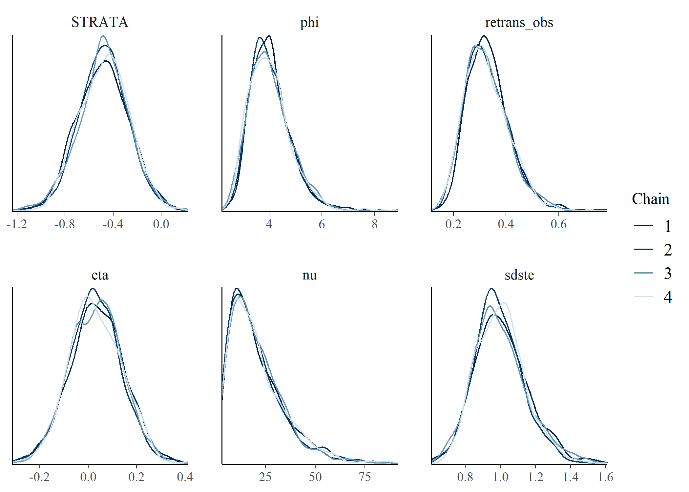

```{r, include = FALSE}
knitr::opts_chunk$set(
  collapse = TRUE,
  comment = "#>"
)
```

```{r setup, message = FALSE}
library(bbsBayes2)
library(ggplot2)
library(dplyr)
library(bayesplot)
```

First make sure you have the BBS data downloaded
```{r}
have_bbs_data()
```

If not, install with `fetch_bbs_data()`
```{r, eval = !have_bbs_data()}
fetch_bbs_data()
```

Let's start by loading an example model, the Hepatic Tanager gamye model which has 1000 iterations and 4 chains. Download the Hepatic Tanager GAMYE model, by clicking "Download" here: <https://github.com/L-Daly/bbsbae/blob/25eeb0f974bcdf832b8375422a9ac57c046c62c2/data/HETA_bbs_usgs_gamye.rds> . 
```{r}
heta_gamye <-readRDS("HETA_bbs_usgs_gamye.rds")
```

Here is the code to generate the above model. User beware, even though this species is range restricted, this model will take over 20 minutes to run!

```{r}
heta_gamye<-stratify(by="bbs_usgs",species="Hepatic Tanager")%>%
  prepare_data()%>%
  prepare_model(model="gamye",model_variant = "hier")%>%
  run_model(chains=4,iter_warmup = 1000,iter_sampling = 1000)
```


Now we can calculate our convergence metrics
```{r,echo=TRUE, warning=FALSE}
conv <- get_convergence(heta_gamye)
summary(conv)
conv
```

Wow, there are a *lot* of variables here.

We can visualize this by transforming the data frame and using ggplot2

```{r}
tconv <- tidyr::pivot_longer(conv, cols = c(ess_bulk, ess_tail, rhat))

ggplot(data = tconv, aes(x = variable, y = value, colour = variable_type)) +
    geom_point() +
    facet_wrap(~name, scales = "free_y") +
    scale_colour_viridis_d(guide = "none")
```
< img src= "figures/converge-1.png" />

We can also choose to extract only some variables. To see which ones are available,
use the `get_model_vars()` function.

```{r}
get_model_vars(heta_gamye)
```

We can then create density plots for different variables colored by chain number. Here we chose six parameters to check convergence, feel free to try any of the above parameters.

```{r}
#create array of model chains
post<-as.array(heta_gamye$model_fit$draws())

mcmc_dens_overlay(post,pars=c("STRATA","phi","retrans_obs","eta","nu","sdste"))
```


We can also extract summary information from the model via the helper function `get_summary()` (wrapper for  `cmdstanr::summary()`)

```{r, warning=FALSE}
get_summary(heta_gamye)
```
