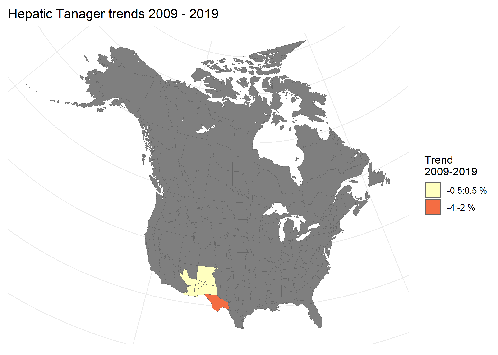
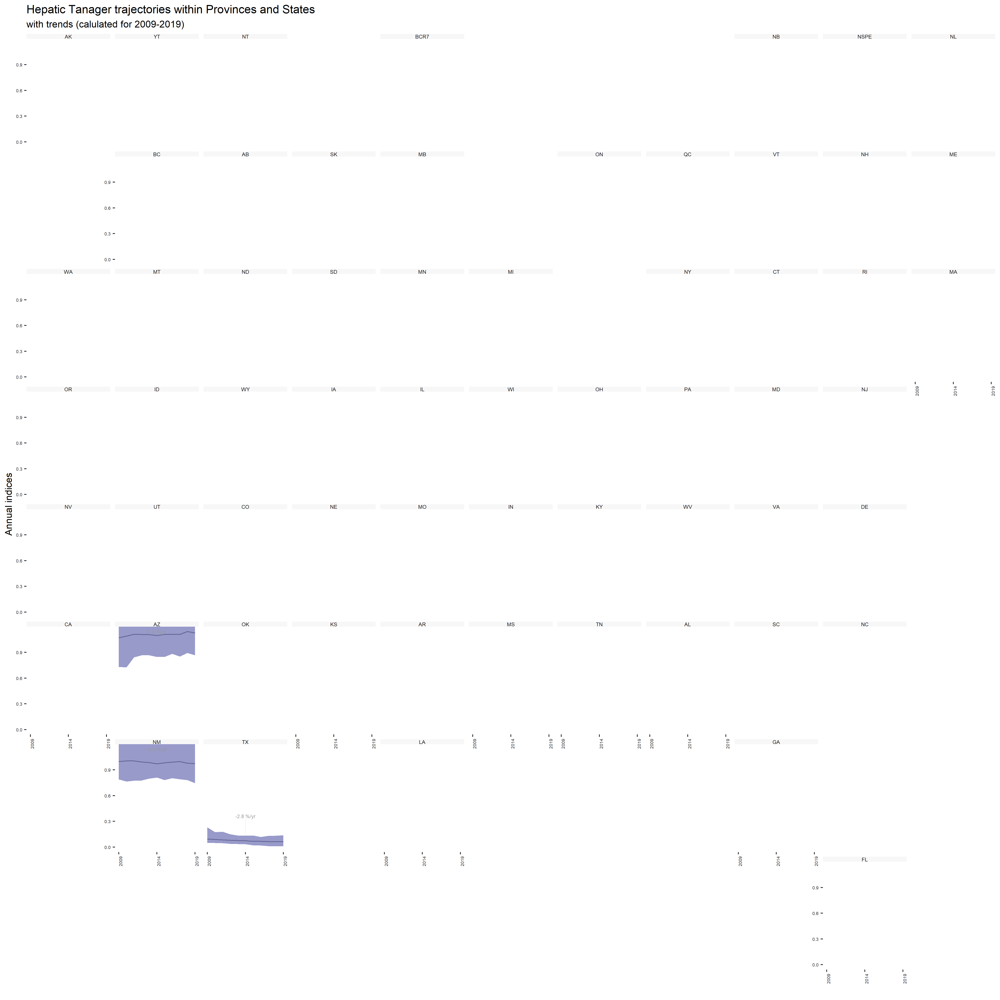

```{r setup,include=FALSE}
knitr::opts_chunk$set(message=FALSE,
                      warning=FALSE,
                      results="hide")
```
## Data prep

### Load packages

```{r}
library(bbsBayes2)
library(patchwork)
library(ggplot2)
```

### Stratify

```{r}

s <- stratify(by = "bbs_cws", species="Hepatic Tanager")
```

### Prepare counts
Here we create a model over less time to speed up processing.
```{r}

p <- prepare_data(s, min_year=2009, max_year=2019)
```

### Prepare model

```{r}

md <- prepare_model(p, model = "first_diff", model_variant = "nonhier")
```

## Run model
A model with the minimum number of iterations and chains for speedy processing, at the expense of accuracy. We recommend using the defaults, 4 chains, 1000 iterations for both warmup and sampling, and assessing convergence.
```{r}

m <- run_model(md, iter_sampling = 100, iter_warmup = 500, chains = 2)
```

## Explore results

### Convergence


```{r}
conv <- get_convergence(m)
conv
```

### Indices

```{r}
i <- generate_indices(model_output = m,
                      regions = c("continent",
                                  "country",
                                  "prov_state",
                                  "stratum"))
p <- plot_indices(i, add_observed_means = TRUE)
```


```{r}
patchwork::wrap_plots(p, ncol = 3)
```


### Trends

```{r}
t <- generate_trends(indices = i)
plot_map(trends = t)
```




### Geofacet plots

```{r}
plot_geofacet(indices = i, trends = t)
```



## Reproducibility and Clean up

```{r}
list.files(pattern = "csv|rds")
unlink(list.files(pattern = "csv|rds"))
```


```{r}
devtools::session_info()
```
