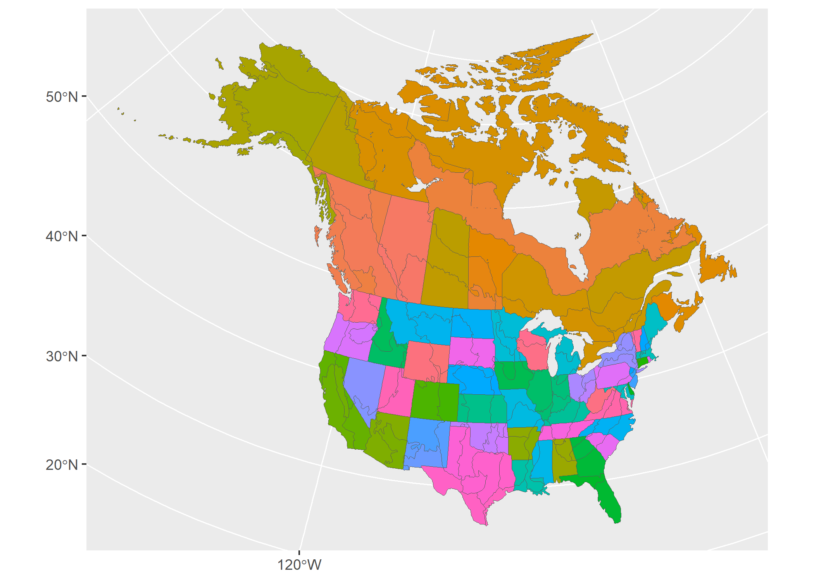
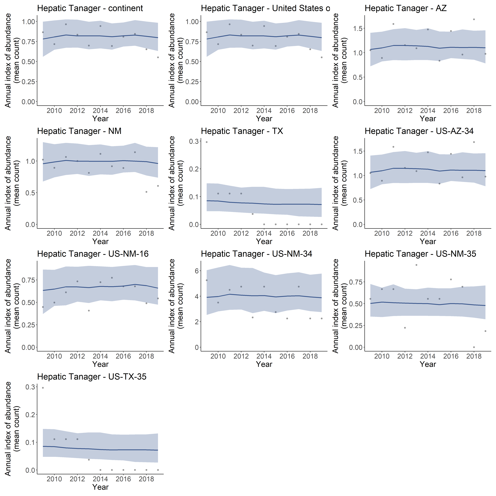
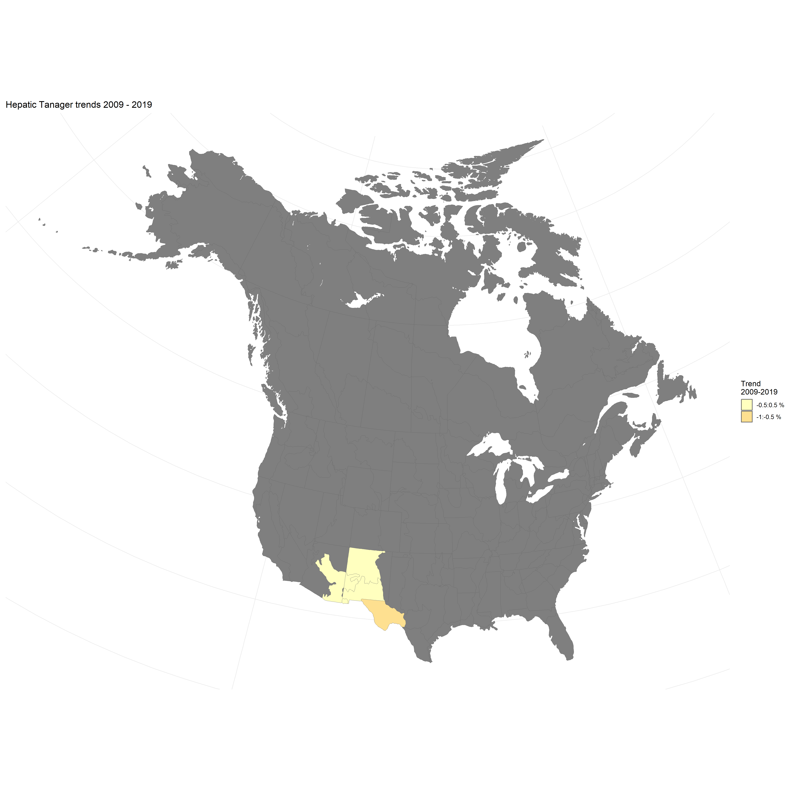
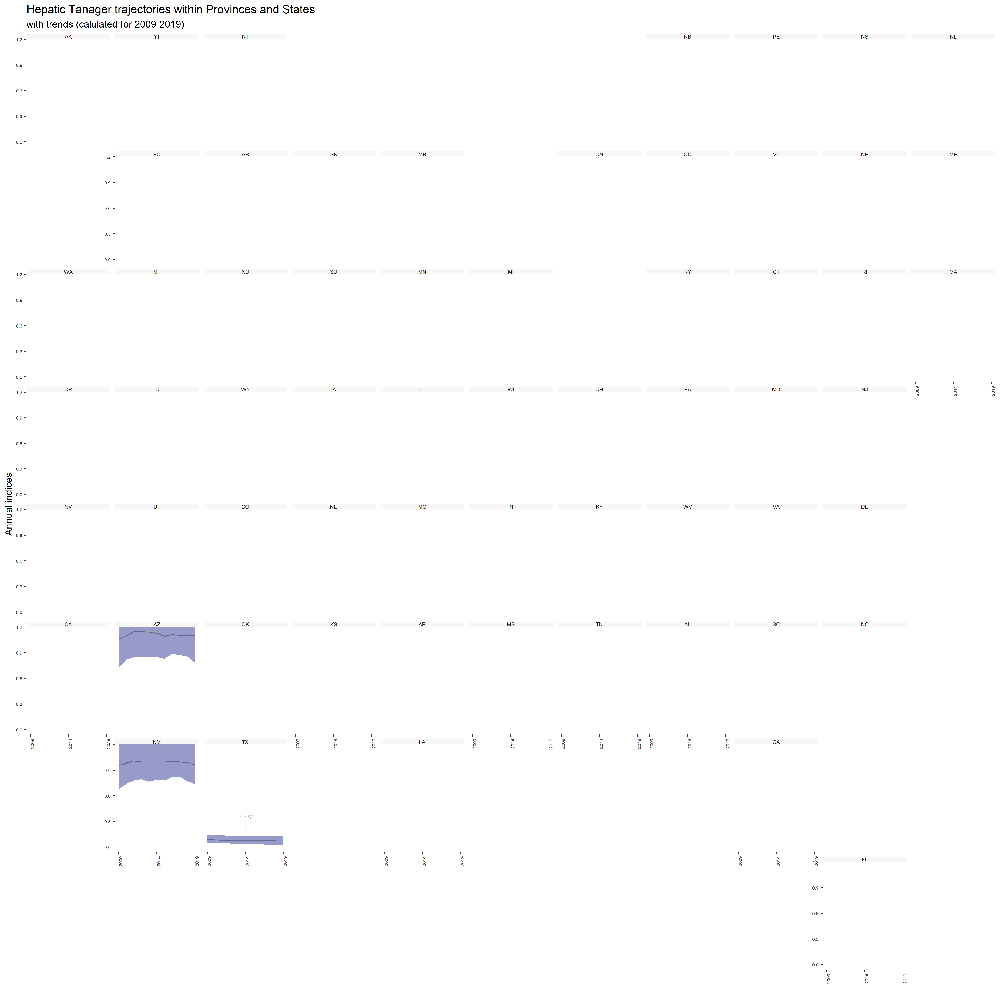

## Data prep

### Load packages


```r
library(bbsBayes2)
library(patchwork)
library(ggplot2)
```

### Stratify


```r
s <- stratify(by = "bbs_usgs", species="Hepatic Tanager")
```

### Prepare counts
Here we are making model for 2009-2019 to decrease model run time. The default is to use the full range of data available.

```r
p <- prepare_data(s, min_year=2009, max_year=2019)
```

### Prepare spatial


```r
map <- load_map("bbs_cws")
ggplot(map, aes(fill = strata_name)) +
  geom_sf(show.legend = FALSE)
```





```r
n <- prepare_spatial(p, map)
```

### Prepare model


```r
md <- prepare_model(n, model = "first_diff", model_variant = "spatial")
```

## Run model
A model with the minimum number of iterations and chains for speedy processing, at the expense of accuracy. We recommend using the defaults, 4 chains, 1000 iterations for both warmup and sampling, and assessing convergence.

```r
m <- run_model(md, iter_sampling = 100, iter_warmup = 500, chains = 2)
```

## Explore results

### Convergence


```r
conv <- get_convergence(m)
conv
```

### Indices


```r
i <- generate_indices(model_output = m,
                      regions = c("continent",
                                  "country",
                                  "prov_state",
                                  "stratum"))
p <- plot_indices(i, add_observed_means = TRUE)
```


```r
patchwork::wrap_plots(p, ncol = 3)
```




### Trends


```r
t <- generate_trends(indices = i)
plot_map(trends = t)
```





### Geofacet plots


```r
plot_geofacet(indices = i, trends = t)
```




## Reproducibility and Clean up


```r
list.files(pattern = "csv|rds")
unlink(list.files(pattern = "csv|rds"))
```


```r
devtools::session_info()
```

```
## Error in loadNamespace(x): there is no package called 'devtools'
```
