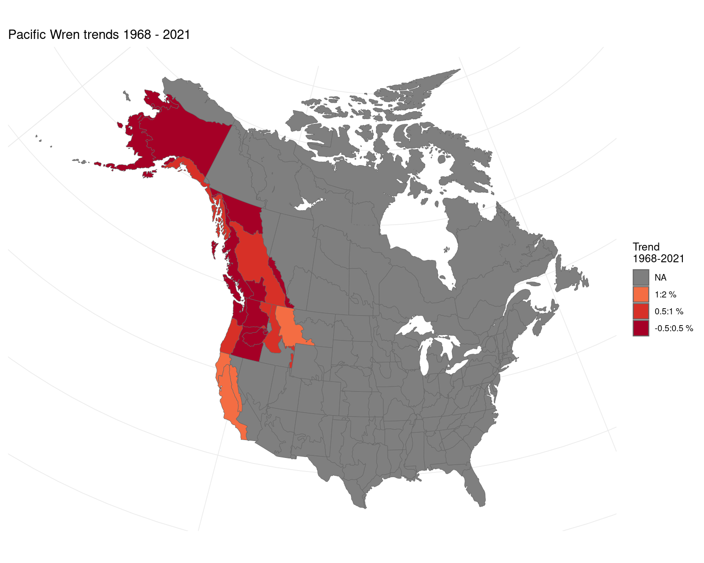

## Data prep

### Load packages

```r

library(bbsBayes2)
library(patchwork)
library(ggplot2)
```

### Stratify

```r

s <- stratify(by = "bbs_cws", sample = TRUE)
```

### Prepare counts

```r

p <- prepare_data(s, min_max_route_years = 2)
```

### Prepare spatial

```r

map <- load_map("bbs_cws")
ggplot(map, aes(fill = strata_name)) +
  geom_sf(show.legend = FALSE)
```


```r

n <- prepare_spatial(p, map)
```

### Prepare model

```r

md <- prepare_model(n, model = "first_diff", model_variant = "spatial")
```

## Run model

```r

m <- run_model(md, iter_sampling = 10, iter_warmup = 10, chains = 2)
```

## Explore results

### Convergence


```r

conv <- get_convergence(m)
conv
summary(conv)
```

### Indices

```r

i <- generate_indices(model_output = m,
                      regions = c("continent",
                                  "country",
                                  "prov_state",
                                  "stratum"))
p <- plot_indices(i, add_observed_means = TRUE)
```


```r

patchwork::wrap_plots(p, ncol = 3)
```


### Trends

```r

t <- generate_trends(indices = i)
plot_map(trends = t)
```




### Geofacet plots

```r

plot_geofacet(indices = i, trends = t)
```


## Reproducibility and Clean up

```r

list.files(pattern = "csv|rds")
```


```r

devtools::session_info()
```

