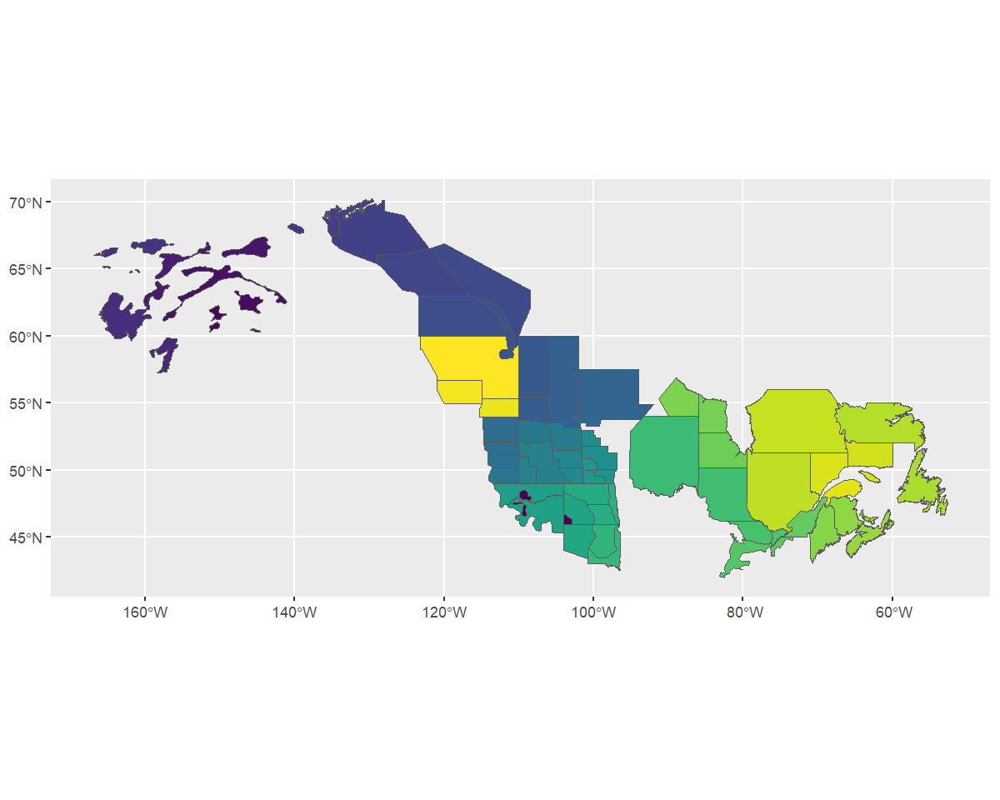
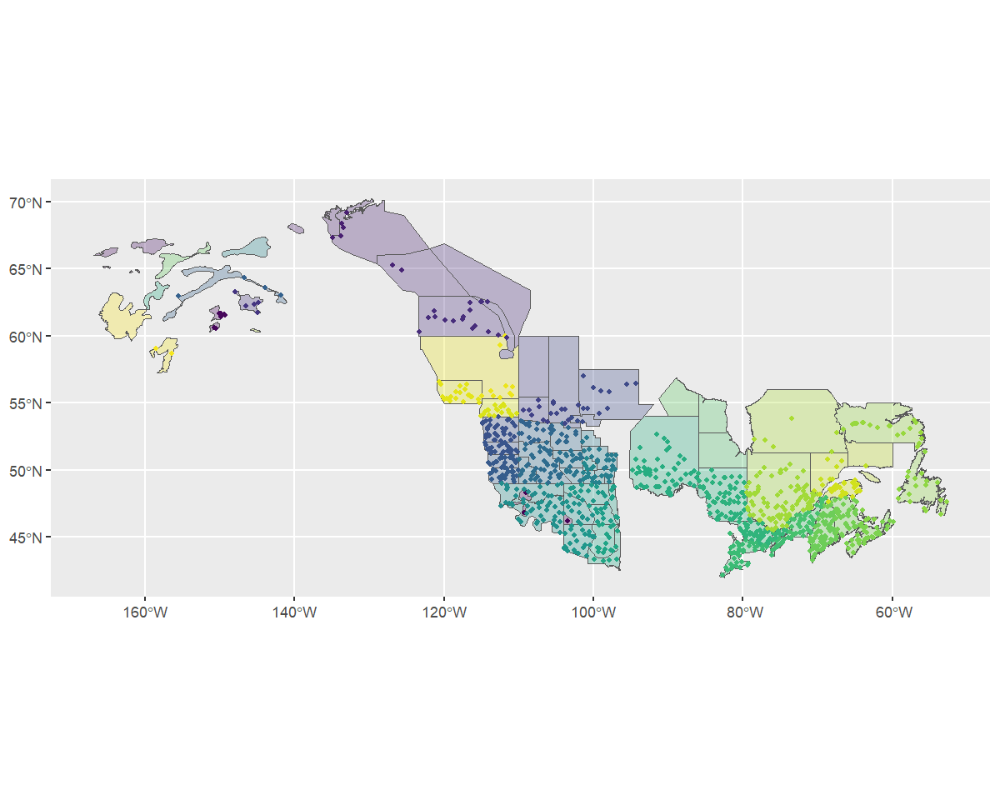
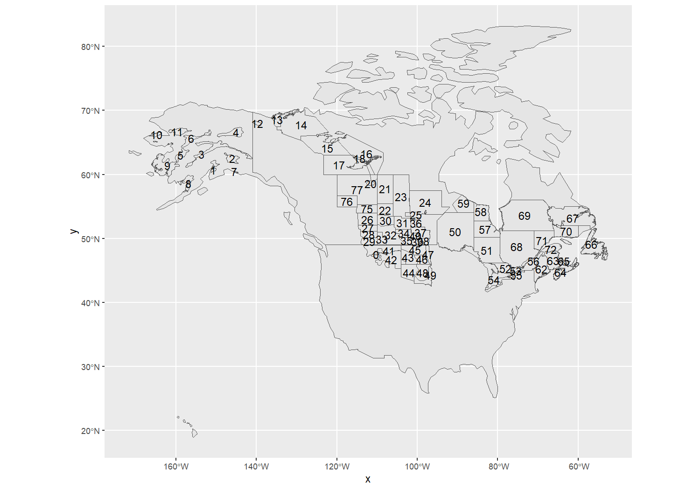
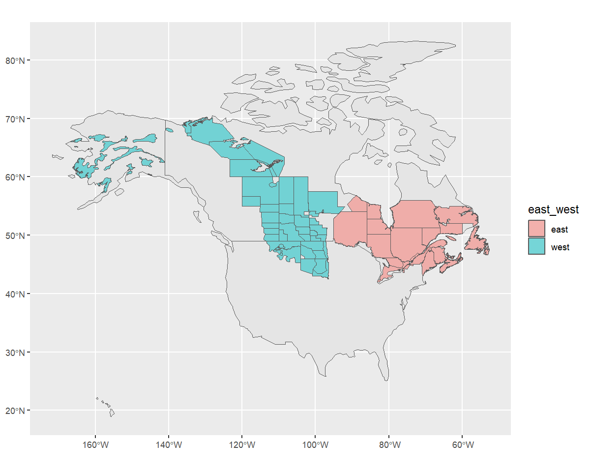
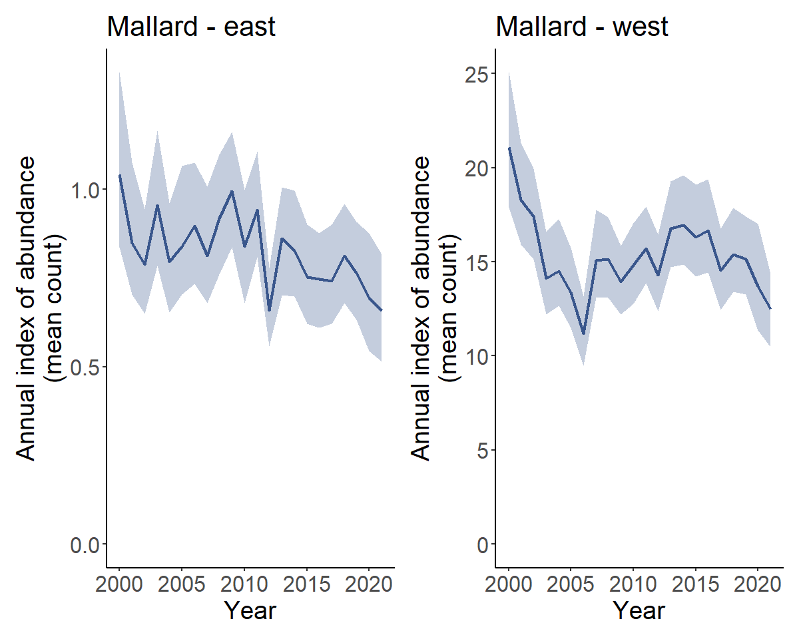
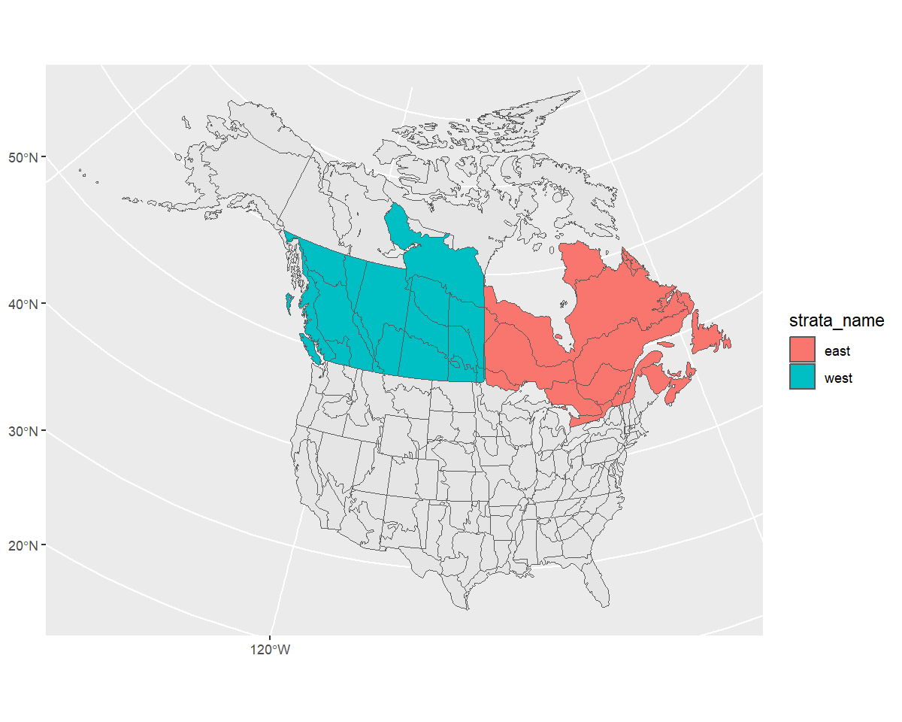

``` r
library(bbsBayes2)
library(sf)       # Spatial data manipulations
#> Warning: package 'sf' was built under R version 4.5.2
library(dplyr)    # General data manipulations
library(ggplot2)  # Plotting
library(patchwork) # mutli-plot
#> Warning: package 'patchwork' was built under R version 4.5.2
```

In this vignette we'll explore the various ways you can stratify the BBS data in
preparation for running the models.

You can use existing, pre-defined stratifications, subset an existing stratification (e.g., clip the data to your area of interest), or load
your own custom stratification, either using a completely new set of spatial
data, or by modifying the spatial polygons of an existing strata.

This vignette assumes that the BBS data have already been downloaded and that you are familiar with the [basics of the bbsBayes2 workflow](./bbsBayes2.html)


## Stratifying with built-in stratifications

The built-in stratifications are
bbs, bbs_usgs, bbs_cws, bcr, bcr_old, latlong, prov_state.

- `bbs` -- New as of Version 1.1.3.1. Intersections of Political regions X Updated Bird Conservation Regions
  (Stratification used by the Canadian Wildlife Service [CWS] for national status reporting as of 2024)
- `bbs_cws` -- Intersections of Political regions X Bird Conservation Regions
  (Stratification formerly used by the Canadian Wildlife Service [CWS] for national status reporting)
- `bbs_usgs` -- Intersections of Political regions X Bird Conservation Regions
  (Stratification used by the United Status Geological Survey [USGS] for national status reporting)
- `bcr` -- Updated (2025) Bird Conservation Regions, including the subdivisions of four former northern BCRs (3, 6, 7, and 8) into the following 10 BCRs: 3C, 3N, 3S, 6N, 6S, 7E, 7W, 7H, 8E and 8W.
- `bcr_old` -- Bird Conservation Regions used prior to version 1.1.3.1, includes large northern BCRs (3, 6, 7, and 8). Primarily included for reproducibility.
- `prov_state` -- Political regions only - states, provinces, and territories
- `latlong` -- Grid-cells of 1 degree of latitude X 1 degree of longitude, aka "degree-blocks". These are the original survey design strata for the BBS. Routes are established at randomized locations within these degree-blocks.

You can visualize these stratifications by looking at the maps
included in bbsBayes2 with `load_map()`.


``` r
ggplot(data = load_map("bbs"), aes(fill = strata_name)) +
  geom_sf() +
  scale_fill_viridis_d(guide = "none")
```


To stratify BBS data, you can use these existing stratifications by
specifying `by = "name"` in the `stratify()` function.


``` r
s <- stratify(by = "bbs_usgs", species = "Mallard")
#> Using 'bbs_usgs' (standard) stratification
#> Loading BBS data...
#> Filtering to species Mallard (1320)
#> Stratifying data...
#> Preparing strata (ESRI:102008; North_America_Albers_Equal_Area_Conic)...
#>   Calculating area weights...
#>   Joining routes to spatial layer...
#>   Renaming routes...
#>   Omitting 2,436/127,482 surveys, on 111 unique routes that do not match a stratum.
#>     To see omitted routes use `return_omitted = TRUE` (see ?stratify)
```

### The latlong stratification - special note

The latlong stratification `by = "latlong"` is the finest-scale stratification built into the package, and so it divides the BBS data into many more strata-units than other stratifications.  Therefore, you may wish to adjust the minimum data inclusion criteria when preparing the data. Specifically, setting `min_n_routes = 1` ensures that every grid-cell with at least one BBS route can be included. There are many degree-blocks that have only one route, as this is the original sampling design goal of the BBS (at least one route within each degree-block).


``` r
s <- stratify(by = "latlong", species = "Mallard", use_map = FALSE)
#> Using 'latlong' (standard) stratification
#> Loading BBS data...
#> Filtering to species Mallard (1320)
#> Stratifying data...
#>   Renaming routes...
#>   Omitting 115/127,482 surveys, on 7 unique routes that do not match a stratum.
#>     To see omitted routes use `return_omitted = TRUE` (see ?stratify)
p <- prepare_data(s, min_n_routes = 1)

```

## Custom stratifications

bbsBayes2 can stratify the BBS data using any polygon map as input.

### Load a custom stratification map

To define a completely different stratification, you'll need to provide a
spatial data object with polygons defining your strata.

In our example we'll use WBPHS stratum boundaries.
This is available from available from the US Fish and Wildlife Service Catalogue: <https://ecos.fws.gov/ServCat/Reference/Profile/142628>

To run this locally, download the file manually and unzip the shapefile contents into subdirectory of your working directory called *output*.

To use this file in bbsBayes2, we need to load it as an sf object using the sf
package.

``` r
map <- sf::read_sf("output/WBPHS_stratum_boundaries.shp")
ggplot(map, aes(fill = factor(stratum))) +
  geom_sf() +
  scale_fill_viridis_d(guide = "none")
```


### Identify the strata names

We see that it has one column that reflects the stratum names. First we'll rename this column to `strata_name`, and mutate it into a character value, so that the `stratify()` function knows what attribute includes the names that define each stratum.


``` r
map <- rename(map, strata_name = stratum) %>%
        mutate(strata_name = as.character(strata_name))
```

### Stratify the data

Now we have the spatial data and relevant information to pass to `stratify()`.

When using a custom stratification, the `by` argument is just a user-defined arbitrary name to document which stratification was used. This name gets passed into the meta data of the following steps and the final fitted model. Let's use something informative, but short (although there's no limit).
We also need to give the function our map.


``` r
s <- stratify(by = "WBPHS", species = "Mallard", strata_custom = map)
#> Using 'wbphs' (custom) stratification
#> Loading BBS data...
#> Filtering to species Mallard (1320)
#> Stratifying data...
#> Preparing strata (EPSG:4326; WGS 84)...
#>   Summarizing strata...
#>   Calculating area weights...
#>   Joining routes to spatial layer...
#>   Renaming routes...
#>   Omitting 106,608/127,482 surveys, on 3,783 unique routes that do not match a stratum.
#>     To see omitted routes use `return_omitted = TRUE` (see ?stratify)
```

> Note that strata names are automatically put into lower case for consistency.

We can take a quick look at the output, by looking at the meta data and routes
contained therein.

``` r
s[["meta_data"]]
#> $stratify_by
#> [1] "wbphs"
#> 
#> $stratify_type
#> [1] "custom"
#> 
#> $species
#> [1] "Mallard"
#> 
#> $sp_aou
#> [1] 1320

s[["routes_strata"]]
#> # A tibble: 20,874 × 34
#>    strata_name country_num state_num route route_name active   bcr route_type_id route_type_detail_id
#>    <chr>             <dbl>     <dbl> <chr> <chr>       <dbl> <dbl>         <dbl>                <dbl>
#>  1 3                   840         3 3-4   BIRCH LAKE      1     4             1                    1
#>  2 3                   840         3 3-4   BIRCH LAKE      1     4             1                    1
#>  3 3                   840         3 3-4   BIRCH LAKE      1     4             1                    1
#>  4 3                   840         3 3-4   BIRCH LAKE      1     4             1                    1
#>  5 3                   840         3 3-4   BIRCH LAKE      1     4             1                    1
#>  6 3                   840         3 3-4   BIRCH LAKE      1     4             1                    1
#>  7 3                   840         3 3-4   BIRCH LAKE      1     4             1                    1
#>  8 3                   840         3 3-4   BIRCH LAKE      1     4             1                    1
#>  9 3                   840         3 3-4   BIRCH LAKE      1     4             1                    1
#> 10 3                   840         3 3-4   BIRCH LAKE      1     4             1                    1
#> # ℹ 20,864 more rows
#> # ℹ 25 more variables: route_data_id <dbl>, rpid <dbl>, year <dbl>, month <dbl>, day <dbl>,
#> #   obs_n <dbl>, total_spp <dbl>, start_temp <dbl>, end_temp <dbl>, temp_scale <chr>,
#> #   start_wind <dbl>, end_wind <dbl>, start_sky <dbl>, end_sky <dbl>, start_time <dbl>,
#> #   end_time <dbl>, assistant <dbl>, quality_current_id <dbl>, run_type <dbl>, state <chr>,
#> #   st_abrev <chr>, country <chr>, longitude <dbl>, latitude <dbl>, area_sq_km <dbl>
```
### Visualise the new strata and data

To get a different look we can also plot this data on top of our map using
ggplot2. Note that we use `factor()` to ensure the strata names are
categorical.


``` r
rts <- s[["routes_strata"]] %>%
  st_as_sf(coords = c("longitude", "latitude"), crs = 4326)

ggplot() +
  geom_sf(data = map, aes(fill = factor(strata_name)), alpha = 0.3) +
  geom_sf(data = rts, aes(colour = factor(strata_name)), size = 1) +
  scale_fill_viridis_d(aesthetics = c("colour", "fill"), guide = "none")
```



### Omitted BBS routes

Based on the message we received during stratification (`Omitting...`) and this
map, it looks as if our custom stratification is excluding some BBS data (i.e., routes with starting locations that are not overlapped by the strata map). This makes sense because the WBPHS survey area is much smaller than the region covered by the BBS. However, let's confirm that the excluded routes are the ones we expect.

We can re-run the stratification with `return_omitted = TRUE` which will attach
a data frame of omitted strata to the output.

``` r
s <- stratify(by = "WBPHS", species = "Mallard", strata_custom = map,
              return_omitted = TRUE)
#> Using 'wbphs' (custom) stratification
#> Loading BBS data...
#> Filtering to species Mallard (1320)
#> Stratifying data...
#> Preparing strata (EPSG:4326; WGS 84)...
#>   Summarizing strata...
#>   Calculating area weights...
#>   Joining routes to spatial layer...
#>   Renaming routes...
#>   Omitting 106,608/127,482 surveys, on 3,783 unique routes that do not match a stratum.
#>     Returning omitted routes.
s[["routes_omitted"]]
#> # A tibble: 106,608 × 11
#>     year strata_name country state   route route_name latitude longitude   bcr   obs_n total_spp
#>    <dbl> <chr>       <chr>   <chr>   <chr> <chr>         <dbl>     <dbl> <dbl>   <dbl>     <dbl>
#>  1  1967 <NA>        US      ALABAMA 2-1   ST FLORIAN     34.9     -87.6    27 1140018        56
#>  2  1969 <NA>        US      ALABAMA 2-1   ST FLORIAN     34.9     -87.6    27  990062        52
#>  3  1970 <NA>        US      ALABAMA 2-1   ST FLORIAN     34.9     -87.6    27  990062        52
#>  4  1971 <NA>        US      ALABAMA 2-1   ST FLORIAN     34.9     -87.6    27  990062        56
#>  5  1972 <NA>        US      ALABAMA 2-1   ST FLORIAN     34.9     -87.6    27  990062        54
#>  6  1973 <NA>        US      ALABAMA 2-1   ST FLORIAN     34.9     -87.6    27 1060057        52
#>  7  1974 <NA>        US      ALABAMA 2-1   ST FLORIAN     34.9     -87.6    27 1060057        55
#>  8  1975 <NA>        US      ALABAMA 2-1   ST FLORIAN     34.9     -87.6    27 1060057        59
#>  9  1976 <NA>        US      ALABAMA 2-1   ST FLORIAN     34.9     -87.6    27 1060057        56
#> 10  1977 <NA>        US      ALABAMA 2-1   ST FLORIAN     34.9     -87.6    27 1060057        51
#> # ℹ 106,598 more rows
```

Let's take a look.


``` r
omitted <- st_as_sf(s[["routes_omitted"]], coords = c("longitude", "latitude"),
                    crs= 4326)

ggplot() +
  geom_sf(data = map, aes(fill = factor(strata_name)), alpha = 0.3) +
  geom_sf(data = rts, aes(colour = factor(strata_name)), size = 1, alpha = 0.5) +
  geom_sf(data = omitted, size = 0.75, alpha = 0.5) +
  scale_fill_viridis_d(aesthetics = c("colour", "fill"), guide = "none")
```


The map shows that most of the omitted routes are routes that are clearly outside of our desired stratification. However, it also shows that there are some BBS route start-points that are just outside of the strata (e.g., some routes in Nova Scotia and Alaska). The user can decide what to do with these sorts of minor overlap issues. For example, buffering the original stratification map might make sense in some situations. For now, we will trust our custom strata map and retain only the BBS routes with start locations inside our strata polygons.


## Fitting the model

To fit the model, we follow the standard workflow using our stratified data.


``` r
p <- prepare_data(s,
                  min_year = 2000,
                  max_year = 2021) #subset a shorter time-span to speed model-fit
sp <- prepare_spatial(p,map)
#> Preparing spatial data...
#> Supplied strata_map is in a geographic projection. Transforming coordinate reference system to a projected and equal area crs to facilitate mapping and neighbourhood relationships. This will not affect the relationship between strata and the BBS data, only ensures that neighbours are consistently defined and easily mapped.
#>     Summarizing polygons by strata...
#> Identifying neighbours (non-Voronoi method)...
#> Linking islands (isolated groups of nodes)...
#>     Islands found (5). Linking by distance between centroids...
#>     Islands found (4). Linking by distance between centroids...
#>     Islands found (3). Linking by distance between centroids...
#>     Islands found (2). Linking by distance between centroids...
#>     Islands found (1). Linking by distance between centroids...
#> Formating neighbourhood matrices...
#> Plotting neighbourhood matrices...
mp <- prepare_model(sp,model = "first_diff",
                   model_variant = "spatial")
```


``` r
m <- run_model(mp,
               iter_warmup = 500,
               iter_sampling = 100)
```


### Predictions from the model using the custom stratification

Now we can start to look at the indices and trends related to our model.

We can apply the `generate_indices()` and `generate_trends()` functions to the output from our model, the same as we would with the built-in stratifications.


``` r
i <- generate_indices(m)
#> Processing region continent
#> Processing region stratum

t <- generate_trends(i)
```
And with one additional argument, we can also use the `plot_map()` function.


``` r
trend_map <- plot_map(t, strata_custom = map)
trend_map
```



## Generating state and province predictions from a custom stratification

A useful feature of the hierarchical Bayesian models for the BBS is the ability to generate formal estimates of indices (annual relative abundance) and trends (rates of population change) for any composite region. *Formal estimates* meaning we can estimate the full posterior distribution, including a point estimate and its associated uncertainty (credible limits). These composite regions can be defined based on any combination of the underlying strata used to fit the model. For example, using any custom stratification, we can generate estimates for political jurisdictions (countries, states, provinces), as long as we can comfortably designate each of the strata to one of these jurisdictions.

By default, `generate_indices()` creates indices at two levels "continent" (the combination of all strata used in the analysis) and "stratum" (estimates for individual strata). For the two *bbs* stratifications ("bbs_usgs" and "bbs_cws"), we can also add "prov_state", "bcr",
"bcr_by_country" (where appropriate). For any custom stratification, we can also add the political jurisdictions and/or create our own regional divisions and provide them as a `regions_index` data frame.

For example, let's imagine we would like to calculate regional indices for
each stratum, country, province/state, as well as for a custom division of
eastern and western regions.

First we'll need to tell the function which strata belong to which province or
state, and then which belong to the 'east' and which to the 'west.

We'll start by using a helper function `assign_prov_state()`. This function
takes a map of strata and assigns each strata to a province or state
depending on the amount of overlap. By default it will warn if the amount of
overlap is less than 75%, but in this case, we will lower that cutoff to 60%.
The plot gives us a chance to make a quick assessment of whether we're happy
with how the various strata have been assigned.


``` r
rindex <- assign_prov_state(map, min_overlap = 0.6, plot = TRUE)
```


Next we'll define the east/west divide by hand. If we plot the strata by
name, we can pick out which are eastern and which western.


``` r

ggplot(rindex) +
  geom_sf(data = load_map(type = "North America")) +
  geom_sf() +
  geom_sf_text(aes(label = strata_name), size = 2)
#> Warning in st_point_on_surface.sfc(sf::st_zm(x)): st_point_on_surface may not give correct results for
#> longitude/latitude data
```


The western and eastern strata seem to be split numerically, such that the western strata have numbers lower than 50 or greater than 74, eastern strata have numbers in between. So we'll add a column to the `rindex` dataframe with "east" and "west" character names to group the strata.


``` r
rindex <- mutate(
  rindex,
  east_west = if_else(as.numeric(strata_name) < 50 | as.numeric(strata_name) > 74,
                      "west",
                      "east"))
```

And now double check that we correctly grouped the strata!


``` r
ggplot(data = rindex) +
  geom_sf(data = load_map(type = "North America")) +
  geom_sf(data = rindex, aes(fill = east_west), alpha = 0.5)
```



Then supply the `rindex` object to the `regions_index` argument of the `generate_indices()` function and include the relevant column names from the object as `regions`.

``` r
i <- generate_indices(
  m,
  regions = c("stratum", "country", "prov_state", "east_west"),
  regions_index = rindex)
#> Processing region stratum
#> Processing region country
#> Processing region prov_state
#> Processing region east_west

t <- generate_trends(i)

```

We can plot the population trajectories for each of these regions with `plot_indices()`.


``` r

p <- plot_indices(i)
names(p)
#>  [1] "1"                        "14"                       "17"                      
#>  [4] "18"                       "2"                        "22"                      
#>  [7] "24"                       "26"                       "27"                      
#> [10] "28"                       "29"                       "30"                      
#> [13] "31"                       "32"                       "33"                      
#> [16] "34"                       "35"                       "37"                      
#> [19] "38"                       "39"                       "40"                      
#> [22] "41"                       "42"                       "43"                      
#> [25] "44"                       "45"                       "46"                      
#> [28] "47"                       "48"                       "49"                      
#> [31] "50"                       "51"                       "52"                      
#> [34] "53"                       "54"                       "55"                      
#> [37] "56"                       "62"                       "63"                      
#> [40] "64"                       "66"                       "68"                      
#> [43] "72"                       "75"                       "76"                      
#> [46] "77"                       "Canada"                   "United_States_of_America"
#> [49] "AB"                       "AK"                       "MB"                      
#> [52] "ME"                       "MT"                       "NB"                      
#> [55] "ND"                       "NL"                       "NS"                      
#> [58] "NT"                       "NY"                       "ON"                      
#> [61] "QC"                       "SD"                       "SK"                      
#> [64] "east"                     "west"

p[["east"]] + p[["west"]]
```



Finally we can even create geofaceted plots (which is only possible in our case
because we assigned our strata to Provinces and States and calculated indices
for these regions). These geofacet plots can be useful for visualizing the population trajectories of species with broad ranges across many states and provinces.

``` r
plot_geofacet(i, trends = t, multiple = TRUE)
```


## Subsetting an existing stratification

In general, it is often useful to use all of the data for a given species, even if you're only interested in trends for a portion of the species' range (estimates of observer effects are informed by all of the data in the analysis). However, there may be situations where the focus of your study is limited to a particular region. For example what if you want to use one of the standard stratifications, but you only want the analysis to be influenced by data from one region, say only Canadian data?

In this case you can subset the BBS CWS stratification to only Canadian regions, and use that subset of regions as a custom stratification in the `stratify()` function.

In addition to maps, stratifications are available as data frames in the
`bbs_strata` object.


``` r
names(bbs_strata)
#> [1] "bbs"        "bbs_usgs"   "bbs_cws"    "bcr"        "bcr_old"    "latlong"    "prov_state"
head(bbs_strata[["bbs_cws"]])
#> # A tibble: 6 × 7
#>   strata_name area_sq_km country country_code prov_state   bcr bcr_by_country
#>   <chr>            <dbl> <chr>   <chr>        <chr>      <dbl> <chr>         
#> 1 CA-AB-10        52565. Canada  CA           AB            10 Canada-BCR_10 
#> 2 CA-AB-11       149352. Canada  CA           AB            11 Canada-BCR_11 
#> 3 CA-AB-6        445135. Canada  CA           AB             6 Canada-BCR_6  
#> 4 CA-AB-8          6987. Canada  CA           AB             8 Canada-BCR_8  
#> 5 CA-BC-10       383006. Canada  CA           BC            10 Canada-BCR_10 
#> 6 CA-BC-4        193180. Canada  CA           BC             4 Canada-BCR_4
```

We can now modify and use this data frame as we like.

``` r
my_cws <- filter(bbs_strata[["bbs_cws"]], country == "Canada")
s <- stratify(by = "bbs_cws", species = "Mallard", strata_custom = my_cws)
#> Using 'bbs_cws' (subset) stratification
#> Loading BBS data...
#> Filtering to species Mallard (1320)
#> Stratifying data...
#> Preparing strata (ESRI:102008; North_America_Albers_Equal_Area_Conic)...
#>   Calculating area weights...
#>   Joining routes to spatial layer...
#>   Renaming routes...
#> Error in UseMethod("semi_join"): no applicable method for 'semi_join' applied to an object of class "list"
```

Note that the stratification is now "bbs_cws" and "subset"


``` r
s[["meta_data"]]
#> $stratify_by
#> [1] "wbphs"
#> 
#> $stratify_type
#> [1] "custom"
#> 
#> $species
#> [1] "Mallard"
#> 
#> $sp_aou
#> [1] 1320
```

We can see the strata included by looking at the `meta_strata`


``` r
print(s[["meta_strata"]], n = Inf)
#> # A tibble: 63 × 1
#>    strata_name
#>    <chr>      
#>  1 3          
#>  2 14         
#>  3 8          
#>  4 1          
#>  5 2          
#>  6 1          
#>  7 15         
#>  8 17         
#>  9 18         
#> 10 77         
#> 11 23         
#> 12 67         
#> 13 76         
#> 14 69         
#> 15 66         
#> 16 24         
#> 17 70         
#> 18 75         
#> 19 22         
#> 20 26         
#> 21 71         
#> 22 30         
#> 23 50         
#> 24 25         
#> 25 70         
#> 26 31         
#> 27 27         
#> 28 68         
#> 29 72         
#> 30 36         
#> 31 32         
#> 32 28         
#> 33 64         
#> 34 37         
#> 35 34         
#> 36 33         
#> 37 63         
#> 38 29         
#> 39 65         
#> 40 51         
#> 41 40         
#> 42 56         
#> 43 35         
#> 44 62         
#> 45 41         
#> 46 38         
#> 47 39         
#> 48 0          
#> 49 45         
#> 50 42         
#> 51 47         
#> 52 43         
#> 53 0          
#> 54 0          
#> 55 46         
#> 56 52         
#> 57 53         
#> 58 55         
#> 59 0          
#> 60 44         
#> 61 54         
#> 62 48         
#> 63 49
```


## Modifying existing BBS maps

Stratify by custom stratification, using sf map object. For example, let's look
at an east/west divide of southern Canada with BBS CWS strata.

First we'll start with the CWS BBS data

``` r
map <- load_map("bbs_cws")
```

We'll modify this by first looking only at provinces (omitting the northern territories),
transforming to the GPS CRS (4326), and ensuring the resulting polygons are valid.

``` r
new_map <- map %>%
  filter(country_code == "CA", !prov_state %in% c("NT", "NU", "YT")) %>%
  st_transform(4326)%>%
  st_make_valid()
```

Now we can crop this map to make a western and an eastern portion, defined by
longitude and latitude (which is why we first transformed to the GPS CRS).

``` r
west <- st_crop(new_map, xmin = -140, ymin = 42, xmax = -95, ymax = 68) %>%
  mutate(strata_name = "west")
#> Warning: attribute variables are assumed to be spatially constant throughout all geometries
east <- st_crop(new_map, xmin = -95, ymin = 42, xmax = -52, ymax = 68) %>%
  mutate(strata_name = "east")
#> Warning: attribute variables are assumed to be spatially constant throughout all geometries
```

Now we'll bind these together and transform back to the original CRS


``` r
new_strata <- bind_rows(west, east) %>%
  st_transform(st_crs(map))

ggplot() +
  geom_sf(data = map) +
  geom_sf(data = new_strata, aes(fill = strata_name), alpha = 1)
```



Looks good! Let's use it in our stratification and take a look at the points
afterwards to ensure they've been categorized appropriately.


``` r
s <- stratify(by = "canada_ew", species = "Mallard",
              strata_custom = new_strata)
#> Using 'canada_ew' (custom) stratification
#> Loading BBS data...
#> Filtering to species Mallard (1320)
#> Stratifying data...
#> Preparing strata (ESRI:102008; North_America_Albers_Equal_Area_Conic)...
#>   Summarizing strata...
#>   Calculating area weights...
#>   Joining routes to spatial layer...
#>   Renaming routes...
#>   Omitting 110,107/127,482 surveys, on 3,812 unique routes that do not match a stratum.
#>     To see omitted routes use `return_omitted = TRUE` (see ?stratify)

s$meta_data
#> $stratify_by
#> [1] "canada_ew"
#> 
#> $stratify_type
#> [1] "custom"
#> 
#> $species
#> [1] "Mallard"
#> 
#> $sp_aou
#> [1] 1320
routes <- s$routes_strata %>%
  st_as_sf(coords = c("longitude", "latitude"), crs = 4326)

ggplot() +
  geom_sf(data = new_strata, aes(fill = strata_name), alpha = 1) +
  geom_sf(data = routes, aes(shape = strata_name))
```


