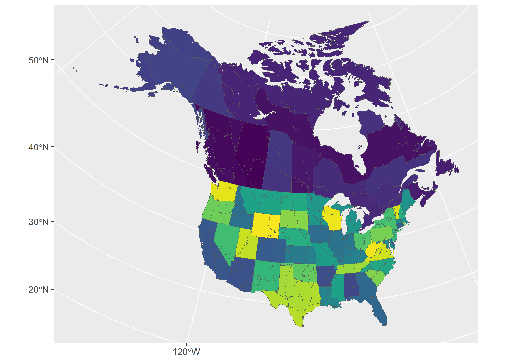
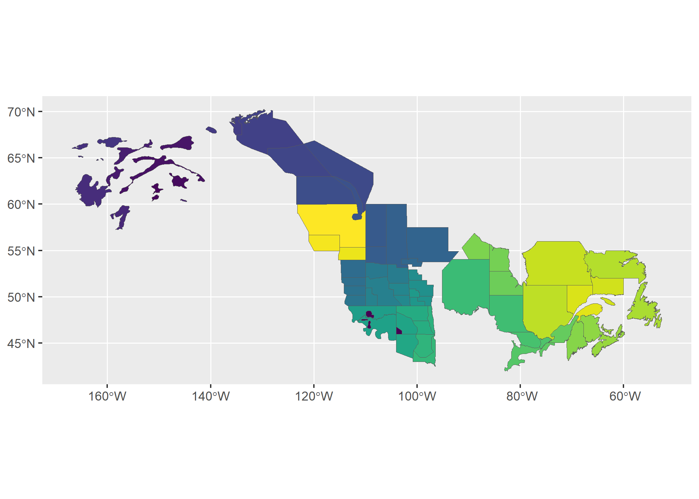
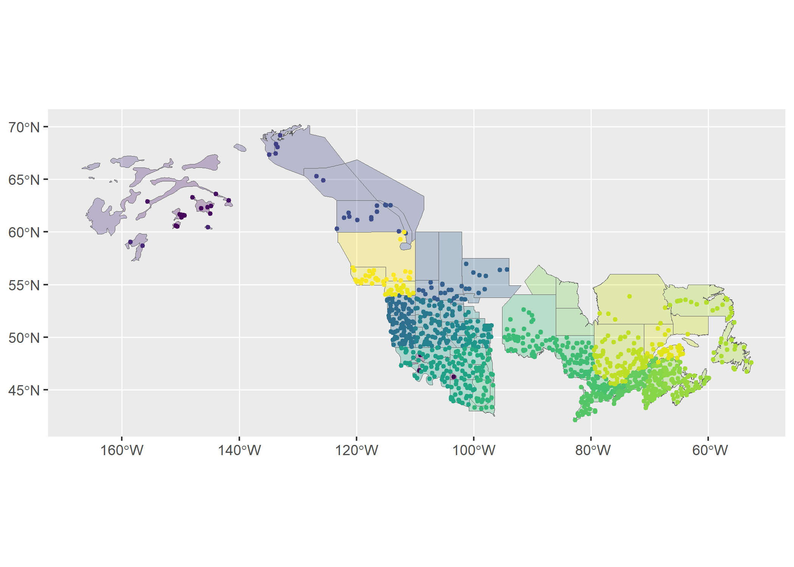
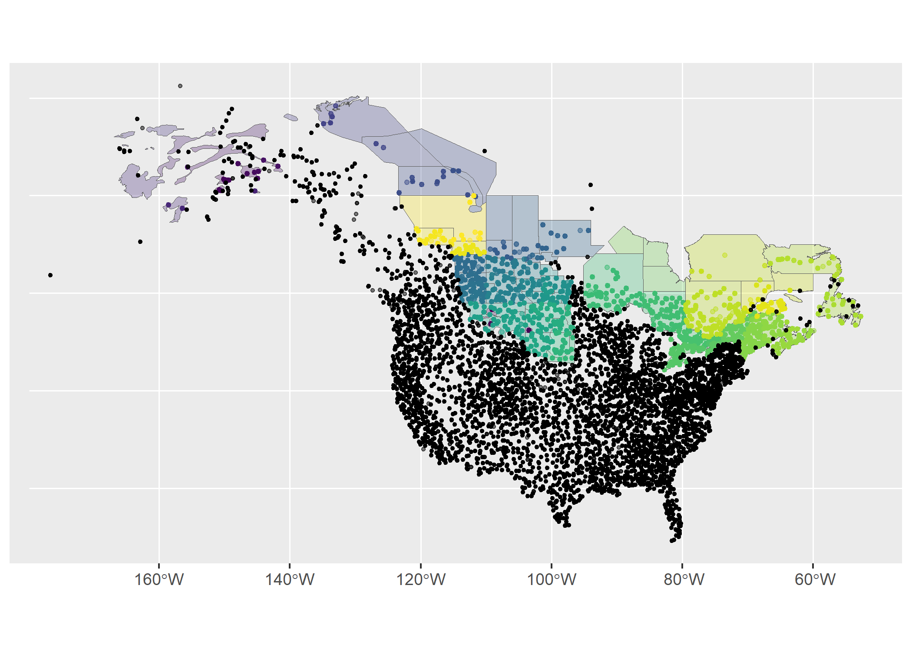
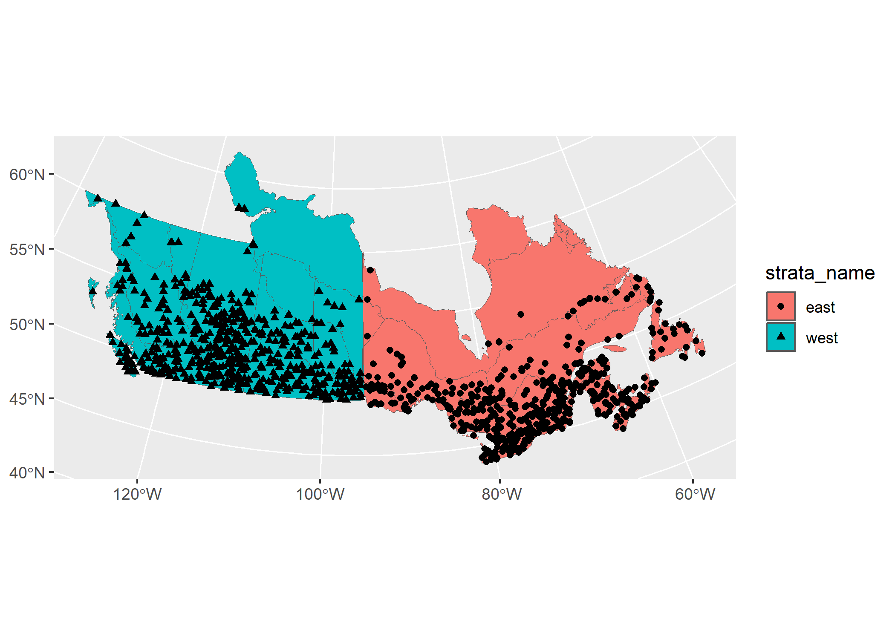
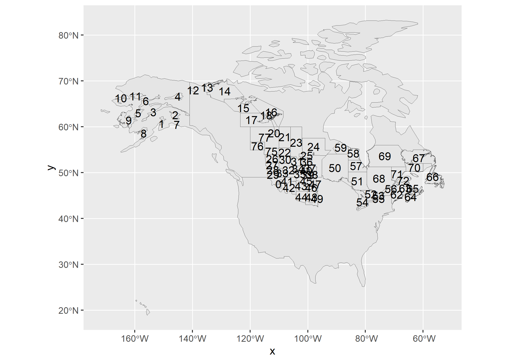
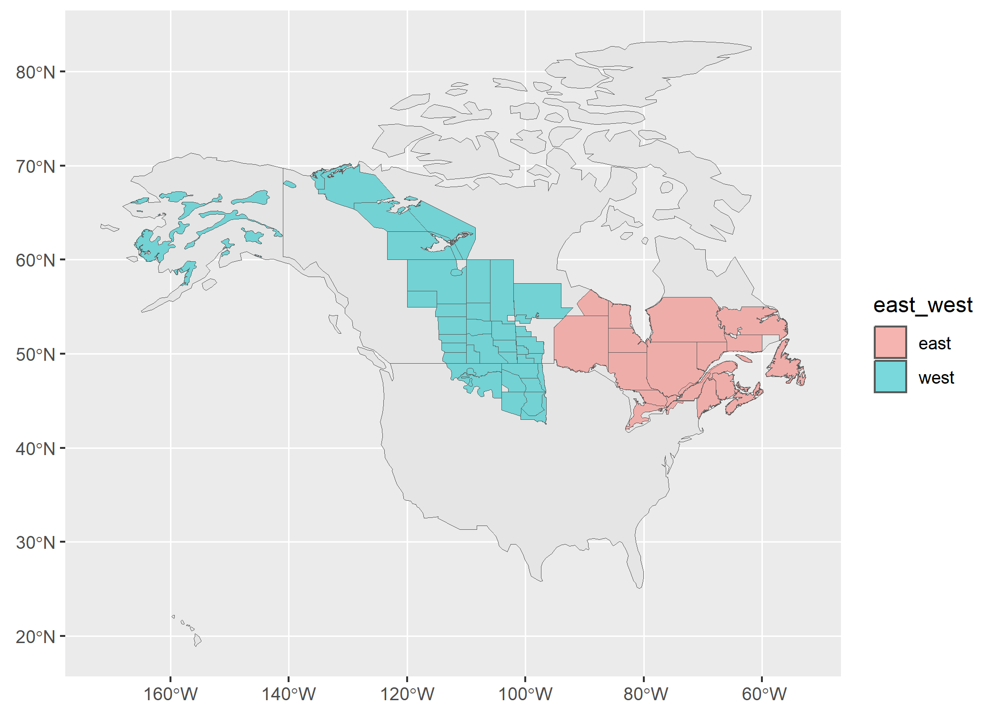

```{r setup,include=FALSE}
knitr::opts_chunk$set(message=FALSE,
                      warning=FALSE,
                      results="hide")
```

In this vignette we'll explore the various ways you can stratify your data in 
preparation for running the models. 

You can use existing, pre-defined strata, subset an existing strata, or create
your own custom stratification, either using a completely new set of spatial
data, or by modifying the spatial polygons of an existing strata.

Let's get started!


First, we'll load the packages we need.
```{r setup, message = FALSE}
library(bbsBayes2)
library(sf)       # Spatial data manipulations
library(dplyr)    # General data manipulations
library(ggplot2)  # Plotting
library(patchwork) # mutli-plot
```

Then we'll make sure we have the BBS data downloaded
```{r}
have_bbs_data()
```

If not, install with `fetch_bbs_data()`
```{r, eval = !have_bbs_data()}
fetch_bbs_data()
```

## Stratifying with existing categories

The existing stratifications are 
`r paste0(names(bbs_strata), collapse = ", ")`.

You can take a look at how these stratify your data by looking at the maps 
included in bbsBayes2 with `load_map()`.

```{r}
ggplot(data = load_map("bbs_cws"), aes(fill = strata_name)) +
  geom_sf() +
  scale_fill_viridis_d(guide = "none")
```


To stratify BBS data, you can use these existing stratifications by 
specifying `by = "name"` in the `stratify()` function.

```{r}
s <- stratify(by = "bbs_usgs", species = "Canada Jay")
```


## Subsetting an existing stratification

But what if you want to use the BBS CWS stratification, but only really want
to look at Canadian regions?

In this case you'll subset the BBS CWS stratification and give `stratify()` that
data set in addition to the specification. 

In addition to maps, stratifications are available as data frames in the 
`bbs_strata` object.

```{r}
names(bbs_strata)
head(bbs_strata[["bbs_cws"]])
```

We can now modify and use this data frame as we like.
```{r}
my_cws <- filter(bbs_strata[["bbs_cws"]], country == "Canada")
s <- stratify(by = "bbs_cws", species = "Canada Jay", strata_custom = my_cws)
```

Note that the stratification is now "bbs_cws" and "subset"

```{r}
s[["meta_data"]]
```

We can see the strata included by looking at the `meta_strata`

```{r}
print(s[["meta_strata"]], n = Inf)
```


## Custom stratification - New map

To define a completely different stratification, you'll need to provide a 
spatial data object with polygons defining your strata.

In our example we'll use WBPHS stratum boundaries for 2019.
This is available from available from the US Fish and Wildlife Service Catalogue: <https://ecos.fws.gov/ServCat/Reference/Profile/142628>

You can either download it by hand, or with the following code.
```{r}
z <- "WBPHS_stratum_boundaries_2019.zip"

download.file(url = "https://ecos.fws.gov/ServCat/DownloadFile/213149",
              destfile = z)
unzip(z)  # Unzip
unlink(z) # Remove the zipped file
```

To use this file in bbsBayes2, we need to load it as an sf object using the sf 
package.
```{r}
map <- read_sf("WBPHS_stratum_boundaries_2019.shp")
ggplot(map, aes(fill = factor(STRAT))) + 
  geom_sf() +
  scale_fill_viridis_d(guide = "none")

```


We see that it has one column that reflects the stratum names. First we'll
rename this column to `strata_name` which is what `stratify()` requires.

```{r}
map <- rename(map, strata_name = STRAT)
```


Now we have the spatial data and relevant information to pass to `stratify()`.

When using a custom stratification, the `by` argument becomes the name you want
to apply. Let's use something informative, but short (although there's no limit).
We also need to give the function our map.

```{r}
s <- stratify(by = "WBPHS_2019", species = "Canada Jay", strata_custom = map)
```

> Note that strata names are automatically put into lower case for consistency. 

We can take a quick look at the output, by looking at the meta data and routes
contained therein.
```{r}
s[["meta_data"]]

s[["routes_strata"]]
```


To get a different look we can also plot this data on top of our map using
ggplot2. Note that we use `factor()` to ensure the strata names are 
categorical.

```{r}
r <- s[["routes_strata"]] %>%
  st_as_sf(coords = c("longitude", "latitude"), crs = 4326)

ggplot() +
  geom_sf(data = map, aes(fill = factor(strata_name)), alpha = 0.3) +
  geom_sf(data = r, aes(colour = factor(strata_name)), size = 1) +
  scale_fill_viridis_d(aesthetics = c("colour", "fill"), guide = "none")
```



Based on the message we received during stratification (`Omitting...`) and this
map, it looks as if our custom stratification is excluding some BBS data.

We can re-run the stratification with `return_omitted = TRUE` which will attach
a data frame of omitted strata to the output.
```{r}
s <- stratify(by = "WBPHS_2019", species = "Canada Jay", strata_custom = map,
              return_omitted = TRUE)
s[["routes_omitted"]]
```


Let's take a look at this visually.

```{r}
omitted <- st_as_sf(s[["routes_omitted"]], coords = c("longitude", "latitude"), 
                    crs= 4326)

ggplot() +
  geom_sf(data = map, aes(fill = factor(strata_name)), alpha = 0.3) +
  geom_sf(data = r, aes(colour = factor(strata_name)), size = 1, alpha = 0.5) +
  geom_sf(data = omitted, size = 0.75, alpha = 0.5) +
  scale_fill_viridis_d(aesthetics = c("colour", "fill"), guide = "none")
```



We could also look at this visually by comparing the stratified data to the raw
BBS data.

First we load the raw routes data, then we'll add it to our plot.

This plot may take a little while to run!

```{r}
bbs_routes <- load_bbs_data()[["routes"]] %>%
  st_as_sf(coords = c("longitude", "latitude"), crs= 4326)

ggplot() +
  geom_sf(data = map, aes(fill = factor(strata_name)), alpha = 0.3) +
  geom_sf(data = r, aes(colour = factor(strata_name)), size = 1) +
  geom_sf(data = bbs_routes, size = 0.5) +
  scale_fill_viridis_d(aesthetics = c("colour", "fill"), guide = "none") 
```
< img src = "figures/route_map-1.png" />

So either way, we can clearly see, spatially, which points have been omitted
from our data.

## Custom stratification - Modifying existing BBS maps

Stratify by custom stratification, using sf map object. For example, let's look
at an east/west divide of southern Canada with BBS CWS strata.

First we'll start with the CWS BBS data
```{r}
map <- load_map("bbs_cws")
```

We'll modify this by first looking only at provinces (omitting the northern territories),
transforming to the GPS CRS (4326), and ensuring the resulting polygons are valid.
```{r}
new_map <- map %>%
  filter(country_code == "CA", !prov_state %in% c("NT", "NU", "YT")) %>%
  st_transform(4326)%>%
  st_make_valid()
```

Now we can crop this map to make a western and an eastern portion, defined by 
longitude and latitude (which is why we first transformed to the GPS CRS).
```{r}
west <- st_crop(new_map, xmin = -140, ymin = 42, xmax = -95, ymax = 68) %>%
  mutate(strata_name = "west")
east <- st_crop(new_map, xmin = -95, ymin = 42, xmax = -52, ymax = 68) %>%
  mutate(strata_name = "east")
```

Now we'll bind these together and transform back to the original CRS

```{r}
new_strata <- bind_rows(west, east) %>%
  st_transform(st_crs(map))

ggplot() +
  geom_sf(data = map) +
  geom_sf(data = new_strata, aes(fill = strata_name), alpha = 1)
```


Looks good! Let's use it in our stratification and take a look at the points 
afterwards to ensure they've been categorized appropriately.

```{r}
s <- stratify(by = "canada_ew", species = "Canada Jay", 
              strata_custom = new_strata)

s$meta_data
routes <- s$routes_strata %>%
  st_as_sf(coords = c("longitude", "latitude"), crs = 4326)

ggplot() +
  geom_sf(data = new_strata, aes(fill = strata_name), alpha = 1) +
  geom_sf(data = routes, aes(shape = strata_name))

```


This outlies the various ways in which you can stratify your data. 
For a more indepth look at how to use custom stratifications throughout the
entire workflow, see the 
[Custom Stratifications article](./custom_stratification.html).


Here we will explore how to use custom stratifications 
in later steps, such as `generate_indices()`.

## Setup

First, we'll load the packages we need.
```{r setup, message = FALSE}
library(bbsBayes2)
library(sf)       # Spatial data manipulations
library(dplyr)    # General data manipulations
library(ggplot2)  # Plotting
library(patchwork) #Combining plots
```


Then make sure you have the BBS data downloaded
```{r}
have_bbs_data()
```

If not, install with `fetch_bbs_data()`
```{r, eval = !have_bbs_data()}
fetch_bbs_data()
```

## Preparing the data and running the model

We'll start with a custom stratification example we used in the original
Stratification vignette. First we need a spatial data object with polygons 
defining the strata.

We'll use WBPHS stratum boundaries for 2019.
This is available from available from the US Fish and Wildlife Service Catalogue: <https://ecos.fws.gov/ServCat/Reference/Profile/142628>

You can either download it by hand, or with the following code.
```{r, eval = !file.exists("WBPHS_stratum_boundaries_2019.zip")}

download.file(url = "https://ecos.fws.gov/ServCat/DownloadFile/213149", dest="WBPHS_2019.zip", mode="wb") 
unzip ("WBPHS_2019.zip", exdir = "./")
```

We'll load and prepare this data.
```{r}
map <- read_sf("WBPHS_stratum_boundaries_2019.shp") %>%
  rename(strata_name = STRAT)
```

And stratify our data!
```{r}
s <- stratify(by = "WBPHS_2019", species = "Canada Jay", strata_custom = map)
```

> See the [Stratification vignette](./stratification.html) for more details 
> regarding the `stratify()` step.

Once stratified, the next couple of steps are the same, regardless of whether 
we're using a custom stratification or not. Here we run a model for 10 years of data, to speed things up.
```{r}
p <- prepare_data(s, min_year = 2009, max_year = 2019)
```

Prepare and run the model (note this is not an appropriate model, as we're aiming for speed
rather than accuracy). We recommend using the defaults, 4 chains, 1000 iterations for both warmup and sampling, and assessing convergence.
```{r}
#a quick model with too few iterations
m <- prepare_model(p, model = "first_diff") %>%
  run_model(chains = 2, iter_sampling = 100, iter_warmup = 500)
```


## Looking at indices and trends

Now we can start to look at the indices and trends related to our model.

`generate_indices()` creates indices at different regional levels. By default
these are "continent" and "stratum", but you can add "prov_state", "bcr",
"bcr_by_country" (where appropriate). You can also create your own regional
divisions and provide them as a `regions_index` data frame.

For example, let's imagine we would like to calculate regional indices for 
each stratum, country, province/state, as well as for a custom division of 
east vs. west. 

First we'll need to tell the function which strata belong to which province or 
state, and then which belong to the 'east' and which to the 'west.

We'll start by using a helper function `assign_prov_state()`. This function
takes a map of strata and assigns each strata to a province or state
depending on the amount of overlap. By default it will warn if the amount of
overlap is less than 75%, but in this case, we will lower that cutoff to 60%.
The plot gives us a chance to make a quick assessment of whether we're happy 
with how the various strata have been assigned.

```{r}
rindex <- assign_prov_state(map, min_overlap = 0.6, plot = TRUE)
```

Next we'll define the east/west divide by hand. If we plot the strata by 
name, we can pick out which are eastern and which western.

```{r}
#| fig-width: 10
ggplot(rindex) +
  geom_sf(data = load_map(type = "North America")) +
  geom_sf() +
  geom_sf_text(aes(label = strata_name))
```


It's a bit hard to see, but looks like strata < 50 and greater than 74 are in the
east and the rest are in the west.

Let's add a column specifying these categories
```{r}
rindex <- mutate(
  rindex, 
  east_west = if_else(as.numeric(strata_name) < 50 | as.numeric(strata_name) > 74,
                      "west", 
                      "east"))
```

And now double check!

```{r}
ggplot(data = rindex) +
  geom_sf(data = load_map(type = "North America")) +
  geom_sf(data = rindex, aes(fill = east_west), alpha = 0.5)

```


Now we'll create our indices and trends
```{r}
i <- generate_indices(
  m, 
  regions = c("stratum", "country", "prov_state", "east_west"),
  regions_index = rindex)

t <- generate_trends(i)
```

We can plot each of these indices with `plot_indices()` which creates a list
of plots. 

```{r}

p <- plot_indices(i)
names(p)

p[["east"]] + p[["west"]]
```

Finally we can even create geofaceted plots (which is only possible in our case
because we assigned our strata to Provinces and States and calculated indices
for these regions).
```{r}
plot_geofacet(i, trends = t, multiple = TRUE)
```

And that is how you can use a custom stratification from start to finish. 
Enjoy!

