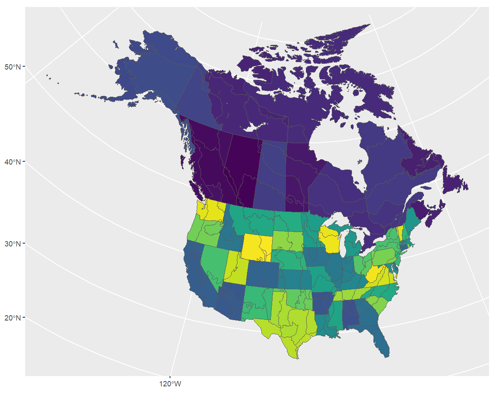
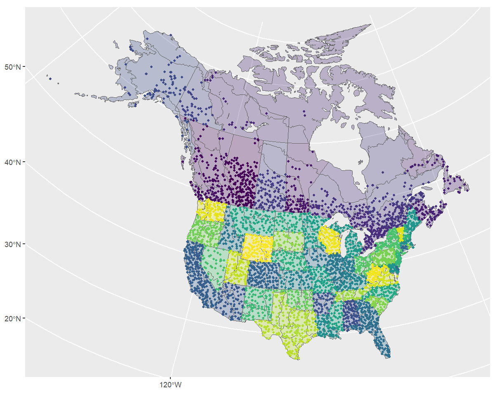
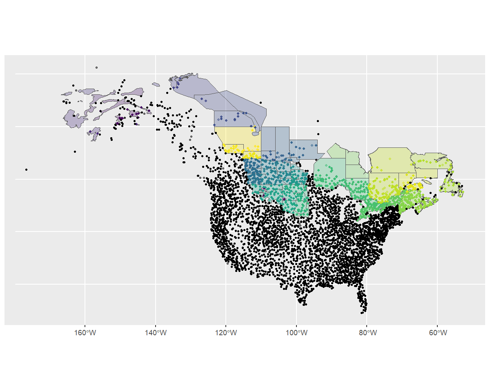
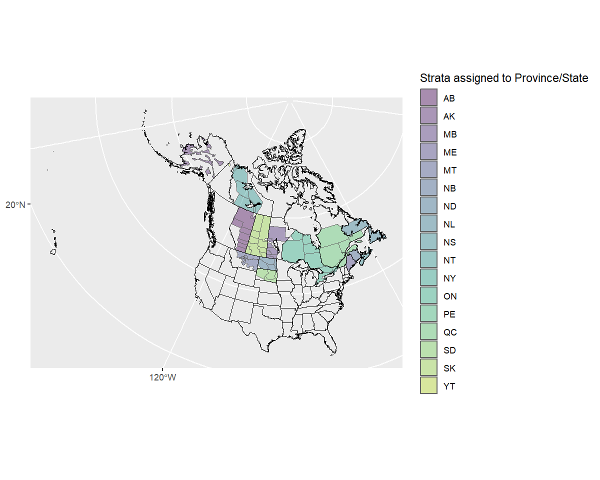
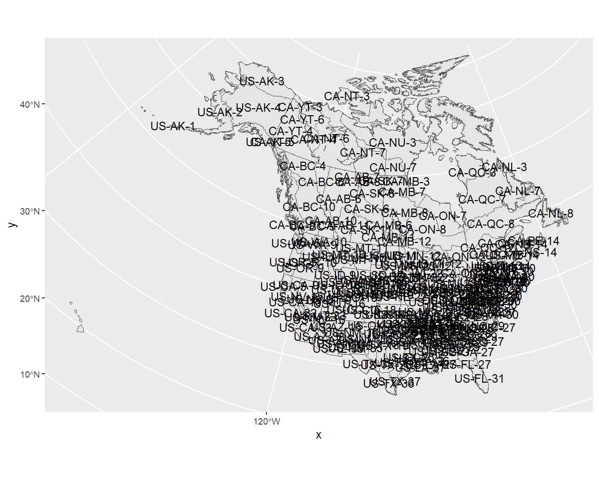
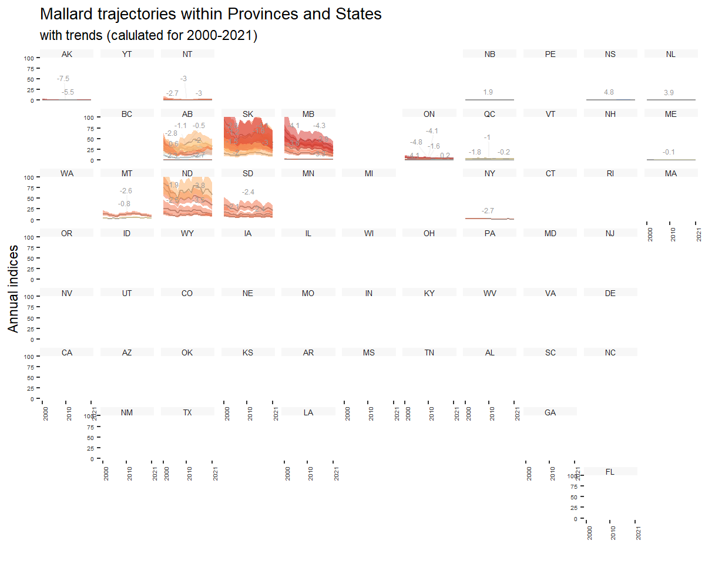
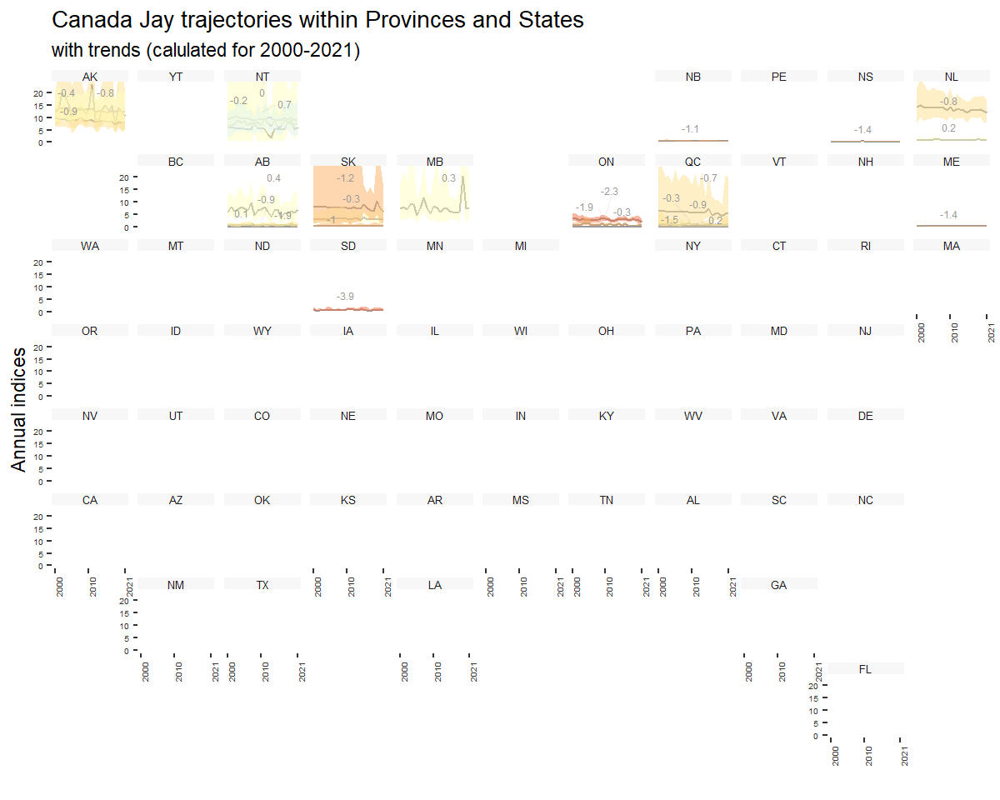
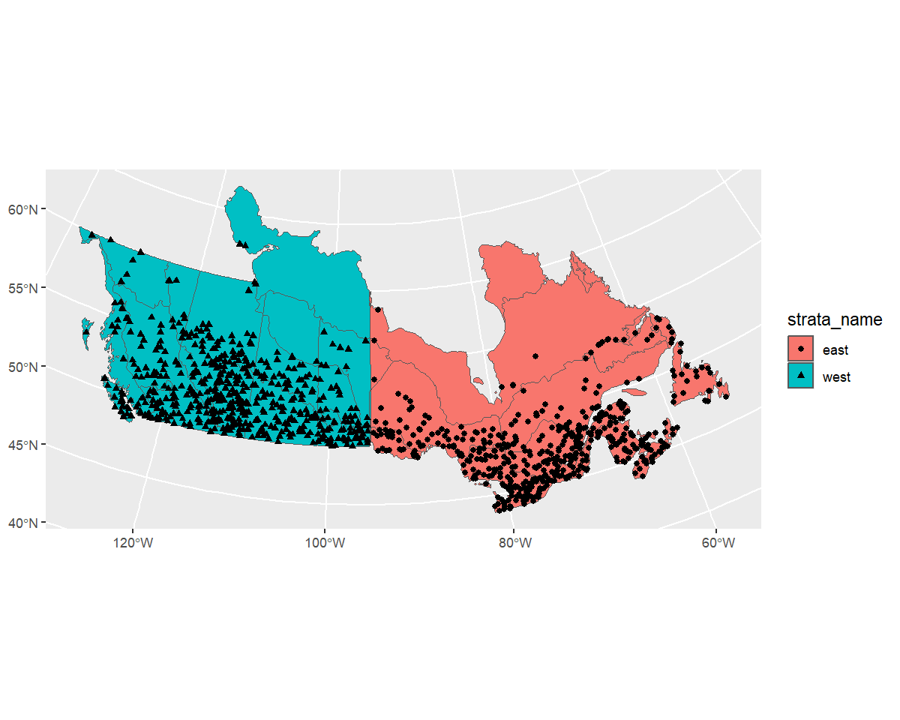

```r
library(bbsBayes2)
library(sf)       # Spatial data manipulations
library(dplyr)    # General data manipulations
library(ggplot2)  # Plotting
library(patchwork) # mutli-plot
```

In this vignette we'll explore the various ways you can stratify the BBS data in
preparation for running the models.

You can use existing, pre-defined stratifications, subset an existing stratification, or load
your own custom stratification, either using a completely new set of spatial
data, or by modifying the spatial polygons of an existing strata.

This vignette assumes that the BBS data have already been downloaded and that you are familiar with the [basics of the bbsBayes2 workflow](./bbsBayes2.html)


## Stratifying with built-in stratifications

The built-in stratifications are
bbs_usgs, bbs_cws, bcr, latlong, prov_state.

- `bbs_cws` -- Intersections of Political regions X Bird Conservation Regions
  (Stratification used by the Canadian Wildlife Service [CWS] for national status reporting)
- `bbs_usgs` -- Intersections of Political regions X Bird Conservation Regions
  (Stratification used by the United Status Geological Survey [USGS] for national status reporting)
- `bcr` -- Bird Conservation Regions only
- `prov_state` -- Political regions only - states, provinces, and territories
- `latlong` -- Grid-cells of 1 degree of latitude X 1 degree of longitude, aka "degree-blocks". These are the original survey design strata for the BBS. Routes are established at randomized locations within these degree-blocks.

You can visualize these stratifications by looking at the maps
included in bbsBayes2 with `load_map()`.


```r
ggplot(data = load_map("bbs_usgs"), aes(fill = strata_name)) +
  geom_sf() +
  scale_fill_viridis_d(guide = "none")
```



To stratify BBS data, you can use these existing stratifications by
specifying `by = "name"` in the `stratify()` function.


```r
s <- stratify(by = "bbs_usgs", species = "Canada Jay")
#> Using 'bbs_usgs' (standard) stratification
#> Loading BBS data...
#> Filtering to species Canada Jay (4840)
#> Stratifying data...
#>   Renaming routes...
```

### The latlong stratification

The latlong stratification `by = "latlong"` is the finest-scale stratification built into the package, and so it divides the BBS data into many more strata-units than other stratifications.  Therefore, you may wish to adjust the minimum data inclusion criteria when preparing the data. Specifically, setting `min_n_routes = 1` ensures that every grid-cell with at least one BBS route can be included. There are many degree-blocks that have only one route, as this is the original sampling design goal of the BBS (at least one route within each degree-block).


```r
s <- stratify(by = "latlong", species = "Canada Jay")
#> Using 'latlong' (standard) stratification
#> Loading BBS data...
#> Filtering to species Canada Jay (4840)
#> Stratifying data...
#>   Renaming routes...
#>   Omitting 80/119,567 route-years that do not match a stratum.
#>     To see omitted routes use `return_omitted = TRUE` (see ?stratify)
p <- prepare_data(s, min_n_routes = 1)
```

## Custom stratifications


### Load a custom stratification map

To define a completely different stratification, you'll need to provide a
spatial data object with polygons defining your strata.

In our example we'll use WBPHS stratum boundaries for 2019.
This is available from available from the US Fish and Wildlife Service Catalogue: <https://ecos.fws.gov/ServCat/Reference/Profile/142628>

You can either download it by hand, or with the following code.

```r
z <- "output/WBPHS_Stratum_Boundaries_2019.zip" #

download.file(url = "https://ecos.fws.gov/ServCat/DownloadFile/213149",
              destfile = z,
              cacheOK = FALSE)
unzip(z)  # Unzip - if you get a file is corrupt message, download it manually
unlink(z) # Remove the zipped file
```
The zip file is also available in this [Google Drive](https://drive.google.com/file/d/1pWPC2Eh5VBP7RIC173gazdAmtHfx4KdF/view?usp=sharing)

To use this file in bbsBayes2, we need to load it as an sf object using the sf
package.

```r
map <- sf::read_sf("output/WBPHS_stratum_boundaries_2019.shp")
ggplot(map, aes(fill = factor(STRAT))) +
  geom_sf() +
  scale_fill_viridis_d(guide = "none")
```


We see that it has one column that reflects the stratum names. First we'll
rename this column to `strata_name` which is what `stratify()` requires.


```r
map <- rename(map, strata_name = STRAT)
```


Now we have the spatial data and relevant information to pass to `stratify()`.

When using a custom stratification, the `by` argument becomes the name you want
to apply. Let's use something informative, but short (although there's no limit).
We also need to give the function our map.


```r
s <- stratify(by = "WBPHS_2019", species = "Canada Jay", strata_custom = map)
#> Using 'wbphs_2019' (custom) stratification
#> Loading BBS data...
#> Filtering to species Canada Jay (4840)
#> Stratifying data...
#> Preparing custom strata (EPSG:4326; WGS 84)...
#>   Summarizing strata...
#>   Calculating area weights...
#>   Joining routes to custom spatial data...
#>   Renaming routes...
#>   Omitting 100,155/119,567 route-years that do not match a stratum.
#>     To see omitted routes use `return_omitted = TRUE` (see ?stratify)
```

> Note that strata names are automatically put into lower case for consistency.

We can take a quick look at the output, by looking at the meta data and routes
contained therein.

```r
s[["meta_data"]]
#> $stratify_by
#> [1] "wbphs_2019"
#> 
#> $stratify_type
#> [1] "custom"
#> 
#> $species
#> [1] "Canada Jay"

s[["routes_strata"]]
#> # A tibble: 19,412 × 33
#>    strata_name country_num state_num route route_name   active latitude longitude   bcr route_type_id
#>    <chr>             <dbl>     <dbl> <chr> <chr>         <dbl>    <dbl>     <dbl> <dbl>         <dbl>
#>  1 3                   840         3 3-8   TOWER BLUFFS      1     63.6     -144.     4             1
#>  2 3                   840         3 3-8   TOWER BLUFFS      1     63.6     -144.     4             1
#>  3 3                   840         3 3-8   TOWER BLUFFS      1     63.6     -144.     4             1
#>  4 3                   840         3 3-8   TOWER BLUFFS      1     63.6     -144.     4             1
#>  5 3                   840         3 3-8   TOWER BLUFFS      1     63.6     -144.     4             1
#>  6 3                   840         3 3-8   TOWER BLUFFS      1     63.6     -144.     4             1
#>  7 3                   840         3 3-8   TOWER BLUFFS      1     63.6     -144.     4             1
#>  8 3                   840         3 3-8   TOWER BLUFFS      1     63.6     -144.     4             1
#>  9 3                   840         3 3-8   TOWER BLUFFS      1     63.6     -144.     4             1
#> 10 3                   840         3 3-8   TOWER BLUFFS      1     63.6     -144.     4             1
#> # ℹ 19,402 more rows
#> # ℹ 23 more variables: route_type_detail_id <dbl>, route_data_id <dbl>, rpid <dbl>, year <dbl>, month <dbl>,
#> #   day <dbl>, obs_n <dbl>, total_spp <dbl>, start_temp <dbl>, end_temp <dbl>, temp_scale <chr>,
#> #   start_wind <dbl>, end_wind <dbl>, start_sky <dbl>, end_sky <dbl>, start_time <dbl>, end_time <dbl>,
#> #   assistant <dbl>, quality_current_id <dbl>, run_type <dbl>, state <chr>, st_abrev <chr>, country <chr>
```

To get a different look we can also plot this data on top of our map using
ggplot2. Note that we use `factor()` to ensure the strata names are
categorical.


```r
rts <- s[["routes_strata"]] %>%
  st_as_sf(coords = c("longitude", "latitude"), crs = 4326)

ggplot() +
  geom_sf(data = map, aes(fill = factor(strata_name)), alpha = 0.3) +
  geom_sf(data = rts, aes(colour = factor(strata_name)), size = 1) +
  scale_fill_viridis_d(aesthetics = c("colour", "fill"), guide = "none")
```




Based on the message we received during stratification (`Omitting...`) and this
map, it looks as if our custom stratification is excluding some BBS data.

We can re-run the stratification with `return_omitted = TRUE` which will attach
a data frame of omitted strata to the output.

```r
s <- stratify(by = "WBPHS_2019", species = "Canada Jay", strata_custom = map,
              return_omitted = TRUE)
#> Using 'wbphs_2019' (custom) stratification
#> Loading BBS data...
#> Filtering to species Canada Jay (4840)
#> Stratifying data...
#> Preparing custom strata (EPSG:4326; WGS 84)...
#>   Summarizing strata...
#>   Calculating area weights...
#>   Joining routes to custom spatial data...
#>   Renaming routes...
#>   Omitting 100,155/119,567 route-years that do not match a stratum.
#>     Returning omitted routes.
s[["routes_omitted"]]
#> # A tibble: 100,155 × 11
#>     year strata_name country state   route route_name latitude longitude   bcr   obs_n total_spp
#>    <dbl> <chr>       <chr>   <chr>   <chr> <chr>         <dbl>     <dbl> <dbl>   <dbl>     <dbl>
#>  1  1967 <NA>        US      ALABAMA 2-1   ST FLORIAN     34.9     -87.6    27 1140018        56
#>  2  1969 <NA>        US      ALABAMA 2-1   ST FLORIAN     34.9     -87.6    27  990062        52
#>  3  1970 <NA>        US      ALABAMA 2-1   ST FLORIAN     34.9     -87.6    27  990062        52
#>  4  1971 <NA>        US      ALABAMA 2-1   ST FLORIAN     34.9     -87.6    27  990062        56
#>  5  1972 <NA>        US      ALABAMA 2-1   ST FLORIAN     34.9     -87.6    27  990062        54
#>  6  1973 <NA>        US      ALABAMA 2-1   ST FLORIAN     34.9     -87.6    27 1060057        52
#>  7  1974 <NA>        US      ALABAMA 2-1   ST FLORIAN     34.9     -87.6    27 1060057        55
#>  8  1975 <NA>        US      ALABAMA 2-1   ST FLORIAN     34.9     -87.6    27 1060057        59
#>  9  1976 <NA>        US      ALABAMA 2-1   ST FLORIAN     34.9     -87.6    27 1060057        56
#> 10  1977 <NA>        US      ALABAMA 2-1   ST FLORIAN     34.9     -87.6    27 1060057        51
#> # ℹ 100,145 more rows
```


Let's take a look at this visually.


```r
omitted <- st_as_sf(s[["routes_omitted"]], coords = c("longitude", "latitude"),
                    crs= 4326)

ggplot() +
  geom_sf(data = map, aes(fill = factor(strata_name)), alpha = 0.3) +
  geom_sf(data = rts, aes(colour = factor(strata_name)), size = 1, alpha = 0.5) +
  geom_sf(data = omitted, size = 0.75, alpha = 0.5) +
  scale_fill_viridis_d(aesthetics = c("colour", "fill"), guide = "none")
```




The map shows that most of the omitted routes are routes that are clearly outside of our desired stratification. It does also show that there are some BBS route start-points that are just outside of the strata (e.g., some routes in Nova Scotia and Alaska). The user can decide what to do with these sorts of minor overlap issues. For example, buffering the original stratification map might make sense in some situations.

To fit the model, we follow the standard workflow using our stratified data.


```r
p <- prepare_data(s,
                  min_year = 2000,
                  max_year = 2021) #subset a shorter time-span to speed model-fit
mp <- prepare_model(p,model = "slope",
                   model_variant = "hier")
```


```r
m <- run_model(mp,
               iter_warmup = 500,
               iter_sampling = 100)
```


#### Looking at indices and trends

Now we can start to look at the indices and trends related to our model.

We can apply the `generate_indices()` and `generate_trends()` functions to the output from our model, the same as we would with the built-in stratifications.


```r
i <- generate_indices(m)
#> Processing region continent
#> Processing region stratum

t <- generate_trends(i)
```
And with one additional argument, we can also use the `plot_map()` function.


```r
trend_map <- plot_map(t, strata_custom = map)
trend_map
```



`generate_indices()` creates indices at different regional levels. By default
these are "continent" and "stratum", but you can add "prov_state", "bcr",
"bcr_by_country" (where appropriate). You can also create your own regional
divisions and provide them as a `regions_index` data frame.

For example, let's imagine we would like to calculate regional indices for
each stratum, country, province/state, as well as for a custom division of
east vs. west.

First we'll need to tell the function which strata belong to which province or
state, and then which belong to the 'east' and which to the 'west.

We'll start by using a helper function `assign_prov_state()`. This function
takes a map of strata and assigns each strata to a province or state
depending on the amount of overlap. By default it will warn if the amount of
overlap is less than 75%, but in this case, we will lower that cutoff to 60%.
The plot gives us a chance to make a quick assessment of whether we're happy
with how the various strata have been assigned.


```r
rindex <- assign_prov_state(map, min_overlap = 0.6, plot = TRUE)
```



Next we'll define the east/west divide by hand. If we plot the strata by
name, we can pick out which are eastern and which western.


```r

ggplot(rindex) +
  geom_sf(data = load_map(type = "North America")) +
  geom_sf() +
  geom_sf_text(aes(label = strata_name))
#> Warning in st_point_on_surface.sfc(sf::st_zm(x)): st_point_on_surface may not give correct results for
#> longitude/latitude data
```


Let's add a column splitting the strata into eastern and western

```r
rindex <- mutate(
  rindex,
  east_west = if_else(as.numeric(strata_name) < 50 | as.numeric(strata_name) > 74,
                      "west",
                      "east"))
```

And now double check!


```r
ggplot(data = rindex) +
  geom_sf(data = load_map(type = "North America")) +
  geom_sf(data = rindex, aes(fill = east_west), alpha = 0.5)
```


Now we'll create our indices and trends

```r
i <- generate_indices(
  m,
  regions = c("stratum", "country", "prov_state", "east_west"),
  regions_index = rindex)
#> Processing region stratum
#> Processing region country
#> Processing region prov_state
#> Processing region east_west

t <- generate_trends(i)
```

We can plot each of these indices with `plot_indices()` which creates a list
of plots.


```r

p <- plot_indices(i)
names(p)
#>  [1] "1"                        "14"                       "17"                       "18"                      
#>  [5] "2"                        "22"                       "23"                       "24"                      
#>  [9] "26"                       "3"                        "31"                       "44"                      
#> [13] "50"                       "51"                       "52"                       "56"                      
#> [17] "62"                       "63"                       "64"                       "66"                      
#> [21] "67"                       "68"                       "69"                       "71"                      
#> [25] "72"                       "75"                       "76"                       "77"                      
#> [29] "Canada"                   "United_States_of_America" "AB"                       "AK"                      
#> [33] "MB"                       "ME"                       "NB"                       "NL"                      
#> [37] "NS"                       "NT"                       "ON"                       "QC"                      
#> [41] "SD"                       "SK"                       "east"                     "west"

p[["east"]] + p[["west"]]
```



Finally we can even create geofaceted plots (which is only possible in our case
because we assigned our strata to Provinces and States and calculated indices
for these regions).

```r
plot_geofacet(i, trends = t, multiple = TRUE)
```




### Subsetting an existing stratification

But what if you want to use the BBS CWS stratification, but only really want
to look at Canadian regions?

In this case you'll subset the BBS CWS stratification and give `stratify()` that
data set in addition to the specification.

In addition to maps, stratifications are available as data frames in the
`bbs_strata` object.


```r
names(bbs_strata)
#> [1] "bbs_usgs"   "bbs_cws"    "bcr"        "latlong"    "prov_state"
head(bbs_strata[["bbs_cws"]])
#> # A tibble: 6 × 7
#>   strata_name area_sq_km country country_code prov_state   bcr bcr_by_country
#>   <chr>            <dbl> <chr>   <chr>        <chr>      <dbl> <chr>         
#> 1 CA-AB-10        52565. Canada  CA           AB            10 Canada-BCR_10 
#> 2 CA-AB-11       149352. Canada  CA           AB            11 Canada-BCR_11 
#> 3 CA-AB-6        445135. Canada  CA           AB             6 Canada-BCR_6  
#> 4 CA-AB-8          6987. Canada  CA           AB             8 Canada-BCR_8  
#> 5 CA-BC-10       383006. Canada  CA           BC            10 Canada-BCR_10 
#> 6 CA-BC-4        193180. Canada  CA           BC             4 Canada-BCR_4
```

We can now modify and use this data frame as we like.

```r
my_cws <- filter(bbs_strata[["bbs_cws"]], country == "Canada")
s <- stratify(by = "bbs_cws", species = "Canada Jay", strata_custom = my_cws)
#> Using 'bbs_cws' (subset) stratification
#> Loading BBS data...
#> Filtering to species Canada Jay (4840)
#> Stratifying data...
#>   Combining BCR 7 and NS and PEI...
#>   Renaming routes...
#>   Omitting 101,474/119,567 route-years that do not match a stratum.
#>     To see omitted routes use `return_omitted = TRUE` (see ?stratify)
```

Note that the stratification is now "bbs_cws" and "subset"


```r
s[["meta_data"]]
#> $stratify_by
#> [1] "bbs_cws"
#> 
#> $stratify_type
#> [1] "subset"
#> 
#> $species
#> [1] "Canada Jay"
```

We can see the strata included by looking at the `meta_strata`


```r
print(s[["meta_strata"]], n = Inf)
#> # A tibble: 30 × 7
#>    strata_name area_sq_km country country_code prov_state   bcr bcr_by_country
#>    <chr>            <dbl> <chr>   <chr>        <chr>      <dbl> <chr>         
#>  1 CA-AB-10        52565. Canada  CA           AB            10 Canada-BCR_10 
#>  2 CA-AB-11       149352. Canada  CA           AB            11 Canada-BCR_11 
#>  3 CA-AB-6        445135. Canada  CA           AB             6 Canada-BCR_6  
#>  4 CA-BC-10       383006. Canada  CA           BC            10 Canada-BCR_10 
#>  5 CA-BC-4        193180. Canada  CA           BC             4 Canada-BCR_4  
#>  6 CA-BC-5        199820. Canada  CA           BC             5 Canada-BCR_5  
#>  7 CA-BC-6        106917. Canada  CA           BC             6 Canada-BCR_6  
#>  8 CA-BC-9         59939. Canada  CA           BC             9 Canada-BCR_9  
#>  9 CA-BCR7-7     1743744. Canada  CA           BCR7           7 Canada-BCR_7  
#> 10 CA-MB-11        70101. Canada  CA           MB            11 Canada-BCR_11 
#> 11 CA-MB-12        15312. Canada  CA           MB            12 Canada-BCR_12 
#> 12 CA-MB-6        127190. Canada  CA           MB             6 Canada-BCR_6  
#> 13 CA-MB-8        234151. Canada  CA           MB             8 Canada-BCR_8  
#> 14 CA-NB-14        72991. Canada  CA           NB            14 Canada-BCR_14 
#> 15 CA-NL-8        157083. Canada  CA           NL             8 Canada-BCR_8  
#> 16 CA-NSPE-14      61502. Canada  CA           NSPE          14 Canada-BCR_14 
#> 17 CA-NT-3        394769. Canada  CA           NT             3 Canada-BCR_3  
#> 18 CA-NT-6        509423. Canada  CA           NT             6 Canada-BCR_6  
#> 19 CA-NU-3       1969549. Canada  CA           NU             3 Canada-BCR_3  
#> 20 CA-ON-12       206181. Canada  CA           ON            12 Canada-BCR_12 
#> 21 CA-ON-13        83859. Canada  CA           ON            13 Canada-BCR_13 
#> 22 CA-ON-8        435545. Canada  CA           ON             8 Canada-BCR_8  
#> 23 CA-QC-12       174314. Canada  CA           QC            12 Canada-BCR_12 
#> 24 CA-QC-13        28409. Canada  CA           QC            13 Canada-BCR_13 
#> 25 CA-QC-14        67711. Canada  CA           QC            14 Canada-BCR_14 
#> 26 CA-QC-8        470310. Canada  CA           QC             8 Canada-BCR_8  
#> 27 CA-SK-11       241315. Canada  CA           SK            11 Canada-BCR_11 
#> 28 CA-SK-6        177763. Canada  CA           SK             6 Canada-BCR_6  
#> 29 CA-SK-8        188615. Canada  CA           SK             8 Canada-BCR_8  
#> 30 CA-YT-4        435349. Canada  CA           YT             4 Canada-BCR_4
```


### Modifying existing BBS maps

Stratify by custom stratification, using sf map object. For example, let's look
at an east/west divide of southern Canada with BBS CWS strata.

First we'll start with the CWS BBS data

```r
map <- load_map("bbs_cws")
```

We'll modify this by first looking only at provinces (omitting the northern territories),
transforming to the GPS CRS (4326), and ensuring the resulting polygons are valid.

```r
new_map <- map %>%
  filter(country_code == "CA", !prov_state %in% c("NT", "NU", "YT")) %>%
  st_transform(4326)%>%
  st_make_valid()
```

Now we can crop this map to make a western and an eastern portion, defined by
longitude and latitude (which is why we first transformed to the GPS CRS).

```r
west <- st_crop(new_map, xmin = -140, ymin = 42, xmax = -95, ymax = 68) %>%
  mutate(strata_name = "west")
#> Warning: attribute variables are assumed to be spatially constant throughout all geometries
east <- st_crop(new_map, xmin = -95, ymin = 42, xmax = -52, ymax = 68) %>%
  mutate(strata_name = "east")
#> Warning: attribute variables are assumed to be spatially constant throughout all geometries
```

Now we'll bind these together and transform back to the original CRS


```r
new_strata <- bind_rows(west, east) %>%
  st_transform(st_crs(map))

ggplot() +
  geom_sf(data = map) +
  geom_sf(data = new_strata, aes(fill = strata_name), alpha = 1)
```


Looks good! Let's use it in our stratification and take a look at the points
afterwards to ensure they've been categorized appropriately.


```r
s <- stratify(by = "canada_ew", species = "Canada Jay",
              strata_custom = new_strata)
#> Using 'canada_ew' (custom) stratification
#> Loading BBS data...
#> Filtering to species Canada Jay (4840)
#> Stratifying data...
#> Preparing custom strata (ESRI:102008; North_America_Albers_Equal_Area_Conic)...
#>   Summarizing strata...
#>   Calculating area weights...
#>   Joining routes to custom spatial data...
#>   Renaming routes...
#>   Omitting 103,468/119,567 route-years that do not match a stratum.
#>     To see omitted routes use `return_omitted = TRUE` (see ?stratify)

s$meta_data
#> $stratify_by
#> [1] "canada_ew"
#> 
#> $stratify_type
#> [1] "custom"
#> 
#> $species
#> [1] "Canada Jay"
routes <- s$routes_strata %>%
  st_as_sf(coords = c("longitude", "latitude"), crs = 4326)

ggplot() +
  geom_sf(data = new_strata, aes(fill = strata_name), alpha = 1) +
  geom_sf(data = routes, aes(shape = strata_name))
```




